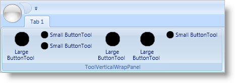
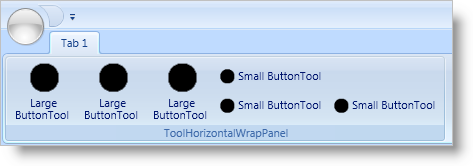
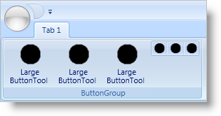

////

|metadata|
{
    "name": "xamribbon-ribbon-group-layout-panels",
    "controlName": ["xamRibbon"],
    "tags": ["Grouping","How Do I","Layouts"],
    "guid": "{EB1AB4EE-6597-403C-9F34-6519F965F95E}",  
    "buildFlags": [],
    "createdOn": "2012-01-30T19:39:54.1941919Z"
}
|metadata|
////

= Ribbon Group Layout Panels

The xamRibbon™ control uses three special layout containers within a link:{ApiPlatform}ribbon.v{ProductVersion}~infragistics.windows.ribbon.ribbongroup.html[RibbonGroup] to arrange Ribbon tools:

* link:{ApiPlatform}ribbon.v{ProductVersion}~infragistics.windows.ribbon.toolverticalwrappanel.html[ToolVerticalWrapPanel]
* link:{ApiPlatform}ribbon.v{ProductVersion}~infragistics.windows.ribbon.toolhorizontalwrappanel.html[ToolHorizontalWrapPanel]
* link:{ApiPlatform}ribbon.v{ProductVersion}~infragistics.windows.ribbon.buttongroup.html[ButtonGroup]

The ToolVerticalWrapPanel and ToolHorizontalWrapPanel containers are responsible for arranging tools based on their current SizingMode property as well as resizing tools when the size of a RibbonGroup changes. On the other hand, the ButtonGroup container's sole responsibility is to arrange a set of tools into a group of functionally-related tools within a ToolVerticalWrapPanel or a ToolHorizontalWrapPanel.

== ToolVerticalWrapPanel

The ToolVerticalWrapPanel is the default layout container used by a RibbonGroup to arrange its tools into columns. The ToolVerticalWrapPanel uses the following rules when arranging its tools:

* Tools whose SizingMode property is resolved to link:{ApiPlatform}ribbon.v{ProductVersion}~infragistics.windows.ribbon.ribbontoolsizingmode.html[ImageAndTextLarge] are displayed in their own column and span the entire height of the RibbonGroup.
* Tools whose SizingMode property is resolved to ImageAndTextNormal or ImageOnly are arranged in a column of up to three items. If a column has less than three tools, the ToolVerticalWrapPanel will leave an empty space at the bottom of the column. You can override this default arrangement by setting the ToolVerticalWrapPanel's link:{ApiPlatform}ribbon.v{ProductVersion}~infragistics.windows.ribbon.toolverticalwrappanel~verticaltoolalignment.html[VerticalToolAlignment] property.

== ToolHorizontalWrapPanel

The ToolHorizontalWrapPanel arranges its tools into rows. The default minimum number of rows is two, and the default maximum number of rows is three; however, you can change these defaults by setting the link:{ApiPlatform}ribbon.v{ProductVersion}~infragistics.windows.ribbon.toolhorizontalwrappanel~minrows.html[MinRows] and link:{ApiPlatform}ribbon.v{ProductVersion}~infragistics.windows.ribbon.toolhorizontalwrappanel~maxrows.html[MaxRows] properties respectively. The ToolHorizontalWrapPanel uses the following rules when arranging its tools:

* If you set the link:{ApiPlatform}ribbon.v{ProductVersion}~infragistics.windows.ribbon.ribbongroup~maximumsizeproperty.html[MaximumSize] attached property on a tool to ImageAndTextLarge, the tool will be sorted and displayed at the beginning of the panel. These tools will not participate in resizing and will remain as large tools.
* Tools whose SizingMode property is resolved to ImageAndTextNormal or ImageOnly will be displayed within a row of the panel.

When you resize a RibbonGroup and the panel arranges the tools into more rows than the MinRows property, you can choose to sort the tools by setting the link:{ApiPlatform}ribbon.v{ProductVersion}~infragistics.windows.ribbon.toolhorizontalwrappanel~sortorderproperty.html[SortOrder] attached property. If you do not set the SortOrder attached property on any tool within the panel, the tools will remain in their original order.

== ButtonGroup

A ButtonGroup is a specialized layout container that you can use to group one or more tools within the other two layout containers. This is useful for grouping functionally-related tools so that the tools do not get separated within a RibbonGroup when resizing xamRibbon. Any tool that is placed inside a ButtonGroup will have its SizingMode resolved to ImageOnly.

If we've piqued your interest, you can read the following topics to learn much more about xamRibbon's layout panels.

* link:xamribbon-add-a-toolhorizontalwrappanel-to-a-ribbongroup.html[Add a ToolHorizontalWrapPanel to a RibbonGroup]
* link:xamribbon-add-tools-to-a-buttongroup.html[Add Tools to a ButtonGroup]
* link:xamribbon-specify-a-sortorder-for-tools-in-a-toolhorizontalwrappanel.html[Specify a SortOrder for Tools in a ToolHorizontalWrapPanel]