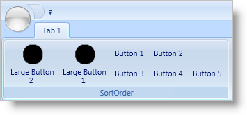
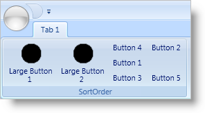

////

|metadata|
{
    "name": "xamribbon-specify-a-sortorder-for-tools-in-a-toolhorizontalwrappanel",
    "controlName": ["xamRibbon"],
    "tags": ["How Do I","Layouts","Sorting"],
    "guid": "{028D8F8F-82D7-418B-89B4-3BCC60B6C606}",  
    "buildFlags": [],
    "createdOn": "2012-01-30T19:39:54.2151961Z"
}
|metadata|
////

= Specify a SortOrder for Tools in a ToolHorizontalWrapPanel

When the width of a link:{ApiPlatform}ribbon.v{ProductVersion}~infragistics.windows.ribbon.ribbongroup.html[RibbonGroup] decreases, the link:{ApiPlatform}ribbon.v{ProductVersion}~infragistics.windows.ribbon.toolhorizontalwrappanel.html[ToolHorizontalWrapPanel] may wrap its tools into extra rows in order to display all its tools within the new confines of the RibbonGroup. If you want to control the order of the tools during this rearrangement phase, you can set the link:{ApiPlatform}ribbon.v{ProductVersion}~infragistics.windows.ribbon.toolhorizontalwrappanel~sortorderproperty.html[SortOrder] attached property. The ToolHorizontalWrapPanel will sort tools only when the number of rows required exceeds the number of rows specified by its link:{ApiPlatform}ribbon.v{ProductVersion}~infragistics.windows.ribbon.toolhorizontalwrappanel~minrows.html[MinRows] property.

The ToolHorizontalWrapPanel sorts its tools in ascending order based on the value of the SortOrder attached property. However, the separation between large tools ( link:{ApiPlatform}ribbon.v{ProductVersion}~infragistics.windows.ribbon.ribbongroup~maximumsizeproperty.html[MaximumSize] attached property set to link:{ApiPlatform}ribbon.v{ProductVersion}~infragistics.windows.ribbon.ribbontoolsizingmode.html[ImageAndTextLarge]) and small tools (SizingMode resolved to ImageAndTextNormal or ImageOnly) will take precedence over the sort order. If you do not set the SortOrder attached property on a tool, it will not take part in the sorting process.

For example, if you have a ToolHorizontalWrapPanel configured as per the example code at the end of this topic, the ToolHorizontalWrapPanel will use the following steps to rearrange its tools into extra rows:

[start=1]
. Sort the large tools (MaximumSize attached property set to ImageAndTextLarge) which have a SortOrder attached property value.
[start=2]
. Place each sorted large tool into its own column. This will result in the link:{ApiPlatform}ribbon.v{ProductVersion}~infragistics.windows.ribbon.buttontool.html[ButtonTool] with the caption 'Large Button 1' being first and the ButtonTool with the caption 'Large Button 2' being second.
[start=3]
. Place any remaining large tools into columns next to the sorted tools from step 2. Steps 1, 2, and 3 will happen regardless of the number of rows that the ToolHorizontalWrapPanel creates.
[start=4]
. Sort the smaller tools (SizingMode property resolved to ImageAndTextNormal or ImageOnly) which have a SortOrder attached property value. This will result in the ButtonTool with the caption 'Button 4' being first and the ButtonTool with the caption 'Button 2' being second.
[start=5]
. Place the sorted smaller tools into the rows starting from the first row.
[start=6]
. Place any remaining smaller tools that did not participate in the sorting process into the remaining rows.

The screen shots below illustrate the order of the tools in a ToolHorizontalWrapPanel before and after the RibbonGroup has been resized.

The following example code demonstrates how to set the SortOrder attached property for tools in a ToolHorizontalWrapPanel.

*In XAML:*

----
...
<!--TODO: Replace any images with your own-->
<igRibbon:ToolHorizontalWrapPanel>        
        <igRibbon:ButtonTool 
                Caption="Large Button 2" 
                LargeImage="32x32.png" 
                igRibbon:RibbonGroup.MaximumSize="ImageAndTextLarge" 
                igRibbon:ToolHorizontalWrapPanel.SortOrder="2" />
        <igRibbon:ButtonTool Caption="Button 1" />
        <igRibbon:ButtonTool 
                Caption="Button 2" 
                igRibbon:ToolHorizontalWrapPanel.SortOrder="2" />
        <igRibbon:ButtonTool Caption="Button 3" />
        <igRibbon:ButtonTool 
                Caption="Button 4" 
                igRibbon:ToolHorizontalWrapPanel.SortOrder="1" />
        <igRibbon:ButtonTool Caption="Button 5" />
        <igRibbon:ButtonTool 
                Caption="Large Button 1" 
                LargeImage="32x32.png" 
                igRibbon:RibbonGroup.MaximumSize="ImageAndTextLarge" 
                igRibbon:ToolHorizontalWrapPanel.SortOrder="1" />            
</igRibbon:ToolHorizontalWrapPanel>
...
----

*In Visual Basic:*

----
Imports Infragistics.Windows.Ribbon
...
Dim bt As New ButtonTool()
bt.Caption = "Large Button 2"
ToolHorizontalWrapPanel.SetSortOrder(bt, 2)
...
----

*In C#:*

----
using Infragistics.Windows.Ribbon;
...
ButtonTool bt = new ButtonTool();
bt.Caption = "Large Button 2";
ToolHorizontalWrapPanel.SetSortOrder(bt, 2);
...
----

== Related Topics

link:xamribbon-add-a-toolhorizontalwrappanel-to-a-ribbongroup.html[Add a ToolHorizontalWrapPanel to a RibbonGroup]

link:xamribbon-add-tools-to-a-buttongroup.html[Add Tools to a ButtonGroup]