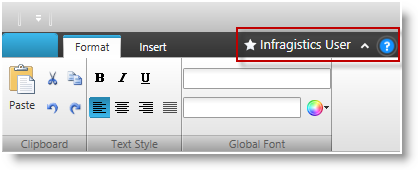
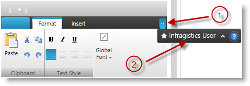

////

|metadata|
{
    "name": "xamribbon-tab-item-area-toolbar",
    "tags": ["Getting Started","How Do I","Layouts"],
    "controlName": ["xamRibbon"],
    "guid": "c0604eda-992e-47b2-8c77-60b884b9afb3",  
    "buildFlags": [],
    "createdOn": "2014-03-21T12:51:46.9108341Z"
}
|metadata|
////

= Tab Item Area Toolbar (xamRibbon)

== Topic Overview

=== Purpose

This topic explains how to create and configure the toolbar area positioned next to the tab items.

=== Required background

The following topics are prerequisites to understanding this topic:

[options="header", cols="a,a"]
|====
|Topic|Purpose

| link:xamribbon-about-xamribbon.html[About xamRibbon]
|In this topic you'll find any information that will help you to better understand the functionalities of the _xamRibbon_ control.

| link:xamribbon-ribbon-tabs.html[Ribbon Tabs]
|The topics in this section describe the ribbon tab area of _xamRibbon_ and demonstrates how to add them to _xamRibbon_ .

|====

=== In this topic

This topic contains the following sections:

* <<_Ref382406228,Introduction>>
* <<_Ref382406229,Creating and Configuring Tab Items Area Toolbar>>
* <<_Ref382406237,Related Content>>

[[_Ref382406228]]
== Introduction

=== TabItem area toolbar summary

The  _xamRibbon_   control allows you to create a toolbar located next to the tabs. This toolbar extends from the `ItemsControl` class allowing you to add any kind of content in it.

This toolbar is located on the line where the tab items are placed aligned to the right. If there is not enough space to render all of the toolbar’s content, some of it will be hidden and an overflow button will be rendered on the right. Clicking this button will open a popup containing all hidden toolbar content.

.Note
[NOTE]
====
If you want to determine at what width toolbar items will begin to be hidden you can specify the minimum width to reserve for the tab items on the left via the `TabItemAreaMinWidth` property.
====

The following screenshot demonstrates a  _xamRibbon_   control with the tab item area toolbar:

The following screenshot demonstrates a  _xamRibbon_   control with the overflow popup shown. The items in the popup were hidden from the toolbar due to the limited space, which prevented the whole toolbar’s content from being rendered next to the tab items:

[start=1]
. Overflow button
[start=2]
. Tab item area toolbar rendered in a popup

[[_Ref382406229]]
== Creating and Configuring Tab Items Area Toolbar

[[_Hlk368069110]]

=== Overview

The tab items area toolbar is represented by the link:{ApiPlatform}ribbon{ApiVersion}~infragistics.windows.ribbon.tabitemareatoolbar_members.html[TabItemAreaToolbar] class. You have to instantiate it and set it to the xamRibbon’s link:{ApiPlatform}ribbon{ApiVersion}~infragistics.windows.ribbon.tabitemareatoolbar_members.html[TabItemAreaToolbar] property. The `TabItemAreaToolbar` class provides several properties for configuring the toolbar, which are explained in the table below.

=== Property settings

The following table maps the desired configuration/behaviors to the property settings that manage it.

[options="header", cols="a,a"]
|====
|In order to:|Do this:

|Create a tab item area toolbar.
|Create an instance of the `TabItemAreaToolbar` class.

|Associate the instance of the tab item area toolbar to a _xamRibbon_ control.
|Set the instance to xamRibbon’s `TabItemAreaToolbar` property.

|Specify (reserve) the minimum width of the tab items’ area.
|Set the desired minimum width on the toolbar’s link:{ApiPlatform}ribbon{ApiVersion}~infragistics.windows.ribbon.tabitemareatoolbar~tabitemareaminwidth.html[TabItemAreaMinWidth] property.

|Obtain the visibility of the overflow button.
|Obtain the value of the link:{ApiPlatform}ribbon{ApiVersion}~infragistics.windows.ribbon.toolbarwithoverflow~overflowbuttonvisibility.html[OverflowButtonVisibility] property.

|Open or close the overflow area of the tab items area toolbar.
|Set or obtain the link:{ApiPlatform}ribbon{ApiVersion}~infragistics.windows.ribbon.toolbarwithoverflow~isoverflowopen.html[IsOverflowOpen] boolean property.

|====

[[_Hlk337817761]]

=== Example

The following code example demonstrates how to create and set a tab item area toolbar:

*In XAML:*

[source,xaml]
----
<igRibbon:XamRibbon>
    <igRibbon:XamRibbon.TabItemAreaToolbar>
        <igRibbon:TabItemAreaToolbar TabItemAreaMinWidth="150">
        <!-- add tab item area toolbar content here -->            
        </igRibbon:TabItemAreaToolbar>
    </igRibbon:XamRibbon.TabItemAreaToolbar>
</igRibbon:XamRibbon>
----

[[_Ref382406237]]
== Related Content

=== Topics

The following topics provide additional information related to this topic.

[options="header", cols="a,a"]
|====
|Topic|Purpose

| link:xamribbon-quick-access-toolbar.html[Quick Access Toolbar]
|The topics in this section describe the key features of the Quick Access Toolbar area of _xamRibbon_ .

|====

=== Samples

The following sample provides additional information related to this topic.

[options="header", cols="a,a"]
|====
|Sample|Purpose

| link:{SamplesURL}/ribbon/tabitemareatoolbar[Tab Item Area Toolbar]
|This sample demonstrates how to create such toolbar and add items in it

|====