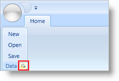

////

|metadata|
{
    "name": "xamribbon-using-the-dialog-box-launcher-to-display-a-dialog-box",
    "controlName": ["xamRibbon"],
    "tags": ["Getting Started","How Do I","Navigation","Selection"],
    "guid": "{7DB3BB05-7E42-4415-8196-872C81E2D380}",  
    "buildFlags": [],
    "createdOn": "2012-01-30T19:39:54.2261983Z"
}
|metadata|
////

= Using the Dialog Box Launcher to Display a Dialog Box

== Before You Begin

A Ribbon Group can show a small button called a DialogBoxLauncher on the right side of the Ribbon Group's caption. As the name suggests, this button is primarily used to show a dialog or task pane related to the application tasks in that Ribbon Group.

You must set the Ribbon Group's DialogBoxLauncherTool property to an instance of a ButtonTool.

== What You Will Accomplish

You will display a DialogBoxLauncher button in a Ribbon Group. You will then use this DialogBoxLauncher to launch a SaveFileDialog.

.Note
[NOTE]
====
This topic assumes that you know how to link:xamribbon-adding-xamribbon-to-your-application-.html[create a basic xamRibbon using Extensible Application Markup Language (XAML)].
====

== To use the DialogBoxLauncherTool to display a dialog box:

[start=1]
. Declare a DialogBoxLauncherTool in a RibbonGroup.
[start=2]
. Create an instance of a ButtonTool in the DialogBoxLauncherTool tags.
[start=3]
. Set the Id property of the ButtonTool to btnSaveDialog. You can use the Id and the xamRibbon™ control's GetToolById method to get a reference to the ButtonTool in the code-behind.
[start=4]
. Attach a click event handler to the ButtonTool. The sample code below uses a method named btnSaveDialog_Click to handle the ButtonTool's click event.

*In XAML:*

----
...
<igRibbon:RibbonGroup Caption="Data">
        <igRibbon:RibbonGroup.DialogBoxLauncherTool>
                <igRibbon:ButtonTool Id="btnSaveDialog" Click="btnSaveDialog_Click" />
        </igRibbon:RibbonGroup.DialogBoxLauncherTool>
</igRibbon:RibbonGroup>
...
----

[start=5]
. In the code-behind, create a method named btnSaveDialog_Click. In this method, instantiate a SaveFileDialog and show it.

*In Visual Basic:*

----
Private Sub btnSaveDialog_Click(ByVal sender As System.Object, _
  ByVal e As System.Windows.RoutedEventArgs)
        Dim dialog As New Microsoft.Win32.SaveFileDialog()
        If dialog.ShowDialog() = True Then
                ' TODO: Add File Saving logic
        End If
End Sub
----

*In C#:*

----
private void btnSaveDialog_Click(object sender, RoutedEventArgs e)
{
        Microsoft.Win32.SaveFileDialog dialog = 
          new Microsoft.Win32.SaveFileDialog();
        if(dialog.ShowDialog() == true)
        {
                // TODO: Add file saving logic
        }
}
----

[start=6]
. Run the application and click the DialogBoxLauncher button in the Ribbon Group with the caption Data.

== Related Topics

link:xamribbon-about-group-resizing.html[About Ribbon Group Resizing]

link:xamribbon-add-a-ribbon-group-to-a-ribbon-tab.html[Add a Ribbon Group to a Ribbon Tab]