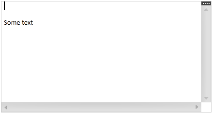

////

|metadata|
{
    "name": "xamrichtexteditor-adding-to-your-page",
    "tags": ["Getting Started","How Do I"],
    "controlName": ["xamRichTextEditor"],
    "guid": "e14a6f99-9891-4b40-afd5-692be929fd4f",  
    "buildFlags": [],
    "createdOn": "2016-05-25T18:21:58.392337Z"
}
|metadata|
////

= Adding xamRichTextEditor to Your Page

== Topic Overview

=== Purpose

This topic provides detailed instructions to help you get up and running as quickly as possible with the link:{ApiPlatform}controls.editors.xamrichtexteditor.v{ProductVersion}~infragistics.controls.editors.xamrichtexteditor.html[ _xamRichTextEditor_  ]™.

=== Required background

The following topics are prerequisites to understanding this topic:

[options="header", cols="a,a"]
|====
|Topic|Purpose

| link:xamrichtexteditor-features-overview.html[Features Overview]
|This topic provides an overview of the features supported by the _xamRichTextEditor_ control.

| link:xamrichtexteditor-content-structure.html[Content Structure]
|This topic explains the document’s content logical structure you can use to edit the contents in the _xamRichTextEditor_ programmatically.

|====

=== In this topic

This topic contains the following sections:

* <<_Ref363741952,Adding xamRichTextEditor to Your Page>>
* <<_Ref363741961,Related Content>>

[[_Ref363741952]]
== Adding  _xamRichTextEditor_  to Your Page

=== Introduction

This procedure explains step by step the operations necessary for adding  _xamRichTextEditor_   to your page.

=== Preview

The following screenshot is a preview of the result.

=== Steps

The following steps demonstrate how to add  _xamRichTextEditor_   to your page.

=== 1. Assembly references

Add the following assembly references in your project:

*Infragistics pick:[sl="SL5"]  pick:[wpf="WPF4"] .v{ProductVersion}*

*Infragistics pick:[sl="SL5"]  pick:[wpf="WPF4"] .Controls.Editors.XamRichTextEditor.v{ProductVersion}*

*Infragistics pick:[sl="SL5"]  pick:[wpf="WPF4"] .Controls.Menus.XamMenu.v{ProductVersion}*

*Infragistics pick:[sl="SL5"]  pick:[wpf="WPF4"] .Documents.RichTextDocument.v{ProductVersion}*

=== 2. Serialization providers assembly references

If you need to export or import external rich content add the following additional assembly references:

*Infragistics pick:[sl="SL5"]  pick:[wpf="WPF4"] .Documents.Core.v{ProductVersion}*

*Infragistics pick:[sl="SL5"]  pick:[wpf="WPF4"] .Documents.RichTextDocument.Rtf.v{ProductVersion}*

*Infragistics pick:[sl="SL5"]  pick:[wpf="WPF4"] .Documents.RichTextDocument.Word.v{ProductVersion}*

=== 3. Namespaces

Add the following namespaces:

*In XAML:*

[source,xaml]
----
xmlns:ig="http://schemas.infragistics.com/xaml"
----

*In C#:*

[source,csharp]
----
using Infragistics.Controls.Editors;
using Infragistics.Documents.RichText;
----

*In Visual Basic:*

[source,vb]
----
Imports Infragistics.Controls.Editors
Imports Infragistics.Documents.RichText
----

=== 4. Create xamRichTextEditor

Create and put the  _xamRichTextEditor_   on your page:

*In XAML:*

[source,xaml]
----
<ig:XamRichTextEditor x:Name="xamRichTextEditor1">
</ig:XamRichTextEditor>
----

=== 5. Add serialization providers (optional)

Optionally, If you need to export or import external rich content add the following:

*In XAML:*

[source,xaml]
----
<ig:XamRichTextEditor.ClipboardSerializationProviders>
    <ig:RtfSerializationProvider />
    <ig:WordSerializationProvider />
</ig:XamRichTextEditor.ClipboardSerializationProviders>
----

*In C#:*

[source,csharp]
----
this.xamRichTextEditor1.ClipboardSerializationProviders.
    Add(RtfSerializationProvider.Instance);
this.xamRichTextEditor1.ClipboardSerializationProviders.
    Add(WordSerializationProvider.Instance);
----

*In Visual Basic:*

[source,vb]
----
Me.xamRichTextEditor1.ClipboardSerializationProviders.
    Add(RtfSerializationProvider.Instance)
Me.xamRichTextEditor1.ClipboardSerializationProviders.
    Add(WordSerializationProvider.Instance)
----

=== 6. Create document (optional)

Optionally, create the  link:{ApiPlatform}documents.richtextdocument.v{ProductVersion}~infragistics.documents.richtext.richtextdocument_members.html[RichTextDocument]  and set it to the   _xamRichTextEditor_ ’s link:{ApiPlatform}controls.editors.xamrichtexteditor.v{ProductVersion}~infragistics.controls.editors.xamrichtexteditor~document.html[Document] property:

*In XAML:*

[source,xaml]
----
<ig:XamRichTextEditor.Document>
    <ig:RichTextDocument />
</ig:XamRichTextEditor.Document>
----

*In C#:*

[source,csharp]
----
RichTextDocument doc = new RichTextDocument();
this.xamRichTextEditor1.Document = doc;
----

*In Visual Basic:*

[source,vb]
----
Dim doc As New RichTextDocument()
Me.xamRichTextEditor1.Document = doc
----

=== 7. Add a text (optional)

Optionally, the following code adds a plain text paragraph to the document:

*In C#:*

[source,csharp]
----
RichTextDocument doc = this.xamRichTextEditor1.Document;
ParagraphNode pn = new ParagraphNode();
pn.SetText("Some text");
doc.RootNode.Body.ChildNodes.Add(pn);
----

*In Visual Basic:*

[source,vb]
----
Dim doc As RichTextDocument = Me.xamRichTextEditor1.Document
Dim pn As New ParagraphNode()
pn.SetText("Some text")
doc.RootNode.Body.ChildNodes.Add(pn)
----

.Note
[NOTE]
====
The text above will appear in the second paragraph of the document because, by default, newly created documents contain an empty first paragraph.
====

[[_Ref363741961]]
== Related Content

=== Topics

The following topics provide additional information related to this topic.

[options="header", cols="a,a"]
|====
|Topic|Purpose

| link:xamrichtexteditor-configuring-xamrichtexteditor.html[Configuring _xamRichTextEditor_ ]
|The topics in this section provide additional information about _xamRichTextEditor_ configuring.

| link:xamrichtexteditor-managing-programmatically.html[Managing _xamRichTextEditor_ Programmatically]
|The topics in this section provide deep knowledge on how to programmatically manage the _xamRichTextEditor_ .

|====