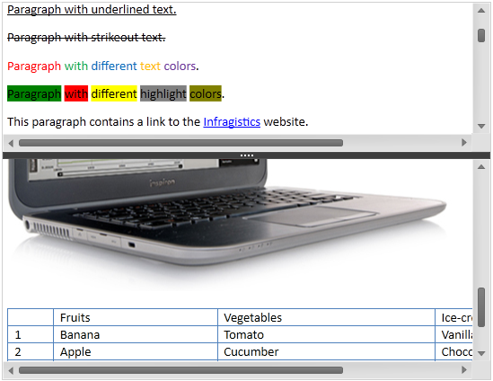

////

|metadata|
{
    "name": "xamrichtexteditor-features-overview",
    "tags": ["Getting Started"],
    "controlName": ["xamRichTextEditor"],
    "guid": "58eb1c7a-fa8c-480a-bdbc-5645e195af4e",  
    "buildFlags": [],
    "createdOn": "2016-05-25T18:21:58.3803367Z"
}
|metadata|
////

= Features Overview (xamRichTextEditor)

== Topic Overview

=== Purpose

This topic provides an overview of the features supported by the control.

=== In this topic

This topic contains the following sections:

* <<_Ref366674967,Introduction>>
* <<_Ref366072664,User Interactions and Usability>>
* <<_Ref366072715,Related Content>>

[[_Ref366674967]]
== Introduction

=== Control summary

The  _xamRichTextEditor™_   is a cross platform control providing displaying and editing capabilities of rich text content, which includes but is not limited to text, lists, images and tables.

The  _xamRichTextEditor_   provides you with the ability to display and edit the link:{ApiPlatform}documents.richtextdocument{ApiVersion}~infragistics.documents.richtext.richtextdocument_members.html[RichTextDocument]’s content. The `RichTextDocument` class allows you to import and export rich content from and to different formats (plain text, RTF, DOCX).

The following screen shot shows the  _xamRichTextEditor_  , in split mode editing rich content :

[[_Ref366072664]]
== User Interactions and Usability

=== User interactions summary chart

The following table summarizes the user interaction capabilities of the  _xamRichTextEditor_   control. Additional details are available after the table.

[options="header", cols="a,a,a"]
|====
|Feature|Description|Configurable?

|<<_Ref360701796,Context Menu>>
|The context menu allows the users to perform clipboard operations and create tables.
|image::images/Yes.png[] 

link:xamrichtexteditor-managing-context-menu.html[Managing the Context Menu]

|<<_Ref360701797,Clipboard>>
|Clipboard operations are available to the user using keyboard shortcuts.
|image::images/Yes.png[] 

link:xamrichtexteditor-managing-clipboard.html[Managing Clipboard]

|<<_Ref366066795,Hyperlinks>>
|Allows the user to click and open hyperlinks.
|image::images/Yes.png[] 

link:xamrichtexteditor-managing-adding-hyperlinks.html[Adding Hyperlinks]

|<<_Ref366066796,Images>>
|The control supports displaying of images of different formats.
|image::images/Yes.png[] 

link:xamrichtexteditor-managing-adding-images.html[Adding Images]

|<<_Ref360785178,Keyboard Navigation>>
|This feature allows the user to navigate the document content using the keyboard.
|image::images/No.png[]

|<<_Ref360701808,Selection>>
|This feature allows the user to select single or multiple ranges of the document content.
|image::images/Yes.png[] 

* link:xamrichtexteditor-configuring-selection.html[Configuring Selection] 

* link:xamrichtexteditor-managing-selection.html[Managing Selection] 

|<<_Ref366066785,Table Resizing>>
|This feature allows the user to resize table columns and rows.
|image::images/No.png[]

|<<_Ref360788236,Text Formatting>>
|This feature allows the user to modify the format of the text content.
|image::images/No.png[]

|<<_Ref360702454,Undo/Redo>>
|This feature allows the user to rollback recent changes or reapplies them.
|image::images/Yes.png[] 

* link:xamrichtexteditor-configuring-undo-redo.html[Configuring Undo/Redo] 

* link:xamrichtexteditor-managing-undo-redo.html[Managing Undo/Redo] 

|<<_Ref360702448,View Splitting>>
|This feature allows the user to split the document view in two.
|image::images/Yes.png[] 

* link:xamrichtexteditor-configuring-view-split.html[Configuring the View Split] 

* link:xamrichtexteditor-managing-view-splitting.html[Managing View Splitting] 

|<<_Ref366069219,View Zooming>>
|This feature allows the user to increase or decrease the rendering size of the view’s content.
|image::images/Yes.png[] 

link:xamrichtexteditor-configuring-view-zoom-level.html[Configuring the View Zoom Level]

|====

[[_Ref360701796]]

=== Context Menu

The  _xamRichTextEditor_   control supports a context menu allowing users to perform clipboard operations and create tables. You can customize the content of the context menu or even hide it.

==== Related Topic:

link:xamrichtexteditor-managing-context-menu.html[Managing the Context Menu]

[[_Ref360701797]]

=== Clipboard

The  _xamRichTextEditor_   control provides Cut, Copy and Paste clipboard support that allows the user to edit the rich content of their document by moving or copying parts of the content at different places. It is also possible to paste rich text content from other application and copy content to other applications.

You must select the content in the  _xamRichTextEditor_   in order to use the Cut and Copy operations. You can execute the Paste operation whether or not you have content selected.

* If no content is selected the clipboard content will be inserted after the current caret position.
* If content is selected the clipboard content will replace the current selection.

The following table lists the operations available for the clipboard support using the keyboard.

[options="header", cols="a,a"]
|====
|Operation|Keyboard Shortcuts

|Clipboard Cut
|Ctrl + X

|Clipboard Copy
|Ctrl + C, Ctrl + Insert

|Clipboard Paste
|Ctrl + V, Shift + Insert

|====

==== Related Topic:

link:xamrichtexteditor-managing-clipboard.html[Managing Clipboard]

[[_Ref366066795]]

=== Hyperlinks

The  _xamRichTextEditor_   supports hyperlinks in the document’s content. The user is able open the URI in the default system browser by clicking on the links.

==== Related Topic:

link:xamrichtexteditor-managing-adding-hyperlinks.html[Adding Hyperlinks]

[[_Ref366066796]]

=== Images

The control supports displaying images of different formats – BMP, DIB, EMF, GIF, JPEG, PNG, TIFF and WMF.

==== Related Topic:

link:xamrichtexteditor-managing-adding-images.html[Adding Images]

[[_Ref360785178]]

=== Keyboard Navigation

The keyboard navigation feature allows the user to navigate through the rich text document’s content.

The following table maps the lists all available user shortcuts:

[options="header", cols="a,a"]
|====
|Shortcut|Description

|Up arrow
|Move caret one line up or scroll up document.

|Down arrow
|Move caret one line down or scroll down document.

|Left arrow
|Move caret on previous character.

|Right arrow
|Move caret on next character.

|Ctrl + left arrow
|Move caret over the start of the previous word.

|Ctrl + right arrow
|Move caret over the start of the next word.

|Page up
|Scroll one page up.

|Page down
|Scroll one page down.

|Home
|Move the caret to the beginning of the current line.

|End
|Move the caret to the end of the current line.

|Ctrl + Home
|Move the caret to the beginning of the document.

|Ctrl + End
|Move the caret to the end of the document.

|====

[[_Ref360701808]]

=== Selection

The selection feature allows the user to select single or multiple ranges from the content of the  _xamRichTextEditor_  .

[[_Ref359594770]]
==== Keyboard single selection

The keyboard single selection allows the user to select a single range of the content of the  _xamRichTextEditor_   using the keyboard.

[start=1]
. Move the caret to the start of the range you want to select.
[start=2]
. Press and hold the shift key and start moving the caret to the end of the range you want to select.
[start=3]
. When reaching the end of the selection range, release the shift key.

[[_Ref359594775]]
==== Mouse single selection

The mouse single selection allows the user to select a single range of the content of the  _xamRichTextEditor_   using the mouse.

[start=1]
. Move the mouse pointer over the start of the range you want to select.
[start=2]
. Press and hold the left mouse button and start moving the mouse over the end of the range you want to select.
[start=3]
. When reaching the end of the selection range, release the mouse left button.

==== Mouse multiple selection

The mouse multiple selection allows the user to select multiple ranges of the content of the  _xamRichTextEditor_   using the mouse.

[start=1]
. Move the mouse pointer over the start of the range you want to select.
[start=2]
. Press and hold the left mouse button and start moving the mouse toward the end of the range you want to select.
[start=3]
. When reaching the end of the selection range, release the mouse left button.
[start=4]
. Hold the Ctrl key on the keyboard.
[start=5]
. Repeat steps 1 to3 for each additional range you want to select while holding the Ctrl key on the keyboard.

.Note
[NOTE]
====
The user can select words from the content with double clicking on words (for both single and multiple selections).
====

.Note
[NOTE]
====
Mouse multiple selection will work only if the link:{ApiPlatform}controls.editors.xamrichtexteditor{ApiVersion}~infragistics.controls.editors.xamrichtexteditor~ismultiselectenabled.html[IsMultiSelectEnabled] property is set to true.
====

==== Related Topics:

* link:xamrichtexteditor-configuring-selection.html[Configuring Selection]
* link:xamrichtexteditor-managing-selection.html[Managing Selection]

[[_Ref366066785]]

=== Table Resizing

The table-resizing feature allows the user to resize all cells on a single column or on a single row or resize the entire table hover the mouse over the lower right corner of the table and dragging it.

==== Related Topic:

link:xamrichtexteditor-managing-adding-tables.html[Adding Tables]

[[_Ref360702441]]

=== Text Formatting

The text styling feature allows the user to modify some of the text content’s properties.

.Note
[NOTE]
====
Not all text content styling have shortcuts. However, all of them are available to you through the public API.
====

The following table maps the desired operation to its respective keyboard shortcut:

[options="header", cols="a,a,a"]
|====
|Operation|Shortcut|Description

|Toggle Bold
|Ctrl + B
|Toggles the bold formatting of the selected text on and off.

|Toggle Italic
|Ctrl + I
|Toggles the italic formatting of the selected text on and off.

|Toggle Underline
|Ctrl + U
|Toggles the underline formatting of the selected text on and off.

|Toggle Subscript
|Ctrl + =
|Toggles the subscript formatting of the selected text on and off.

|Toggle Superscript
|Ctrl + Shift + =
|Toggles the superscript formatting of the selected text on and off.

|Toggle All Caps
|Ctrl + Shift + A
|Toggles the capitalization of the characters of the selected text on and off.

|Toggle Small Caps
|Ctrl + Shift + K
|Toggles the small caps formatting of the characters of the selected text on and off. The small caps feature replaces all lower case characters with capital characters however their height is the same as the lower case characters.

|====

[[_Ref360702454]]

=== Undo/Redo

This feature allows the user to rollback recent changes or reapplies them.

The following table lists the operations available for the Undo/Redo feature using the keyboard:

[options="header", cols="a,a"]
|====
|Operation|Keyboard Shortcut

|Undo
|Ctrl + Z

|Redo
|Ctrl + Y

|====

==== Related Topics:

* link:xamrichtexteditor-configuring-undo-redo.html[Configuring Undo/Redo]
* link:xamrichtexteditor-managing-undo-redo.html[Managing Undo/Redo]

[[_Ref360702448]]

=== View Splitting

The splitting feature allows the user to split the document view horizontally. When split the  _xamRichTextEditor_   can display different parts of the document’s content in the two different views. This feature is configurable, and you may disable the user to split the document view.

==== Related Topics:

* link:xamrichtexteditor-configuring-view-split.html[Configuring the View Split]
* link:xamrichtexteditor-managing-view-splitting.html[Managing View Splitting]

[[_Ref366069219]]

=== View Zooming

This feature allows the user to increase or decrease the rendering size of the view’s content. The view zoom feature is available to the user by holding the Control key and rotating the mouse wheel.

==== Related Topic:

link:xamrichtexteditor-configuring-view-zoom-level.html[Configuring the View Zoom Level]

[[_Ref366072715]]
== Related Content

=== Topics

The following topics provide additional information related to this topic.

[options="header", cols="a,a"]
|====
|Topic|Purpose

| link:xamrichtexteditor-content-structure.html[Content Structure]
|This topic explains the document’s content logical structure you can use to edit the contents in the _xamRichTextEditor_ programmatically.

| link:xamrichtexteditor-adding-to-your-page.html[Adding xamRichTextEditor to Your Page]
|This topic provides detailed instructions to help you get up and running as quickly as possible with the _xamRichTextEditor_ .

|====