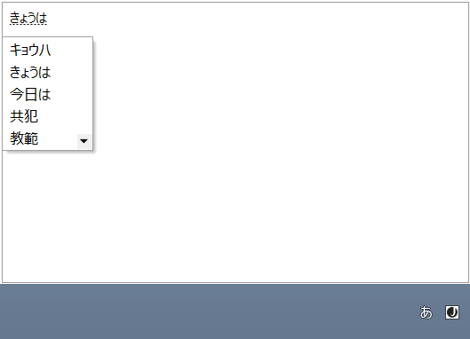
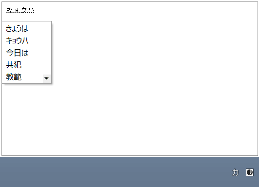

////

|metadata|
{
    "name": "xamrichtexteditor-ime-support",
    "tags": ["Localization"],
    "controlName": ["xamRichTextEditor"],
    "guid": "75e54d25-d853-49e2-a33c-9c3738dbd8ce",  
    "buildFlags": [],
    "createdOn": "2016-05-25T18:21:58.58131Z"
}
|metadata|
////

= IME Support (xamRichTextEditor)

== Topic Overview

=== Purpose

This topic explains the input method support of the control.

=== Required background

The following topics are prerequisites to understanding this topic:

[options="header", cols="a,a"]
|====
|Topic|Purpose

| link:xamrichtexteditor-features-overview.html[Features Overview]
|Provides an overview of the features of the control.

|====

== IME Support

=== IME support summary

The  _xamRichTextEditor_   control supports OS native language input directly in the editor. If you have installed an Asian language input method on your system, the  _xamRichTextEditor_   controls will display input method compositions and candidate lists directly in the control’s editing area, and immediately re-flow surrounding text as the composition changes.

The following screenshot shows an active Japanese language input composition in the  _xamRichTextEditor_   using Hiragana as well as the dropdown list of candidates for the current composition:

The following screenshot shows an active Japanese language input composition in the  _xamRichTextEditor_   using Katakana as well as the dropdown list of candidates for the current composition:

== Related Content

=== Topics

The following topics provide additional information related to this topic.

[options="header", cols="a,a"]
|====
|Topic|Purpose

| link:xamrichtexteditor-configuring-xamrichtexteditor.html[Configuring xamRichTextEditor]
|The topics in this section provide additional information about configuring the control.

|====