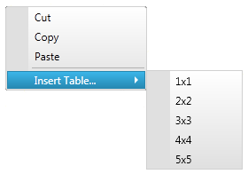

////

|metadata|
{
    "name": "xamrichtexteditor-managing-context-menu",
    "tags": ["Editing","How Do I","Layouts"],
    "controlName": ["xamRichTextEditor"],
    "guid": "8961a6ee-2855-4f8d-afb7-b0927f450ca1",  
    "buildFlags": [],
    "createdOn": "2016-05-25T18:21:58.5563083Z"
}
|metadata|
////

= Managing the Context Menu (xamRichTextEditor)

== Topic Overview

=== Purpose

This topic explains how to manage the context menu of the link:{ApiPlatform}controls.editors.xamrichtexteditor.v{ProductVersion}~infragistics.controls.editors.xamrichtexteditor.html[ _xamRichTextEditor_  ]™.

=== Required background

The following topics are prerequisites to understanding this topic:

[options="header", cols="a,a"]
|====
|Topic|Purpose

| link:xamrichtexteditor-features-overview.html[Features Overview]
|This topic provides an overview of the features supported by the _xamRichTextEditor_ control.

| link:xamrichtexteditor-content-structure.html[Content Structure]
|This topic explains the document’s content logical structure you can use to edit the contents in the _xamRichTextEditor_ programmatically.

| link:xamrichtexteditor-adding-to-your-page.html[Adding xamRichTextEditor to Your Page]
|This topic provides detailed instructions to help you get up and running as quickly as possible with the _xamRichTextEditor_ .

|====

=== In this topic

This topic contains the following sections:

* <<_Ref368490243,Introduction>>
* <<_Ref368490549,Customizing the Context menu>>
* <<_Ref368490553,Related Content>>

[[_Ref368490243]]
== Introduction

=== Context menu summary

The  _xamRichTextEditor_   control supports a context menu allowing users to perform clipboard operations and create tables. You can customize the content of the context menu or even hide it, which is discussed later in this topic.

The following screen shot shows an opened  _xamRichTextEditor’s_   context menu:

[[_Ref368490549]]
== Customizing the Context menu

=== Overview

The  _xamRichTexEditor_   exposes a cancelable event called link:{ApiPlatform}controls.editors.xamrichtexteditor.v{ProductVersion}~infragistics.controls.editors.xamrichtexteditor~contextmenuopening_ev.html[ContextMenuOpening] used to prevent the context menu from showing or to customize the content of the context menu. In either case, you must hook an event handler to the `ContextMenuOpening` event and obtain the link:{ApiPlatform}controls.editors.xamrichtexteditor.v{ProductVersion}~infragistics.controls.editors.contextmenuopeningeventargs.html[ContextMenuOpeningEventArgs] argument provided to the event handler. You can also attach an event handler to the link:{ApiPlatform}controls.editors.xamrichtexteditor.v{ProductVersion}~infragistics.controls.editors.xamrichtexteditor~contextmenuclosing_ev.html[ContextMenuClosing] event to be notified when the context menu closes.

=== Property settings

The following table maps the desired behavior to its respective property settings.

[options="header", cols="a,a,a"]
|====
|In order to:|Use this property/collection:|And:

|Prevent the context menu from showing
| link:{ApiPlatform}controls.editors.xamrichtexteditor.v{ProductVersion}~infragistics.controls.editors.contextmenuopeningeventargs~cancel.html[ContextMenuOpeningEventArgs.Cancel]
|Set it to true

|Change the content of the context menu
| link:{ApiPlatform}controls.editors.xamrichtexteditor.v{ProductVersion}~infragistics.controls.editors.contextmenuopeningeventargs~contextmenu.html[ContextMenuOpeningEventArgs.ContextMenu]
|Edit the link:http://msdn.microsoft.com/query/dev10.query?appId=Dev10IDEF1&l=EN-US&k=k(System.Windows.Controls.ItemsControl.Items)&rd=true[Items] collection (add/remove/edit link:{ApiPlatform}controls.menus.xammenu.v{ProductVersion}~infragistics.controls.menus.xammenuitem.html[XamMenuItem]s)

|====

[[_Ref368490553]]
== Related Content

=== Topics

The following topics provide additional information related to this topic.

[options="header", cols="a,a"]
|====
|Topic|Purpose

| link:xamrichtexteditor-configuring-overview.html[Configuring xamRichTextEditor Overview]
|This topic explains how to configure several useful content editing features of the _xamRichTextEditor_ control.

| link:xammenu-adding-and-removing-items.html[Adding and Removing Items]
|This topic describes how you can add or remove xamMenuItems.

|====