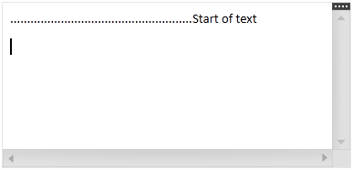

////

|metadata|
{
    "name": "xamrichtexteditor-managing-tab-stops",
    "tags": ["Editing","How Do I"],
    "controlName": ["xamRichTextEditor"],
    "guid": "eeb6a957-34f9-4635-ba7e-25ec2c9a7e29",  
    "buildFlags": [],
    "createdOn": "2016-05-25T18:21:58.563309Z"
}
|metadata|
////

= Managing Tab Stops (xamRichTextEditor)

== Topic Overview

=== Purpose

This topic explains how to use the link:{ApiPlatform}controls.editors.xamrichtexteditor.v{ProductVersion}~infragistics.controls.editors.xamrichtexteditor.html[ _xamRichTextEditor_  ]™ to manage tab stops.

=== Required background

The following topics are prerequisites to understanding this topic:

[options="header", cols="a,a"]
|====
|Topic|Purpose

| link:xamrichtexteditor-features-overview.html[Features Overview]
|This topic provides an overview of the features supported by the _xamRichTextEditor_ control.

| link:xamrichtexteditor-content-structure.html[Content Structure]
|This topic explains the document’s content logical structure you can use to edit the contents in the _xamRichTextEditor_ programmatically.

| link:xamrichtexteditor-adding-to-your-page.html[Adding xamRichTextEditor to Your Page]
|This topic provides detailed instructions to help you get up and running as quickly as possible with the _xamRichTextEditor_ .

|====

=== In this topic

This topic contains the following sections:

* <<_Ref368490243,Introduction>>
* <<_Ref368490549,Defining Tab Stops>>
* <<_Ref368490553,Related Content>>

[[_Ref368490243]]
== Introduction

=== Context menu summary

The  _xamRichTextEditor_   control supports tab stops for each paragraph individually and uses them to specify the locations where the Caret stops after the user presses the Tab key. This way the user may achieve content alignment in single and/or multiple paragraphs.

You can define tab stops by invoking the link:{ApiPlatform}documents.richtextdocument.v{ProductVersion}~infragistics.documents.richtext.tabstopcollection~addtab.html[AddTab] method of the link:{ApiPlatform}documents.richtextdocument.v{ProductVersion}~infragistics.documents.richtext.paragraphsettings~tabstops.html[TabStops] collection of each link:{ApiPlatform}documents.richtextdocument.v{ProductVersion}~infragistics.documents.richtext.paragraphnode~settings.html[ParagraphNode.Settings]. This collection also has methods for removing and obtaining tab stops.

[[_Ref368490549]]
== Defining Tab Stops

=== Overview

Tab stops are defined by three key parameters:

* the offset from the start of the line where the tab stop should occur
* the alignment of the content relative to the tab stops’ offset
* the characters used to fill the leading space before the tab stop offset

You can customize the tab stops with several different content alignments and various characters fills for the content’s leading space, which is listed in the following table.

=== Property settings

The following table maps the desired configuration to its respective argument of the `AddTab` method.

[options="header", cols="a,a,a"]
|====
|In order to:|Use this argument|And:

|Configure the tab stop offset
|`position`
|Set it to a value of type link:{ApiPlatform}documents.richtextdocument.v{ProductVersion}~infragistics.documents.richtext.extent_members.html[Extent]

|Configure the content’s alignment
|`alignment`
|Set it to a value of type link:{ApiPlatform}documents.richtextdocument.v{ProductVersion}~infragistics.documents.richtext.tabstopalignment.html[TabStopAlignment]

|Configure the content’s leading characters
|`leader`
|Set it to a value of type link:{ApiPlatform}documents.richtextdocument.v{ProductVersion}~infragistics.documents.richtext.tabstopleader.html[TabStopLeader]

|====

=== Code example

The following code snippet shows how to set a tab stop with 200 pixels offset, start tab stop alignment and a dot used for the leading fill character:

*In C#:*

[source,csharp]
----
ParagraphSettings ps = paragraphNode.Settings;
ps.TabStops.AddTab(
    new Extent(200, ExtentUnitType.LogicalPixels),
    TabStopAlignment.Start,
    TabStopLeader.Dot);
----

*In Visual Basic:*

[source,vb]
----
Dim ps As ParagraphSettings = paragraphNode.Settings
ps.TabStops.AddTab( _
    New Extent(200, ExtentUnitType.LogicalPixels), _
    TabStopAlignment.Start, _
    TabStopLeader.Dot)
----

The following screenshot shows the  _xamRichTextEditor_   with a 200 pixels tab stop defined in the first paragraph. The leading characters of the tab stop is DOT and it is filling the 200 pixels before the text:

[[_Ref368490553]]
== Related Content

=== Topics

The following topic provides additional information related to this topic.

[options="header", cols="a,a"]
|====
|Topic|Purpose

| link:xamrichtexteditor-configuring-overview.html[Configuring xamRichTextEditor Overview]
|This topic explains how to configure several useful content editing features of the _xamRichTextEditor_ control.

|====