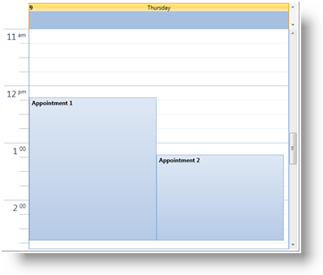

////
|metadata|
{
    "name": "xamschedule-getting-started",
    "controlName": ["xamSchedule"],
    "tags": ["Getting Started","How Do I","Scheduling"],
    "guid": "4b32ea6a-5ba3-40f3-b88b-897bb1f1e1e6",
    "buildFlags": [],
    "createdOn": "2016-05-25T18:21:58.6443227Z"
}
|metadata|
////

= Adding xamSchedule to Your Page

== Before You Begin

XamSchedule allows you to show and edit schedule data. This data consists of different types of link:{ApiPlatform}controls.schedules{ApiVersion}~infragistics.controls.schedules.activitybase.html[activities] ( link:{ApiPlatform}controls.schedules{ApiVersion}~infragistics.controls.schedules.appointment.html[appointments], in this walk-through) and every activity has its owning resource and owning calendar. In order to show the appointments in the view ( link:{ApiPlatform}controls.schedules{ApiVersion}~infragistics.controls.schedules.xamdayview.html[dayView] control is used in the code below) a link:{ApiPlatform}controls.schedules{ApiVersion}~infragistics.controls.schedules.listscheduledataconnector.html[ListScheduleDataConnector] is used to populate the link:{ApiPlatform}controls.schedules{ApiVersion}~infragistics.controls.schedules.xamscheduledatamanager.html[XamScheduleDataManager] with data.

== What You Will Accomplish

You will learn how to define xamSchedule control and its data manager in Procedural Code.

== Follow these Steps

[start=1]
. Create a Microsoft® {PlatformName}® page.

[start=2]
. Add the following references to your project in Solution Explorer:

** {ApiPlatform}{DllVersion}dll
** {ApiPlatform}Controls.Schedules.{DllVersion}dll
** {ApiPlatform}Controls.SchedulesDialogs.{DllVersion}dll

[start=3]
. Create a page and add the namespace declaration for xamSchedule.
+
*In XAML:*
+
[source,xaml]
----
xmlns:ig="http://schemas.infragistics.com/xaml"
----
+
*In Visual Basic:*
+
[source,vb]
----
Imports Infragistics.Controls.Schedules
----
+
*In C#:*
+
[source,csharp]
----
using Infragistics.Controls.Schedules;
----

[start=4]
. In the XAML page find the main Grid tag and name it "PageRoot" so you can access it from code-behind.
+
*In XAML:*
+
[source,xaml]
----
<Grid Name="PageRoot"> 
</Grid>
----

[start=5]
. Create a resource and a calendar in the code-behind:
+
*In Visual Basic:*
+
[source,vb]
----
Dim resources As New ObservableCollection(Of Resource)()
Dim resAmanda As New Resource() With { _
        Key .Id = "own1", _
        Key .Name = "Amanda" _
}
resources.Add(resAmanda)
Dim calendars As New ObservableCollection(Of ResourceCalendar)()
Dim calAmanda As New ResourceCalendar() With { _
        Key .Id = "cal1", _
        Key .OwningResourceId = "own1" _
}
calendars.Add(calAmanda)
----
+
*In C#:*
+
[source,csharp]
----
ObservableCollection<Resource> resources =
    new ObservableCollection<Resource>();
Resource resAmanda = new Resource() { Id = "own1", Name = "Amanda" };
resources.Add(resAmanda);
ObservableCollection<ResourceCalendar> calendars =
    new ObservableCollection<ResourceCalendar>(); 
ResourceCalendar calAmanda = new ResourceCalendar()
{
    Id = "cal1",
    OwningResourceId = "own1"
};
calendars.Add(calAmanda);
----
+
Note that the owning resource id of the calendar is the same as the id of the resource.

[start=6]
. Create a list of appointments with two items inside:
+
*In Visual Basic:*
+
[source,vb]
----
Dim appointments As New ObservableCollection(Of Appointment)()
        ' Convert the date to universal time,
        ' because a time zone is not set in this snippet 
Dim app1 As New Appointment() With { _
        Key .Id = "t1", _
        Key .OwningResourceId = "own1", _
        Key .OwningCalendarId = "cal1", _
        Key .Subject = "Appointment 1", _
        Key .Description = "My first appointment", _
        Key .Start = DateTime.Today.AddHours(9).AddMinutes(12).
            ToUniversalTime(), _
        Key .[End] = DateTime.Today.AddHours(11).AddMinutes(42).
            ToUniversalTime() _
}
appointments.Add(app1)
        ' Convert the date to universal time,
        ' because a time zone is not set in this snippet    
Dim app2 As New Appointment() With { _
        Key .Id = "t2", _
        Key .OwningResourceId = "own1", _
        Key .OwningCalendarId = "cal1", _
        Key .Subject = "Appointment 2", _
        Key .Description = "My second appointment", _
        Key .Start = DateTime.Today.AddHours(10).AddMinutes(12).
            ToUniversalTime(), _
        Key .[End] = DateTime.Today.AddHours(11).AddMinutes(42).
            ToUniversalTime() _
}
appointments.Add(app2)
----
+
*In C#:*
+
[source,csharp]
----
ObservableCollection<Appointment> appointments =
    new ObservableCollection<Appointment>(); 
Appointment app1 = new Appointment()
{
    Id = "t1",
    OwningResourceId = "own1",
    OwningCalendarId = "cal1",
    Subject = "Appointment 1",
    Description = "My first appointment",
    // Convert the date to universal time, because a time zone is not set
    // in this snippet    
    Start = DateTime.Today.AddHours(9).AddMinutes(12).ToUniversalTime(),
    End = DateTime.Today.AddHours(11).AddMinutes(42).ToUniversalTime()
};
appointments.Add(app1);
Appointment app2 = new Appointment()
{
    Id = "t2",
    OwningResourceId = "own1",
    OwningCalendarId = "cal1",
    Subject = "Appointment 2",
    Description = "My second appointment",
    // Convert the date to universal time, because a time zone is not set
    // in this snippet    
    Start = DateTime.Today.AddHours(10).AddMinutes(12).ToUniversalTime(),
    End = DateTime.Today.AddHours(11).AddMinutes(42).ToUniversalTime()
};
appointments.Add(app2);
----
+
Note that the two appointments' resource id and the calendar id are the same as the resource and calendar defined in the previous step.

[start=7]
. Find the main grid in the XAML page or the page contructor if you are going to use the code-behind and add create a ListScheduleDataConnector. Attach the list of resources, calendars and appointments to it:
+
*In XAML:*
+
[source,xaml]
----
<ig:ListScheduleDataConnector x:Name="dataConnector" />
----
+
*In Visual Basic:*
+
[source,vb]
----
Dim dataConnector As New ListScheduleDataConnector()
dataConnector.ResourceItemsSource = resources
dataConnector.ResourceCalendarItemsSource = calendars
dataConnector.AppointmentItemsSource = appointments
----
+
*In C#:*
+
[source,csharp]
----
ListScheduleDataConnector dataConnector =
    new ListScheduleDataConnector();
dataConnector.ResourceItemsSource = resources;
dataConnector.ResourceCalendarItemsSource = calendars;
dataConnector.AppointmentItemsSource = appointments;
----

[start=8]
. Create the xamScheduleDataManager and bind the DataConnector property to the data connector. Create one link:{ApiPlatform}controls.schedules{ApiVersion}~infragistics.controls.schedules.calendargroup.html[CalendarGroup] in the collection CalendarGroups. link:{ApiPlatform}controls.schedules{ApiVersion}~infragistics.controls.schedules.calendargroup~initialcalendarids.html[InitialCalendarIds] property can contain comma separated values specifying the calendars to be shown. The format is owningResourceId[calendarId] or just owningResourceId if the primary calendar is the display target.
+
Ex: InitialCalendarIds=“own2, own1[cal1]”
+
*In XAML:*
+
[source,xaml]
----
<ig:XamScheduleDataManager x:Name="dataManager"
             DataConnector="{Binding ElementName=dataConnector}">
     <ig:XamScheduleDataManager.CalendarGroups>
         <ig:CalendarGroup InitialCalendarIds="own1[cal1]"/>
     </ig:XamScheduleDataManager.CalendarGroups>
</ig:XamScheduleDataManager>
----

[start=9]
. Create a calendar group and set the initial calendar:
+
*In Visual Basic:*
+
[source,vb]
----
Dim dataManager As New XamScheduleDataManager()
dataManager.DataConnector = dataConnector
Dim calGroups As CalendarGroupCollection = _
    dataManager.CalendarGroups
Dim calGroup As New CalendarGroup()
calGroup.InitialCalendarIds = "own1[cal1]"
calGroups.Add(calGroup)
----
+
*In C#:*
+
[source,csharp]
----
XamScheduleDataManager dataManager = new XamScheduleDataManager(); 
dataManager.DataConnector = dataConnector;
CalendarGroupCollection calGroups = dataManager.CalendarGroups;
CalendarGroup calGroup = new CalendarGroup();
calGroup.InitialCalendarIds = "own1[cal1]";
calGroups.Add(calGroup);
----
+
*Note:* Resources may have more than one calendars associated with them, so we are specifying which calendar is to be used. If you do not specify a calendar the primary for the current user will be used.

[start=10]
. Finally create a xamSchedule DayView, attach the data manager to it and add it to the "PageRoot" grid named in step 4:
+
*In XAML:*
+
[source,xaml]
----
<ig:XamDayView x:Name="dayView"
DataManager="{Binding ElementName=dataManager}" />
----
+
*In Visual Basic:*
+
[source,vb]
----
Dim dayView As New XamDayView()
dayView.DataManager = dataManager
Me.PageRoot.Children.Add(dayView)
----
+
*In C#:*
+
[source,csharp]
----
XamDayView dayView = new XamDayView();
dayView.DataManager = dataManager;
this.PageRoot.Children.Add(dayView);
----

[start=11]
. Save and run the application. Scroll down the view to find the appointments you just created. 
+

