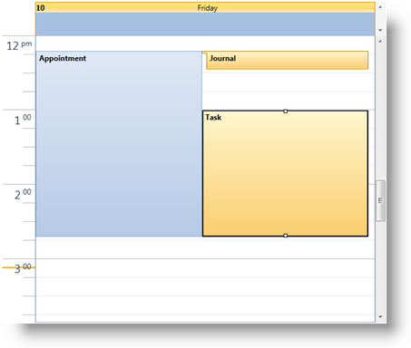

////

|metadata|
{
    "name": "xamschedule-understanding-activities",
    "controlName": ["xamSchedule"],
    "tags": ["Getting Started","How Do I","Scheduling"],
    "guid": "d1f9e572-e286-47ae-8401-4b0340d9a379",  
    "buildFlags": [],
    "createdOn": "2016-05-25T18:21:58.6373216Z"
}
|metadata|
////

= About Activities

Activity entities are a core concept in a scheduling application. There are different types of activities, all derived from the link:{ApiPlatform}controls.schedules{ApiVersion}~infragistics.controls.schedules.activitybase.html[ActivityBase] class and therefore having common properties such as link:{ApiPlatform}controls.schedules{ApiVersion}~infragistics.controls.schedules.activitybase~subject.html[Subject], link:{ApiPlatform}controls.schedules{ApiVersion}~infragistics.controls.schedules.activitybase~start.html[Start], link:{ApiPlatform}controls.schedules{ApiVersion}~infragistics.controls.schedules.activitybase~end.html[End], link:{ApiPlatform}controls.schedules{ApiVersion}~infragistics.controls.schedules.activitybase~owningcalendarid.html[OwningCalendarId] and link:{ApiPlatform}controls.schedules{ApiVersion}~infragistics.controls.schedules.activitybase~owningresourceid.html[OwningResourceId]. The Start and End are defined as UTC values and may either be fixed times or floating.

ActivityBase also has settings related to recurrence, reminder and time zones as well as properties to control whether the activity is displayed (IsVisible) and whether the activity is modifiable (IsLocked).

XamSchedule supports three types of activities:

[start=1]
. link:{ApiPlatform}controls.schedules{ApiVersion}~infragistics.controls.schedules.appointment.html[Appointment] – This is the most commonly used entity and represents a scheduled amount of time on a calendar, such as a meeting or event. XamSchedule provides built-in support for displaying a dialog for creating or modifying an Appointment.
[start=2]
. link:{ApiPlatform}controls.schedules{ApiVersion}~infragistics.controls.schedules.task.html[Task] entity – Represents a task or a to-do to be performed with a link:{ApiPlatform}controls.schedules{ApiVersion}~infragistics.controls.schedules.task~percentcomplete.html[PercentComplete] setting.
[start=3]
. link:{ApiPlatform}controls.schedules{ApiVersion}~infragistics.controls.schedules.journal.html[Journal] entity – Represents a journal entry or a note. 

== Related Topics

link:xamschedule-understanding-data-connector.html[About the Data Connector]

link:xamschedule-understanding-data-manager.html[About the Data Manager]

link:xamschedule-understanding-views.html[About the xamSchedule views]

link:xamschedule-understanding-resources-calendars.html[About Resources and Calendars]