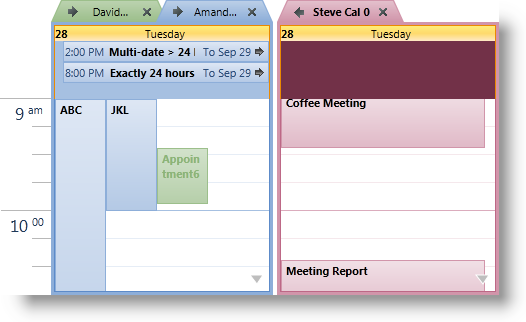
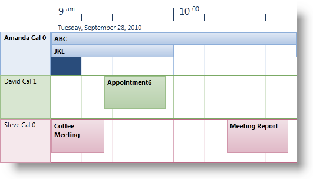
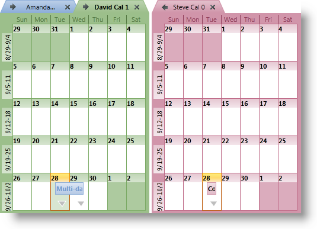
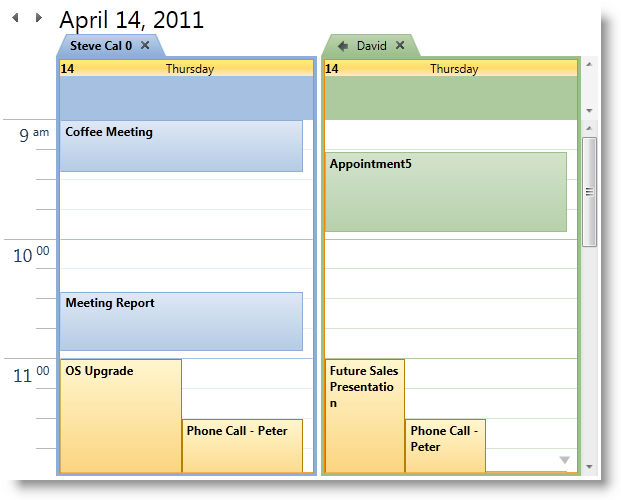
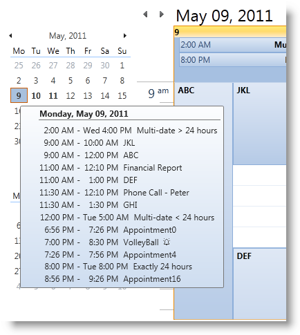

////
|metadata|
{
    "name": "xamschedule-understanding-views",
    "controlName": ["xamSchedule"],
    "tags": ["Scheduling"],
    "guid": "47db0c8b-16d3-491c-9b17-dfda2a8bc490",
    "buildFlags": [],
    "createdOn": "2016-05-25T18:21:58.6253206Z"
}
|metadata|
////

= About the xamSchedule views

This topic presents the views supported by the xamSchedule control:

* xamDayView
* xamScheduleView
* xamMonthView
* xamOutlookCalendarView
* xamDateNavigator

== Introduction

The xamSchedule family of controls provides a set of views visualizing Calendar activities from different perspectives, like link:{ApiPlatform}controls.schedules.v{ProductVersion}~infragistics.controls.schedules.xamdayview.html[Day View], link:{ApiPlatform}controls.schedules.v{ProductVersion}~infragistics.controls.schedules.xammonthview.html[Month View], and others. Each view can be attached to a separate link:{ApiPlatform}controls.schedules.v{ProductVersion}~infragistics.controls.schedules.xamscheduledatamanager.html[Data Manager] or many views can share one single Data Manager to present the same activities in different ways. The views allow customization of how activities are visualized, so each view has some specifics of its own. In addition to that, the user can interact with and manipulate the activities through the user interface (UI) of each view.

== Description of xamSchedule Views

Following is the descriptions of the views supported by the xamSchedule control.

* link:{ApiPlatform}controls.schedules.v{ProductVersion}~infragistics.controls.schedules.xamdayview.html[xamDayView] – presents an hour-based view of the calendar, in which the hours of the day are listed vertically going from top to bottom and the Activities are arranged horizontally.The “building blocks” of this view are the time-slot segments; these segments have equal length which is specified by the developer. Activities for one or more days can be presented (based on the entries in the VisibleDates collection). (Figure 1)
+

+
Figure 1: Sample implementation of the xamDayView control

* link:{ApiPlatform}controls.schedules.v{ProductVersion}~infragistics.controls.schedules.xamscheduleview.html[xamScheduleView] – presents activities for one or more days (based on the entries in the VisibleDates collection) in a continuous horizontal display organizing them vertically by resource and calendar. (Figure 2)
+

+
Figure 2: Sample implementation of the xamScheduleView control

* link:{ApiPlatform}controls.schedules.v{ProductVersion}~infragistics.controls.schedules.xammonthview.html[xamMonthView] - presents a week-based view of the calendar, in which the weeks of the month are arranged vertically going from top to bottom and the days of the week are arranged horizontally. Activities for up to 6 weeks can be visible based on the entries in the VisibleDates collection. (Figure 3)
+

+
Figure 3: Sample implementation of the xamMonthView control

* link:{ApiPlatform}controls.schedules.v{ProductVersion}~infragistics.controls.schedules.xamoutlookcalendarview.html[xamOutlookCalendarView] - this view combines the previous three views into one easy-to-use shell allowing the user to switch and navigate views using the integrated navigation header. (Figure 4)
+

+
Figure 4: Sample implementation of the xamOutlookCalendarView control

* link:{ApiPlatform}controls.schedules.v{ProductVersion}~infragistics.controls.schedules.xamdatenavigator.html[xamDateNavigator] - this is a special type of view that is often used in conjunction with the xamOutlookCalendarView control (This is the same functionality as provided by Outlook’s calendar navigator located in the left of the Outlook’s Calendar view). The DateNavigator can be also used as a standalone view and in this case it can be configured to display information about each activity in the associated DataManager in a tooltip that appears when the mouse is hovered over a day. (Figure 5)
+

+
Figure 5: Sample combined implementation of the xamOutlookCalendarView and xamDateNavigator

== Related Topics

link:xamschedule-understanding-data-connector.html[About the Data Connector]

link:xamschedule-understanding-data-manager.html[About the Data Manager]

link:xamschedule-understanding-resources-calendars.html[About Resources and Calendars]

link:xamschedule-understanding-activities.html[About Activities]