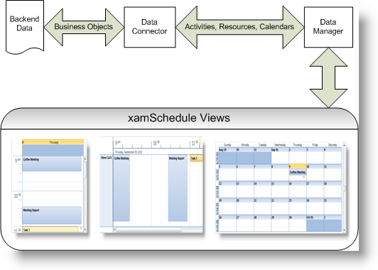

////
|metadata|
{
    "name": "xamschedule-understanding",
    "controlName": ["xamSchedule"],
    "tags": ["Scheduling"],
    "guid": "fd5a7a5e-0c35-4011-9384-10dc943dc3a2",
    "buildFlags": [],
    "createdOn": "2016-05-25T18:21:58.6063493Z"
}
|metadata|
////

= Understanding xamSchedule

XamSchedule is a scheduling solution which replicates much of the Microsoft™ Outlook™ calendar functionality. It allows you to display activity information in different views with little code. It supports displaying multiple resources with multiple calendars, thus providing a convenient method for comparing different schedules.

The rich UI allows end users to resize, drag, create and edit activities directly within the view. Configurable dialogs are used to specify basic activity properties such as start/end times and advanced settings as recurrences, reminders and time zones.

The solution contains a family of views (UI elements), a data manager control and data connectors.

* *Views:*
+
There are several views in the solution: link:{ApiPlatform}controls.schedules{ApiVersion}~infragistics.controls.schedules.xamdayview.html[xamDayView], link:{ApiPlatform}controls.schedules{ApiVersion}~infragistics.controls.schedules.xamscheduleview.html[xamScheduleView] and link:{ApiPlatform}controls.schedules{ApiVersion}~infragistics.controls.schedules.xammonthview.html[xamMonthView]. They allow the user to display and manipulate activities (such as link:{ApiPlatform}controls.schedules{ApiVersion}~infragistics.controls.schedules.appointment.html[Appointments], link:{ApiPlatform}controls.schedules{ApiVersion}~infragistics.controls.schedules.task.html[Tasks] and link:{ApiPlatform}controls.schedules{ApiVersion}~infragistics.controls.schedules.journal.html[Journals]) that are associated with certain calendars of one or more resources.

* *link:{ApiPlatform}controls.schedules{ApiVersion}~infragistics.controls.schedules.xamscheduledatamanager.html[DataManager]:*
+
This object provides the data (resources, calendars and activities) to views, as well as exposes properties that let you provide various settings, including working days and hours and settings that control user interaction.

* *Data Connectors:*
+
A data connector is used to bind to your schedule data (resources, calendars and activities). The data connector is then associated with the data manager, which will provide a central point through which each of the view controls can access the data.

*General overview of the xamSchedule architecture:*

link:xamschedule-understanding-data-connector.html[About the Data Connector]

link:xamschedule-understanding-data-manager.html[About the Data Manager]

link:xamschedule-understanding-views.html[About the xamSchedule views]

link:xamschedule-understanding-resources-calendars.html[About Resources and Calendars]

link:xamschedule-understanding-activities.html[About Activities]