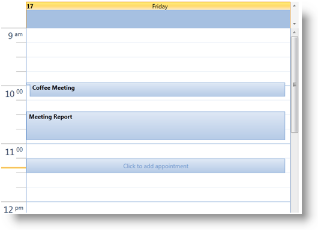

////
|metadata|
{
    "name": "xamschedule-using-activities-appointments",
    "controlName": ["xamSchedule"],
    "tags": ["Appointments","Data Binding","Data Presentation","Scheduling"],
    "guid": "c727d60b-800b-49a4-a5c3-821a13693a97",
    "buildFlags": [],
    "createdOn": "2016-05-25T18:21:58.7923218Z"
}
|metadata|
////

= Appointments

The link:{ApiPlatform}controls.schedules{ApiVersion}~infragistics.controls.schedules.appointment.html[Appointment] entity is a core concept in a scheduling application, containing all of the relevant information about an activity that will occur during some block of time.

== Creating

The creation of an appointment entity can happen in three different ways:

When binding the link:{ApiPlatform}controls.schedules{ApiVersion}~infragistics.controls.schedules.listscheduledataconnector~appointmentitemssource.html[AppointmentItemsSource] of a link:{ApiPlatform}controls.schedules{ApiVersion}~infragistics.controls.schedules.listscheduledataconnector.html[ListScheduleDataConnector] to a collection of Appointment instances, a developer can create an appointment in code or xaml and add it to the list which has been set as the AppointmentItemsSource on a ListScheduleDataConnector.

*In XAML:*

----
<ig:Appointment
    Id="t1"
    OwningCalendarId="cal1"
    OwningResourceId="own1"
    Start="9/9/2010 9:12:00"
    End="9/9/2010 11:42:00" 
    Subject="Appointment 1"
    Description="My first Appointment in XAML"/>
----

*In Visual Basic:*

----
Dim appointment = New Infragistics.Controls.Schedules.Appointment() With { _
    .Id = "t1", _
    .OwningCalendarId = "cal1", _
    .OwningResourceId = "own1", _
    .Start = New DateTime(2010, 9, 9).AddHours(9).AddMinutes(12).ToUniversalTime(), _
    .[End] = New DateTime(2010, 9, 9).AddHours(9).AddMinutes(42).ToUniversalTime(), _
    .Subject = "Appointment 1", _
    .Description = "My first Appointment in XAML" _
}
----

*In C#:*

----
var appointment = new Infragistics.Controls.Schedules.Appointment 
{
    Id = "t1",
    OwningCalendarId = "cal1",
    OwningResourceId = "own1",
    Start = new DateTime(2010,9,9).AddHours(9).AddMinutes(12).ToUniversalTime(),
    End = new DateTime(2010,9,9).AddHours(9).AddMinutes(42).ToUniversalTime(),
    Subject = "Appointment 1",
    Description = "My first Appointment in XAML"
};
----

*Note:* Appointment start/end times are specified as UTC times. For more information see link:xamschedule-using-timezone-support.html[TimeZone Support].

The second scenario occurs when the developer uses his/her own entities and binds an entity to the ListScheduleDataConnector using its mapping capabilities. Then internally the ListScheduleDataConnector creates the Appointment entities based on the supplied data from the custom entities and the mapping information.

The third option is available for the end user to create an appointment in the UI, with either the “Click to add” option by selecting a range and starting to type the link:{ApiPlatform}controls.schedules{ApiVersion}~infragistics.controls.schedules.activitybase~subject.html[Subject] of the appointment, or by double-clicking on a timeslot and using the Appointment dialog.

== Modifying

The UI allows the end user to modify an Appointment entity using a dialog or with "in-place" editing of the Subject, dragging of the Start/End placeholders or dragging of the entire Appointment representation. It also provides the ability to delete an activity either via the activity dialog or by selecting the activity and pressing the Delete key. In these cases the changes are passed from the UI to the link:{ApiPlatform}controls.schedules{ApiVersion}~infragistics.controls.schedules.xamscheduledatamanager.html[DataManager]. The DataManager then communicates with the DataConnector and it in turn applies the changes to the data source.

*Note:*

It is possible to provide your own activity editing dialog by providing a custom link:{ApiPlatform}controls.schedules{ApiVersion}~infragistics.controls.schedules.xamscheduledatamanager~dialogfactory.html[DialogFactory] on the XamScheduleDataManager.

*Note:*

The link:{ApiPlatform}controls.schedules{ApiVersion}~infragistics.controls.schedules.schedulesettings.html[ScheduleSettings] $$->$$  link:{ApiPlatform}controls.schedules{ApiVersion}~infragistics.controls.schedules.schedulesettings~appointmentsettings.html[AppointmentSettings] property may be used to restrict the types of changes that the end user may make.

== Visualization

The XamSchedule family supports several view controls, but in general a visual representation of one appointment is a rectangle filling the block of time between the Start and End of the appointment. Inside this rectangle the Subject property is displayed. In case the block is too small, an “insertion” graphic element is added – see the “Coffee Meeting” appointment in the picture above.

As a representation of the link:{ApiPlatform}controls.schedules{ApiVersion}~infragistics.controls.schedules.activitybase.html[ActivityBase] object, the Appointment supports settings such as Reminders, Time Zone support and recurrence capabilities. For more information see the related topics section below.

== Related Topics

link:xamschedule-using-activities-tzna.html[What is a Time Zone Neutral Activity ?]

link:xamschedule-using-activities-tasks.html[Tasks]

link:xamschedule-using-activities-journals.html[Journals]

link:xamschedule-using-activities-recurrent.html[Recurrent Activities]

link:xamschedule-using-activities-reminders.html[Reminders]