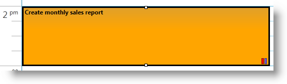
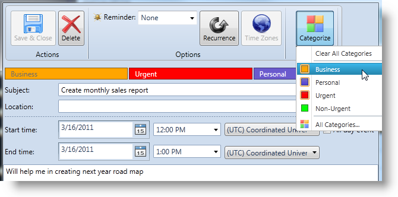
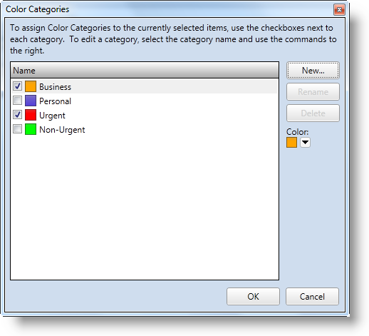

////

|metadata|
{
    "name": "xamschedule-using-activities-categories",
    "controlName": ["xamSchedule"],
    "tags": ["Data Presentation","Scheduling"],
    "guid": "4301b9c2-6108-4824-abc8-5e6cb5a5523d",  
    "buildFlags": [],
    "createdOn": "2016-05-25T18:21:58.9203672Z"
}
|metadata|
////

= Activity Categories

Activity categories are color codes used to distinguish visually (through different colors) the activities various types displayed in a calendar. More precisely, activity categories are defined by name, color, and description. When a category is assigned to an activity, the activity is highlighted with the color corresponding to that category.

More than one category can be assigned to an activity. In this case, one of the categories becomes a *primary category* which highlights the appointment and the others remain *secondary categories* represented by small color rectangles added in the lower-right corner of the activity. The primeness of a category is determined automatically by the order in which the categories are assigned to the appointment: the category that is assigned last becomes the primary category for that appointment.

For example, let’s say there are three categories assigned to an activity with the following colors and in the following order: blue, red, and orange (assigned last = the primary category). The primary category will highlight the activity in orange, and the two secondary categories will be represented, respectively, by red and blue rectangles.

====== Figure 1: An appointment always adopts the color of its primary activity category.

In a calendar, multiple sets of categories can be used. For example, you can use different categories for business and personal appointments.

== Defining Activity Categories

The allowed activity categories are defined in an link:{ApiPlatform}controls.schedules.v{ProductVersion}~infragistics.controls.schedules.activitycategorycollection.html[ActivityCategoryCollection]. To define the allowed categories, bind the link:{ApiPlatform}controls.schedules.v{ProductVersion}~infragistics.controls.schedules.listscheduledataconnector~activitycategoryitemssource.html[ActivityCategoryItemsSource] property of the data connector to a collection of ActivityCategoryCollection type.

The following code snippet demonstrates how to define the category items:

*In XAML:*

----
<Page.Resources>
    <ig:ActivityCategoryCollection x:Key="CategoryDataSource">
        <ig:ActivityCategory 
            CategoryName="My custom category"
            Description="Description for my custom category"
            Color="Cyan">
        </ig:ActivityCategory>
    </ig:ActivityCategoryCollection>
</Page.Resources>
…
<ig:XamScheduleDataManager
    x:Name="dataManager" CurrentUserId="own1">
    <ig:XamScheduleDataManager.DataConnector>
        <ig:ListScheduleDataConnector
            x:Name="dataConnector"
            ActivityCategoryItemsSource=
                "{Binding Source={StaticResource CategoryDataSource}}">
        </ig:ListScheduleDataConnector>
    </ig:XamScheduleDataManager.DataConnector>
</ig:XamScheduleDataManager>
----

*In Visual Basic:*

----
Me.dataConnector.ActivityCategoryItemsSource = _
    New ActivityCategoryCollection() From { _
        New ActivityCategory() With { _
                Key .CategoryName = "My custom category", _
                Key .Description = "Description for my custom category", _
                Key .Color = Colors.Cyan _
        } _
}
----

*In C#:*

----
this.dataConnector.ActivityCategoryItemsSource = new ActivityCategoryCollection() 
{
    new ActivityCategory() {
        CategoryName = "My custom category", 
        Description = "Description for my custom category",
        Color = Colors.Cyan
    }
};
----

== Modifying Assigned Categories

The easiest way the user can modify the assigned categories is to double-click on the desired activity and then click the Categorize dropdown button and select or unselect some categories. (Figure 2 below) The Clear All Categories option removes all categories set on the selected activity.

====== Figure 2: Selecting a category from the Categorize drop-down button

== Regular Categories vs. Custom Categories

Choosing the All Categories option in the Categorize drop-down button displays the Color Categories dialog. The user may use this dialog to set/remove the regular categories on the selected activity and to define new categories if this is allowed by the link:{ApiPlatform}controls.schedules.v{ProductVersion}~infragistics.controls.schedules.schedulesettings~allowcustomizedcategories.html[AllowCustomizedCategories] property in the link:{ApiPlatform}controls.schedules.v{ProductVersion}~infragistics.controls.schedules.schedulesettings.html[ScheduleSettings]. The default value of the AllowCustomizedCategories Boolean property is True.

*In XAML:*

----
<ig:XamScheduleDataManager x:Name="dataManager" CurrentUserId="own1">
  <ig:XamScheduleDataManager.Settings>
    <ig:ScheduleSettings AllowCustomizedCategories="True|>
    </ig:ScheduleSettings>
  </ig:XamScheduleDataManager.Settings>
</ig:XamScheduleDataManager>
----

If enabled, custom categories are added in the link:{ApiPlatform}controls.schedules.v{ProductVersion}~infragistics.controls.schedules.resource~customactivitycategories.html[CustomActivityCategories] collection of the resource owner of the selected activity and can be used in other activities owned by this resource. The regular categories (these you set using the categories item source property) can be used for all resource owners.

The Color Categories dialog allows the user to check/uncheck the associated categories with the selected activity. In addition custom categories can be created and later modified.

====== Figure 3: The Color Categories dialog

*Note:* The regular categories (those defined in the ActivityCategoriesItemSource property) cannot be modified from this dialog.

== Related Topics

link:xamschedule-using-activities-appointments.html[Appointments]

link:xamschedule-using-activities-tasks.html[Tasks]

link:xamschedule-using-activities-journals.html[Journals]