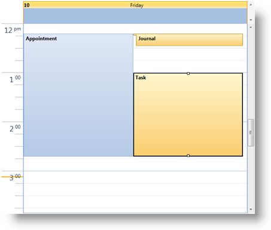

////

|metadata|
{
    "name": "xamschedule-using-activities-journals",
    "controlName": ["xamSchedule"],
    "tags": ["Data Presentation","How Do I","Scheduling"],
    "guid": "277d2ea2-64f4-4466-9610-1a8671399ba4",  
    "buildFlags": [],
    "createdOn": "2016-05-25T18:21:58.8053235Z"
}
|metadata|
////

= Journals

The link:{ApiPlatform}controls.schedules{ApiVersion}~infragistics.controls.schedules.journal.html[Journal] entity is an activity type that xamSchedule supports and is used to represent a note. Journal derives from the link:{ApiPlatform}controls.schedules{ApiVersion}~infragistics.controls.schedules.activitybase.html[ActivityBase] class and therefore inherits properties and behaviors like the other types of activities such as link:{ApiPlatform}controls.schedules{ApiVersion}~infragistics.controls.schedules.appointment.html[Appointments] and link:{ApiPlatform}controls.schedules{ApiVersion}~infragistics.controls.schedules.task.html[Tasks]. Depending on the data connector, a Journal may optionally support an link:{ApiPlatform}controls.schedules{ApiVersion}~infragistics.controls.schedules.activitybase~end.html[End] time.

*Note:* When End is not supported then the activity is treated like a 0 minute activity and resizing will not be supported.

== Creating a Journal instance

The developer can make new instances of Journal and create an IEnumerable collection of Journal entities in code or in xaml. Binding this collection to a link:{ApiPlatform}controls.schedules{ApiVersion}~infragistics.controls.schedules.listscheduledataconnector.html[ListScheduleDataConnector]'s link:{ApiPlatform}controls.schedules{ApiVersion}~infragistics.controls.schedules.listscheduledataconnector~journalitemssource.html[JournalItemsSource] property will allow the data to be transferred to the link:{ApiPlatform}controls.schedules{ApiVersion}~infragistics.controls.schedules.xamscheduledatamanager.html[XamScheduleDataManager] and then to the view.

*In XAML:*

----
<ig:Journal
    Id="j1"
    OwningCalendarId="cal1"
    OwningResourceId="own1"
    Start="9/9/2010 9:12:00"
    End="9/9/2010 10:12:00" 
    Subject="Journal 1"
    Description="My first Journal in XAML" />
----

*In Visual Basic:*

----
Dim journal = New Infragistics.Controls.Schedules.Journal() With { _
    Key .Id = "j1", _
    Key .OwningCalendarId = "cal1", _
    Key .OwningResourceId = "own1", _
    Key .Start = New DateTime(2010, 9, 9).AddHours(9).AddMinutes(12).
        ToUniversalTime(), _
    Key .[End] = New DateTime(2010, 9, 9).AddHours(10).AddMinutes(12).
        ToUniversalTime(), _
    Key .Subject = "Journal 1", _
    Key .Description = "My first Journal in XAML" _
}
----

*In C#:*

----
var journal = new Infragistics.Controls.Schedules.Journal 
{
    Id = "j1",
    OwningCalendarId = "cal1",
    OwningResourceId = "own1",
    Start = new DateTime(2010,9,9).AddHours(9).AddMinutes(12).
        ToUniversalTime(),
    End = new DateTime(2010,9,9).AddHours(10).AddMinutes(12).
        ToUniversalTime(),
    Subject = "Journal 1",
    Description = "My first journal in XAML"
};
----

*Note:* Journal start/end times are specified as UTC times. For more information see link:xamschedule-using-timezone-support.html[TimeZone Support].

The second creation scenario is when you supply a ListScheduleDataConnector or link:{ApiPlatform}controls.schedules{ApiVersion}~infragistics.controls.schedules.wcflistscheduledataconnector.html[WcfListScheduleDataConnector] with custom entities and link:{ApiPlatform}controls.schedules{ApiVersion}~infragistics.controls.schedules.listscheduledataconnector~journalpropertymappings.html[JournalPropertyMappings] . In this case, the ListScheduleDataConnector creates the Journal entities based on the supplied data and passes them to the DataManager.

== Modifying

The UI allows the end user to modify a Journal entity using a dialog or with "in-place" editing of the link:{ApiPlatform}controls.schedules{ApiVersion}~infragistics.controls.schedules.activitybase~subject.html[Subject], dragging of the Start/End placeholders (when the End time is supported) or dragging of the entire Journal representation. It also provides the ability to delete an activity either via the activity dialog or by selecting the activity and pressing the Delete key. In these cases the changes are passed from the UI to the link:{ApiPlatform}controls.schedules{ApiVersion}~infragistics.controls.schedules.xamscheduledatamanager.html[DataManager]. The DataManager then communicates with the DataConnector and it in turn applies the changes to the data source.

*Note:*

It is possible to provide your own activity editing dialog by providing a custom link:{ApiPlatform}controls.schedules{ApiVersion}~infragistics.controls.schedules.xamscheduledatamanager~dialogfactory.html[DialogFactory] on the XamScheduleDataManager.

== Visualization

As with all other activities, the visual representation of one Journal has a rectangular shape. Having a link:{ApiPlatform}controls.schedules{ApiVersion}~infragistics.controls.schedules.activitybase~start.html[Start] (and optionally an End) the block is displayed with the “insertion” graphic element at the start.

As a derived class of link:{ApiPlatform}controls.schedules{ApiVersion}~infragistics.controls.schedules.activitybase.html[ActivityBase], the Journal supports settings such as Reminders, Time Zone support and recurrence capabilities. For more information on these see the following related topics.

== Related Topics

link:xamschedule-using-activities-tzna.html[What is a Time Zone Neutral Activity ?]

link:xamschedule-using-activities-appointments.html[Appointments]

link:xamschedule-using-activities-tasks.html[Tasks]

link:xamschedule-using-activities-recurrent.html[Recurrent Activities]

link:xamschedule-using-activities-reminders.html[Reminders]