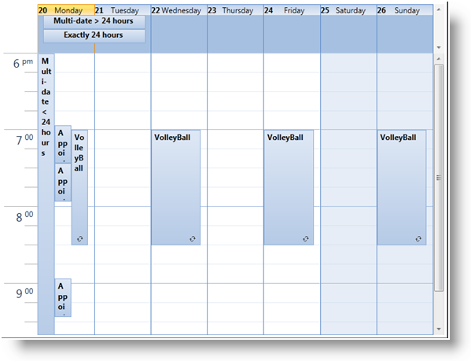

////
|metadata|
{
    "name": "xamschedule-using-activities-recurrent",
    "controlName": ["xamSchedule"],
    "tags": ["Appointments","How Do I","Recurrences","Scheduling"],
    "guid": "6d42a4f6-2b43-4d91-890a-92491e9e2797",
    "buildFlags": [],
    "createdOn": "2016-05-25T18:21:58.8123588Z"
}
|metadata|
////

= Recurrent Activities

The XamSchedule controls have built in support for recurring activities. The developer can choose from a complete set of recurrence rules and set the link:{ApiPlatform}controls.schedules{ApiVersion}~infragistics.controls.schedules.activitybase~recurrence.html[Recurrence] property of an activity to a collection of these rules. The activity then becomes a template or a root activity from which the recurring instances of the activity are created. There are several properties on the link:{ApiPlatform}controls.schedules{ApiVersion}~infragistics.controls.schedules.activitybase.html[ActivityBase] class (and therefore all ActivityBase-derived classes such as link:{ApiPlatform}controls.schedules{ApiVersion}~infragistics.controls.schedules.appointment.html[Appointment], link:{ApiPlatform}controls.schedules{ApiVersion}~infragistics.controls.schedules.journal.html[Journal] and link:{ApiPlatform}controls.schedules{ApiVersion}~infragistics.controls.schedules.task.html[Task]) that you can use to determine the role (if any) a particular ActivityBase instance plays in a recurrence:

[options="header", cols="a,a,a,a,a"]
|====
| link:{ApiPlatform}controls.schedules{ApiVersion}~infragistics.controls.schedules.activitybase.html[Activity]

| link:{ApiPlatform}controls.schedules{ApiVersion}~infragistics.controls.schedules.activitybase~recurrence.html[Recurrence]| link:{ApiPlatform}controls.schedules{ApiVersion}~infragistics.controls.schedules.activitybase~isrecurrenceroot.html[IsRecurrenceRoot]| link:{ApiPlatform}controls.schedules{ApiVersion}~infragistics.controls.schedules.activitybase~isoccurrence.html[IsOccurence]| link:{ApiPlatform}controls.schedules{ApiVersion}~infragistics.controls.schedules.activitybase~isvariance.html[IsVariance]

|Non recurring
|null
|false
|false
|false

|Recurrence root
| link:{ApiPlatform}controls.schedules{ApiVersion}~infragistics.controls.schedules.recurrencebase.html[RecurrenceBase] class
|true
|false
|false

|Occurrence
|null
|false
|true
|false

|Occurrence (modified)
|null
|false
|true
|true

|====

The UI representation of an occurrence is marked with an occurrence icon in the bottom right corner of the activity rectangle.

*Variances:*

When an occurrence is modified or deleted, it becomes a variance. To check if an activity is a variance activity, use the Activity object’s IsVariance property. Unlike occurrences which are auto-generated based on the recurrences, the variances are stored in the activity data source. The following listing describes some of the properties of the ActivityBase that are related to recurrences, occurrences and variances.

* link:{ApiPlatform}controls.schedules{ApiVersion}~infragistics.controls.schedules.activitybase~recurrence.html[Recurrence] – An instance of the DateRecurrence class that defines the recurrence rules. This applies to the root activities only. Occurrences and variances will always return null for this property.
* link:{ApiPlatform}controls.schedules{ApiVersion}~infragistics.controls.schedules.activitybase~maxoccurrencedatetime.html[MaxOccurrenceDateTime] – Applies to root activities only. Returns a date-time value that’s equal to or greater than the end time of the latest occurrence or variance that’s associated with the root activity. This is used as an optimization in the query that retrieves the recurring activities for a date range. Note that this is an optional field.
* link:{ApiPlatform}controls.schedules{ApiVersion}~infragistics.controls.schedules.activitybase~rootactivityid.html[RootActivityId] – Id of the root recurring activity that this occurrence or variance is associated with.
* link:{ApiPlatform}controls.schedules{ApiVersion}~infragistics.controls.schedules.activitybase~originaloccurrencestart.html[OriginalOccurrenceStart] and link:{ApiPlatform}controls.schedules{ApiVersion}~infragistics.controls.schedules.activitybase~originaloccurrenceend.html[OriginalOccurrenceEnd] – Indicate the original occurrence times of a variance. These are used to identify the instance of the occurrence in the series defined by the recurrence that this variance is associated with.
* link:{ApiPlatform}controls.schedules{ApiVersion}~infragistics.controls.schedules.activitybase~isoccurrencedeleted.html[IsOccurrenceDeleted] – Indicates whether the occurrence is deleted. When an occurrence is deleted, it also becomes a variance.

A recurrence can be defined through the UI (using the activity recurrence dialog) and programmatically. The following code shows how to define a recurring appointment in code:

*In Visual Basic:*
[source,vb]
----
Dim recAppointment = New Appointment() With { _
    .Id = "t1", _
    .OwningCalendarId = "cal1", _
    .OwningResourceId = "own1", _
    .Start = New DateTime(2010, 9, 9).AddHours(9).AddMinutes(12), _
    .[End] = New DateTime(2010, 9, 9).AddHours(9).AddMinutes(42), _
    .Subject = "Recurrent Appointment 1", _
    .Description = "My first Recurrent Appointment in XAML" _
}
Dim rec = New DateRecurrence()
rec.Rules.Add(New DayOfWeekRecurrenceRule(DayOfWeek.Monday, 0))
rec.Rules.Add(New DayOfWeekRecurrenceRule(DayOfWeek.Wednesday, 0))
rec.Rules.Add(New DayOfWeekRecurrenceRule(DayOfWeek.Friday, 0))
rec.Rules.Add(New DayOfWeekRecurrenceRule(DayOfWeek.Sunday, 0))
rec.Frequency = DateRecurrenceFrequency.Weekly
recAppointment.Recurrence = rec
----

*In C#:*
[source,csharp]
----
var recAppointment = new Appointment
{
    Id = "t1",
    OwningCalendarId = "cal1",
    OwningResourceId = "own1",
    Start = new DateTime(2010, 9, 9).AddHours(9).AddMinutes(12),
    End = new DateTime(2010, 9, 9).AddHours(9).AddMinutes(42),
    Subject = "Recurrent Appointment 1",
    Description = "My first Recurrent Appointment in XAML"
};
var rec = new DateRecurrence();
rec.Rules.Add(new DayOfWeekRecurrenceRule(DayOfWeek.Monday, 0));
rec.Rules.Add(new DayOfWeekRecurrenceRule(DayOfWeek.Wednesday, 0));
rec.Rules.Add(new DayOfWeekRecurrenceRule(DayOfWeek.Friday, 0));
rec.Rules.Add(new DayOfWeekRecurrenceRule(DayOfWeek.Sunday, 0));
rec.Frequency = DateRecurrenceFrequency.Weekly;
recAppointment.Recurrence = rec;
----

The code sample above uses DayOfWeekRecurrenceRule. Other supported DateRecurrenceRules are:

* link:{ApiPlatform}controls.schedules{ApiVersion}~infragistics.controls.schedules.dayofmonthrecurrencerule.html[DayOfMonthRecurrenceRule]
* link:{ApiPlatform}controls.schedules{ApiVersion}~infragistics.controls.schedules.dayofweekrecurrencerule.html[DayOfWeekRecurrenceRule]
* link:{ApiPlatform}controls.schedules{ApiVersion}~infragistics.controls.schedules.dayofyearrecurrencerule.html[DayOfYearRecurrenceRule]
* link:{ApiPlatform}controls.schedules{ApiVersion}~infragistics.controls.schedules.hourrecurrencerule.html[HourRecurrenceRule]
* link:{ApiPlatform}controls.schedules{ApiVersion}~infragistics.controls.schedules.minuterecurrencerule.html[MinuteRecurrenceRule]
* link:{ApiPlatform}controls.schedules{ApiVersion}~infragistics.controls.schedules.monthofyearrecurrencerule.html[MonthOfYearRecurrenceRule]
* link:{ApiPlatform}controls.schedules{ApiVersion}~infragistics.controls.schedules.secondrecurrencerule.html[SecondRecurrenceRule]
* link:{ApiPlatform}controls.schedules{ApiVersion}~infragistics.controls.schedules.subsetrecurrencerule.html[SubsetRecurrenceRule]
* link:{ApiPlatform}controls.schedules{ApiVersion}~infragistics.controls.schedules.weekofyearrecurrencerule.html[WeekOfYearRecurrenceRule]

== Creating an Occurrence Variance in a Recurrent Activity

In some cases you may want to have a recurrent activity occurrence slightly different than the others. This is called a *variance* and to achieve this you have to follow these rules:

* Each variance is defined as a separate activity.
* The variance activity's `Id` must follow a special pattern which is shown in the code snippet below.
* The variance activity's `RootActivityId` must be set to the recurrence activity's *Id*.
* The variance activity's `OwningResourceId` must be the same as the recurrence activity's *OwningResourceID*.
* The variance activity's `OwningCalendarId` must be the same as the recurrence activity's *OwningCalendarId*.

The following code snippet demonstrates how to define a task recurrent activity and a variance for the second day of the recurrence.

*In Visual Basic:*
[source,vb]
----
Dim myRecTask As New Task() With { _
	.Id = "t" + 2, _
	.OwningCalendarId = "cal1", _
	.OwningResourceId = "own1", _
	.Subject = "Task 1", _
	.Description = "My  Recurrent Task " + 1, _
	.Start = New DateTime(2016, 8, 14, 1, 0, 0), _
	.[End] = New DateTime(2016, 8, 14, 1, 0, 0).AddMinutes(15), _
	.IsTimeZoneNeutral = True _
}

Dim rec As New DateRecurrence()
rec.Count = 10
rec.Frequency = DateRecurrenceFrequency.Daily
rec.Interval = 1
myRecTask.Recurrence = rec

Dim varianceOcurrenceDate As String = _
    myRecTask.Start.AddDays(2).ToString("yyyyMMdd")
Dim varianceOcurrenceTime As String = _
    myRecTask.Start.ToString("HHmmss")
Dim varianceId As String = _
    [String].Format("{0}-{1}-{2}T{3}", myRecTask.Id, _
    myRecTask.RecurrenceVersion, varianceOcurrenceDate, _
    varianceOcurrenceTime)

Dim myVarianceTask As New Task() With { _
	.Id = varianceId, _
	.OwningCalendarId = myRecTask.OwningCalendarId, _
	.OwningResourceId = myRecTask.OwningResourceId, _
	.Subject = "Task 1", _
	.Description = "My Recurrent Task " + 1, _
	.Start = New DateTime(2016, 8, 14, 1, 0, 0).AddMinutes(60).AddDays(2), _
	.[End] = New DateTime(2016, 8, 14, 1, 0, 0).AddMinutes(75).AddDays(2), _
	.IsTimeZoneNeutral = True, _
	.RootActivityId = myRecTask.Id _
}
----

*In C#:*
[source,csharp]
----
Task myRecTask = new Task
{
    Id = "t" + 2,
    OwningCalendarId = "cal1",
    OwningResourceId = "own1",
    Subject = "Task 1",
    Description = "My  Recurrent Task " + 1,
    Start = new DateTime(2016, 8, 14, 1, 0, 0),
    End = new DateTime(2016, 8, 14, 1, 0, 0).AddMinutes(15),
    IsTimeZoneNeutral = true
};

DateRecurrence rec = new DateRecurrence();
rec.Count = 10;
rec.Frequency = DateRecurrenceFrequency.Daily;
rec.Interval = 1;
myRecTask.Recurrence = rec;

string varianceOcurrenceDate =
    myRecTask.Start.AddDays(2).ToString("yyyyMMdd");
string varianceOcurrenceTime =
    myRecTask.Start.ToString("HHmmss");
string varianceId = String.Format("{0}-{1}-{2}T{3}",
    myRecTask.Id,
    myRecTask.RecurrenceVersion,
    varianceOcurrenceDate,
    varianceOcurrenceTime);
    
Task myVarianceTask = new Task
{
    Id = varianceId,
    OwningCalendarId = myRecTask.OwningCalendarId,
    OwningResourceId = myRecTask.OwningResourceId,
    Subject = "Task 1",
    Description = "My Recurrent Task " + 1,
    Start = new DateTime(2016, 8, 14, 1, 0, 0).AddMinutes(60).AddDays(2),
    End = new DateTime(2016, 8, 14, 1, 0, 0).AddMinutes(75).AddDays(2),
    IsTimeZoneNeutral = true,
    RootActivityId = myRecTask.Id
};
----

== Related Topics

link:xamschedule-using-activities-tzna.html[What is a Time Zone Neutral Activity ?]

link:xamschedule-using-activities-appointments.html[Appointments]

link:xamschedule-using-activities-tasks.html[Tasks]

link:xamschedule-using-activities-journals.html[Journals]

link:xamschedule-using-activities-reminders.html[Reminders]