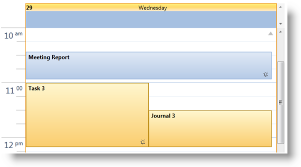
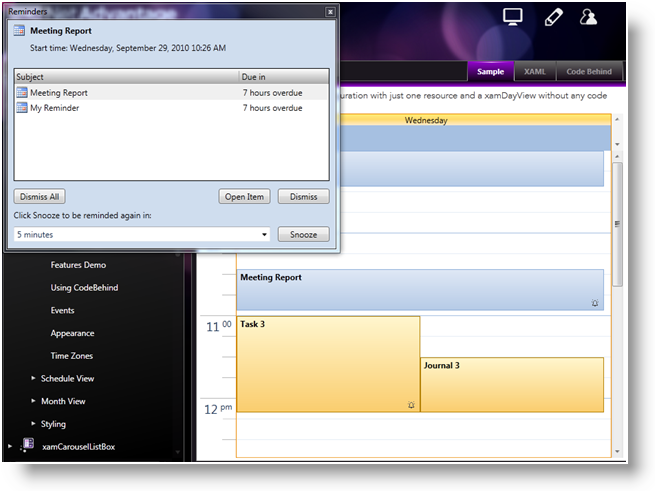

////

|metadata|
{
    "name": "xamschedule-using-activities-reminders",
    "controlName": ["xamSchedule"],
    "tags": ["Appointments","How Do I","Recurrences","Scheduling"],
    "guid": "2f0de47e-b757-4ad7-aa40-152d46a43fba",  
    "buildFlags": [],
    "createdOn": "2016-05-25T18:21:58.8183603Z"
}
|metadata|
////

= Reminders

XamSchedule has built in support for reminders for all supported activity types (ex: link:{ApiPlatform}controls.schedules{ApiVersion}~infragistics.controls.schedules.appointment.html[Appointment], link:{ApiPlatform}controls.schedules{ApiVersion}~infragistics.controls.schedules.journal.html[Journal] and link:{ApiPlatform}controls.schedules{ApiVersion}~infragistics.controls.schedules.task.html[Task]). The following properties are available on the link:{ApiPlatform}controls.schedules{ApiVersion}~infragistics.controls.schedules.activitybase.html[ActivityBase] class to programmatically setup a reminder:

*Note:* Appointment, Journal and Task all inherit from ActivityBase.

* link:{ApiPlatform}controls.schedules{ApiVersion}~infragistics.controls.schedules.activitybase~reminderenabled.html[ReminderEnabled] – Specifies whether the activity’s reminder is set. The default value is false.
* link:{ApiPlatform}controls.schedules{ApiVersion}~infragistics.controls.schedules.activitybase~reminderinterval.html[ReminderInterval] – A time span defining the amount of time prior to the start of the activity when the reminder should be triggered.
* link:{ApiPlatform}controls.schedules{ApiVersion}~infragistics.controls.schedules.activitybase~reminder.html[Reminder] – An instance of the link:{ApiPlatform}controls.schedules{ApiVersion}~infragistics.controls.schedules.reminder.html[Reminder] class that provides additional information about the reminder including information about whether/when the reminder was snoozed.

*In Visual Basic:*

----
Dim remAppointment = New Appointment() With { _
    Key .Id = "t1", _
    Key .OwningCalendarId = "cal1", _
    Key .OwningResourceId = "own1", _
    Key .Start = New DateTime(2010, 9, 9).AddHours(9).AddMinutes(12), _
    Key .[End] = New DateTime(2010, 9, 9).AddHours(9).AddMinutes(42), _
    Key .Subject = "Appointment 1", _
    Key .Description = "My first Appointment in XAML", _
    Key .ReminderInterval = New TimeSpan(0, 0, 30), _
    Key .ReminderEnabled = True, _
    Key .Reminder = New Reminder() With { _
        Key .IsSnoozed = False, _
        Key .SnoozeInterval = New TimeSpan(0, 0, 40), _
        Key .Text = "My Reminder" _
    } _
}
----

*In C#:*

----
var remAppointment = new Appointment
{
    Id = "t1",
    OwningCalendarId = "cal1",
    OwningResourceId = "own1",
    Start = new DateTime(2010, 9, 9).AddHours(9).AddMinutes(12),
    End = new DateTime(2010, 9, 9).AddHours(9).AddMinutes(42),
    Subject = "Appointment 1",
    Description = "My first Appointment in XAML",
    ReminderInterval = new TimeSpan(0, 0, 30),
    ReminderEnabled = true,
    Reminder = new Reminder
    {
        IsSnoozed = false,
        SnoozeInterval = new TimeSpan(0, 0, 40),
        Text = "My Reminder" 
    }
};
----

The UI representation of an activity with a reminder enabled displays a reminder icon (ex: a small ringing bell) in the bottom right corner of the activity’s rectangle.

Note that when reminders are enabled for activities, they are only displayed and triggered for activities that are associated with the link:{ApiPlatform}controls.schedules{ApiVersion}~infragistics.controls.schedules.xamscheduledatamanager~currentuser.html[CurrentUser] of the link:{ApiPlatform}controls.schedules{ApiVersion}~infragistics.controls.schedules.xamscheduledatamanager.html[xamScheduleDataManager]. This means - if the link:{ApiPlatform}controls.schedules{ApiVersion}~infragistics.controls.schedules.activitybase~owningresourceid.html[OwningResourceId] of the activity is set to the same value as the DataManager’s link:{ApiPlatform}controls.schedules{ApiVersion}~infragistics.controls.schedules.xamscheduledatamanager~currentuserid.html[CurrentUserId] property then the reminders will appear.

The end user interaction with reminders is similar to Microsoft Outlook. This includes the ability to snooze and dismiss reminders. There is also an option in the activity dialogs for the end user to set a reminder and its interval.

== Related Topics

link:xamschedule-using-activities-tzna.html[What is a Time Zone Neutral Activity ?]

link:xamschedule-using-activities-appointments.html[Appointments]

link:xamschedule-using-activities-tasks.html[Tasks]

link:xamschedule-using-activities-journals.html[Journals]

link:xamschedule-using-activities-recurrent.html[Recurrent Activities]