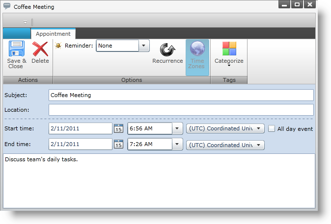
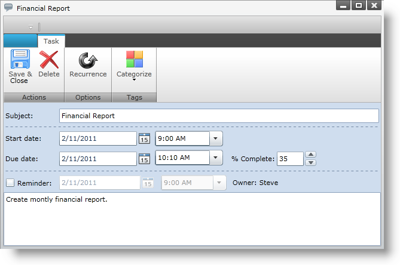
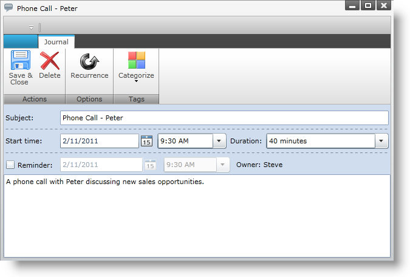
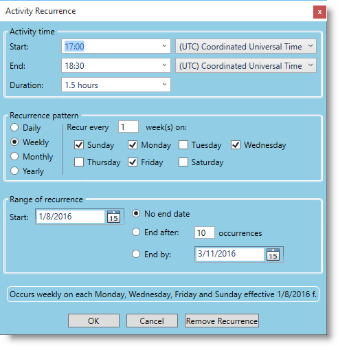
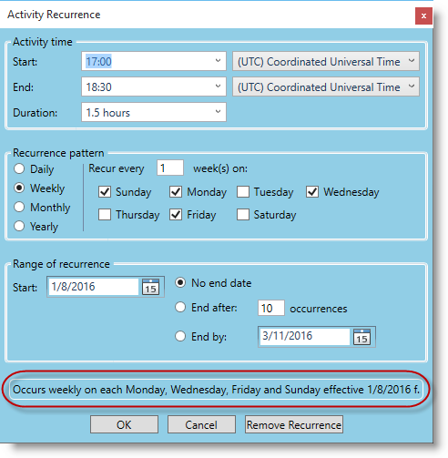

////
|metadata|
{
    "name": "xamschedule-using-activitydialogs",
    "controlName": ["xamSchedule"],
    "tags": ["How Do I","Scheduling"],
    "guid": "55e80de1-4d44-4eb5-aefd-d8d6e404caab",
    "buildFlags": [],
    "createdOn": "2016-05-25T18:21:58.9083688Z"
}
|metadata|
////

= Activity Dialogs

This topic explains the user activity dialogs of the xamSchedule controls and demonstrates how to create custom dialogs.

The topic is organized as follows:

* Introduction
* Built-In Dialogs
* Custom Dialogs

** Specifying a Custom Dialog

*** Code Example

** Customizing Existing Dialogs

*** Methods Used
*** Reverting to Built-In Dialogs
*** Providing the Contents of a Custom Dialog

* "Lightweight" and "Full-Featured" Dialogs

** Example Lightweight and Full-Featured Dialogs
** Switching Full-Featured and Lightweight Dialogs

* Activity Recurrence Dialog
* Displaying Dialogs
* Related Topics

== Introduction

Infragistics xamSchedule controls provide robust support for dialog-based user interaction. Standard ‘built-in’ dialogs are available, as well as the capability for creating custom dialogs.

== Built-In Dialogs

The standard built-in dialogs are defined in the xamSchedule controls assembly and are available without referencing any additional assemblies. These dialogs are designed to be efficient in terms of resource use and, as such, do not reference any additional external assemblies to display their user interface (UI), although xamSchedule does provide a mechanism for using custom dialogs that reference other assemblies which contain the needed controls and/or functionality.

Table 1 lists the built-in dialogs provided with xamSchedule and the possible user interactions in them.

===== Table 1: User interactions supported by the xamSchedule built-in dialogs

[options="header", cols="a,a"]
|====
|Dialog Name|User Interactions

| link:{ApiPlatform}controls.schedules{ApiVersion}~infragistics.controls.schedules.primitives.appointmentdialogcore.html[Appointment]
|creating and editing link:{ApiPlatform}controls.schedules{ApiVersion}~infragistics.controls.schedules.appointment.html[Appointments]

| link:{ApiPlatform}controls.schedules{ApiVersion}~infragistics.controls.schedules.primitives.taskdialogcore.html[Task]
|creating and editing link:{ApiPlatform}controls.schedules{ApiVersion}~infragistics.controls.schedules.task.html[Tasks]

| link:{ApiPlatform}controls.schedules{ApiVersion}~infragistics.controls.schedules.primitives.journaldialogcore.html[Journal]
|creating and editing link:{ApiPlatform}controls.schedules{ApiVersion}~infragistics.controls.schedules.journal.html[Journals]

| link:{ApiPlatform}controls.schedules{ApiVersion}~infragistics.controls.schedules.primitives.activityrecurrencedialogcore.html[Activity Recurrence Dialog]
|creating and editing recurrence rules for all activity types (Appointment, Journal, Task)

| link:{ApiPlatform}controls.schedules{ApiVersion}~infragistics.controls.schedules.primitives.activitycategorydialog.html[Categorize]
|categorizing of xamSchedule activities

| link:{ApiPlatform}controls.schedules{ApiVersion}~infragistics.controls.schedules.primitives.reminderdialog.html[Reminder Dialog]
|viewing expired link:{ApiPlatform}controls.schedules{ApiVersion}~infragistics.controls.schedules.reminder.html[Reminders] and snoozing/dismissing reminders for all activity types

| link:{ApiPlatform}controls.schedules{ApiVersion}~infragistics.controls.schedules.primitives.activityrecurrencechooserdialog.html[Activity Recurrence Chooser Dialog]
|choosing, for editing purposes, between a Recurrence Series or an individual Occurrence in the series. Supports all activity types.

| link:{ApiPlatform}controls.schedules{ApiVersion}~infragistics.controls.schedules.primitives.timezonechooserdialog.html[Time Zone Chooser Dialog]
|specifying the Local Time Zone (in case it cannot be established automatically by the xamSchedule controls)

|====

== Custom Dialogs

=== Specifying a Custom Dialog

The control architecture allows the developer to specify custom dialogs that should be used by the xamSchedule controls in place of any of the above built-in dialogs. To supply a custom dialog:

[start=1]
. First, create a class which inherits from link:{ApiPlatform}controls.schedules{ApiVersion}~infragistics.controls.schedules.scheduledialogfactorybase.html[ScheduleDialogFactoryBase] and override one or more methods to supply the dialog(s) you would like to replace.
[start=2]
. Next, set the link:{ApiPlatform}controls.schedules{ApiVersion}~infragistics.controls.schedules.xamscheduledatamanager~dialogfactory.html[DialogFactory] property on the link:{ApiPlatform}controls.schedules{ApiVersion}~infragistics.controls.schedules.xamscheduledatamanager.html[XamScheduleDataManager] to an instance of your derived class.

==== Code Example

*In Visual Basic:*
[source,vb]
----
dataManager.DialogFactory = New MyScheduleDialogFactory()
----

*In C#:*
[source,csharp]
----
dataManager.DialogFactory = new MyScheduleDialogFactory();
----

*Note:*

To revert to using the built-in dialogs, simply set the dataManager.DialogFactory property to null.

=== Customizing Existing Dialogs

==== Methods Used

Custom versions of specific dialogs can be implemented with the abstract ScheduleDialogFactoryBase class which exposes a number of virtual methods that you can override. (Table 2)

===== Table 2: Methods and parameters for customization of dialogs

[options="header", cols="a,a,a"]
|====
|Method|Description|Parameters

| link:{ApiPlatform}controls.schedules{ApiVersion}~infragistics.controls.schedules.scheduledialogfactorybase~supportedactivitydialogtypes.html[SupportedActivityDialogTypes]
|Returns a flagged link:{ApiPlatform}controls.schedules{ApiVersion}~infragistics.controls.schedules.activitytypes.html[ActivityTypes] enumeration that indicates the Activity types for which the custom dialog factory can supply custom activity dialogs
|None

| link:{ApiPlatform}controls.schedules{ApiVersion}~infragistics.controls.schedules.scheduledialogfactorybase~createactivitydialog.html[CreateActivityDialog]
|Returns a FrameworkElement-derived instance that represents the contents of the dialog for the specified activity. Note that this method should be capable of returning a value for every activity type returned by the SupportedActivityDialogTypes override above.
|FrameworkElement container, XamScheduleDataManager dataManager, ActivityBase activity, bool allowModifications, bool allowRemove

| link:{ApiPlatform}controls.schedules{ApiVersion}~infragistics.controls.schedules.scheduledialogfactorybase~createactivityrecurrencechooserdialog.html[CreateActivityRecurrenceChooserDialog]
|Returns a FrameworkElement-derived instance that represents the contents of the ActivityRecurrenceChooserDialog.
|FrameworkElement container, XamScheduleDataManager dataManager, ActivityBase activity, RecurrenceChooserType chooserType, ActivityRecurrenceChooserDialog.RecurrenceChooserResult chooserResult

| link:{ApiPlatform}controls.schedules{ApiVersion}~infragistics.controls.schedules.scheduledialogfactorybase~createactivityrecurrencedialog.html[CreateActivityRecurrenceDialog]
|Returns a FrameworkElement-derived instance that represents the contents of the ActivityRecurrenceDialog
|FrameworkElement container, XamScheduleDataManager dataManager, ActivityBase activity, bool allowModifications

| link:{ApiPlatform}controls.schedules{ApiVersion}~infragistics.controls.schedules.scheduledialogfactorybase~createreminderdialog.html[CreateReminderDialog]
|Returns a FrameworkElement-derived instance that represents the contents of the ReminderDialog
|FrameworkElement container, XamScheduleDataManager dataManager

| link:{ApiPlatform}controls.schedules{ApiVersion}~infragistics.controls.schedules.scheduledialogfactorybase~createtimezonechooserdialog.html[CreateTimeZoneChooserDialog]
|Returns a FrameworkElement-derived instance that represents the contents of the TimeZoneChooserDialog
|FrameworkElement container, XamScheduleDataManager dataManager, TimeZoneInfoProvider tzInfoProvider, TimeZoneChooserDialog.TimeZoneChooserResult chooserResult

|====

==== Sample Implementation

To supply a custom dialog for editing Appointments:

Create a ScheduleDialogFactory derived class as in this sample code:

*In Visual Basic:*
[source,vb]
----
Public Class MyCustomScheduleDialogFactory
    Inherits ScheduleDialogFactoryBase
    Public Overrides ReadOnly Property SupportedActivityDialogTypes() _
    As ActivityTypes
        Get
            Return ActivityTypes.Appointment
        End Get
    End Property
    
    Public Overrides Function CreateActivityDialog(container As _
    FrameworkElement, dataManager As XamScheduleDataManager, _
    activity As ActivityBase, allowModifications As Boolean, _
    allowRemove As Boolean) As FrameworkElement
        Select Case activity.ActivityType
            Case ActivityType.Appointment
                If True Then
                    ' Create the element that represents
                    ' the contents of the dialog
                    Return GetMyCustomDialog()
                End If
            Case Else
                If True Then
                    ' Return null for unsupported activity types.
                    Return Nothing
                End If
        End Select
    End Function
End Class
----

*In C#:*
[source,csharp]
----
public class MyCustomScheduleDialogFactory : ScheduleDialogFactoryBase
{
    public override ActivityTypes SupportedActivityDialogTypes
    {
        get { return ActivityTypes.Appointment; }
    }
    
    public override FrameworkElement CreateActivityDialog(
        FrameworkElement        container,
        XamScheduleDataManager  dataManager,
        ActivityBase            activity,
        bool                    allowModifications,
        bool                    allowRemove)
    {
        switch (activity.ActivityType)
        {
            case ActivityType.Appointment:
            {
                // Create the element that represents
                // the contents of the dialog
                return GetMyCustomDialog();
            }
            default:
            {                                               
                // Return null for unsupported activity types.
                return null;
            }
        }
    }
}
----

To revert to using the built-in dialogs, simply set the XamScheduleDataManager DialogFactory property to null.

==== Providing the Contents of a Custom Dialog

In the example above, the code calls a method named GetMyCustomDialog(). The name of the method is at your discretion. You need to create and return a FrameworkElement derived class that represents the contents of your custom dialog. You have two basic options in terms of what element you return:

* Return a Window that is appropriate for the platform on which your application will run (i.e., Silverlight, WPF or WPF/XBAP) which contains all the elements necessary to display the user interface (UI) of your custom dialog.
* Return any non-window FrameworkElement-derived class containing the dialog’s elements and xamSchedule will take care of hosting it in a top-level window that is appropriate for the platform on which your application will run.

=== Implementing Complex Appointment or ActivityRecurrence Dialogs

If you are creating a custom dialog as a replacement for the Appointment or ActivityRecurrence dialogs, you may want to consider using the link:{ApiPlatform}controls.schedules{ApiVersion}~infragistics.controls.schedules.primitives.appointmentdialogcore.html[AppointmentDialogCore] and/or link:{ApiPlatform}controls.schedules{ApiVersion}~infragistics.controls.schedules.primitives.activityrecurrencedialogcore.html[ActivityRecurrenceDialogCore] classes to reduce the amount of work required to fully implement these fairly complex dialogs. These two classes are derived from Control and implement the majority of the functionality contained in each dialog.

*Note:*

The references to AppointmentDialogCore in the following paragraphs also apply to TaskDialogCore and JournalDialogCore. All three classes are derived from the abstract base class ActivityDialogCore which contains the logic for the common behaviors and features that are supported by all three dialogs.

In the case of AppointmentDialogCore, the default Style for this control includes all the dialog elements contained in the built-in Appointment dialog except the Ribbon (although it does expose a NavigationControlSite property of type ContentControl where you can place a navigation control like a Ribbon). In the case of ActivityRecurrenceDialogCore, the default Style for this control includes all the dialog elements contained in the built-in ActivityRecurrenceDialog.

There two ways you can make use of these controls. One approach would be to create an instance of one of the Core classes in your custom dialog and add other dialog elements around it. An alternative approach involves creating a Style that formats the control to suit your needs.

The primary benefit of using the controls is to take advantage of the exposed view model properties that you can bind to from within your template in addition to commands that handle common dialog scenarios. The commands exposed by the controls include:

* ActivityDialogCore commands (apply to all three activity dialogs - AppointmentDialogCore, TaskDialogCore, JournalDialogCore):

** link:{ApiPlatform}controls.schedules{ApiVersion}~infragistics.controls.schedules.primitives.activitydialogcoresaveandclosecommand.html[ActivityDialogCoreSaveAndCloseCommand] – saves the modified Activity data using the appropriate link:{ApiPlatform}controls.schedules{ApiVersion}~infragistics.controls.schedules.xamscheduledatamanager.html[XamScheduleDataManager] data edit methods (i.e., link:{ApiPlatform}controls.schedules{ApiVersion}~infragistics.controls.schedules.xamscheduledatamanager~beginedit.html[BeginEdit], link:{ApiPlatform}controls.schedules{ApiVersion}~infragistics.controls.schedules.xamscheduledatamanager~endedit.html[EndEdit], link:{ApiPlatform}controls.schedules{ApiVersion}~infragistics.controls.schedules.xamscheduledatamanager~canceledit.html[CancelEdit]) to properly update your data source, and closes the dialog
** link:{ApiPlatform}controls.schedules{ApiVersion}~infragistics.controls.schedules.primitives.activitydialogcoreclosecommand.html[ActivityDialogCoreCloseCommand] – prompts the user with save options if necessary and then closes the dialog
** link:{ApiPlatform}controls.schedules{ApiVersion}~infragistics.controls.schedules.primitives.activitydialogcoredisplayrecurrencedialogcommand.html[ActivityDialogCoreDisplayRecurrenceDialogCommand] – displays the ActivityRecurrenceDialog for the Appointment being edited
** link:{ApiPlatform}controls.schedules{ApiVersion}~infragistics.controls.schedules.primitives.activitydialogcoreshowtimezonepickerscommand.html[ActivityDialogCoreShowTimeZonePickersCommand] – sets the AppointmentDialogCore. link:{ApiPlatform}controls.schedules{ApiVersion}~infragistics.controls.schedules.primitives.activitydialogcore~timezonepickervisibility.html[TimeZonePickerVisibility] property which controls in your template can bind
** link:{ApiPlatform}controls.schedules{ApiVersion}~infragistics.controls.schedules.primitives.activitydialogcorehidetimezonepickerscommand.html[ActivityDialogCoreHideTimeZonePickersCommand] – sets the AppointmentDialogCore.TimeZonePickerVisibility property which controls in your template can bind

* ActivityRecurrenceDialogCore commands:

** link:{ApiPlatform}controls.schedules{ApiVersion}~infragistics.controls.schedules.primitives.recurrencedialogcoresaveandclosecommand.html[RecurrenceDialogCoreSaveAndCloseCommand] – saves the modified Recurrence data into the Appointment being edited
** link:{ApiPlatform}controls.schedules{ApiVersion}~infragistics.controls.schedules.primitives.recurrencedialogcoreclosecommand.html[RecurrenceDialogCoreCloseCommand] – discards the modified Recurrence data and closes the dialog
** link:{ApiPlatform}controls.schedules{ApiVersion}~infragistics.controls.schedules.primitives.recurrencedialogcoreremoverecurrencecommand.html[RecurrenceDialogCoreRemoveRecurrenceCommand] – removes the Recurrence data from the Appointment being edited (resulting in a non-recurring Appointment) and closes the dialog

== "Lightweight" and "Full-Featured" Dialogs

To minimize the impact of the built-in activities (appointments, tasks, journals) dialogs on the footprint of the xamSchedule controls, they are designed in a way that does not require references to or loading of other assemblies that contain additional controls.

In the case of the activities dialogs which typically contain a ribbon control, the built-in version of the dialogs includes a custom "simulated" ribbon that has the basic look and functionality of a "real" ribbon control (e.g., XamRibbon) but without advanced features like Application Menu, Quick AccessToolbar, collapsing RibbonGroups, etc. As a result, no additional assemblies are required when using the built-in Appointment, Task, and Journal dialogs.

The activities dialogs with this simulated ribbon are sufficient for most applications – particularly those that place value on reducing the number of assemblies that must be loaded at runtime.

To address the needs of applications that require full featured ribbon activities dialogs, xamSchedule includes a "full-featured" version of the dialogs that uses a XamRibbon control in the dialog’s UI instead of the simulated ribbon control used in the built-in "lightweight" Appointment dialog. Following are examples of the lightweight and full-featured versions of the dialogs.

=== Example Lightweight and Full-Featured Dialogs

*In Visual Basic:* 
[source,vb]
---- 
dataManager.DialogFactory = Nothing
---- 

*In C#:*
[source,csharp]
---- 
dataManager.DialogFactory = null;
---- 

[cols="a"]
|====

|image::images/xamSchedule_Dialogs1.png[] 

===== Figure 1: A lightweight appointment dialog 

|image::images/xamSchedule_Dialogs2.png[] 

===== Figure 2: A lightweight task dialog 

|image::images/xamSchedule_Dialogs3.png[] 

===== Figure 3: A lightweight journal dialog 

|====

=== Switching Full-Featured and Lightweight Dialogs

This version of the Activities dialogs uses a XamRibbon control and is supplied in a separate assembly:

*{ApiPlatform}Controls.SchedulesDialogs.{DllVersion}dll*

To use the full-featured activities dialogs add a reference to the appropriate assembly in your project and set the XamScheduleDataManager DialogFactory property as follows:

*In Visual Basic:* 
[source,vb]
---- 
dataManager.DialogFactory = _
    New Infragistics.Controls.Schedules.ScheduleDialogFactory()
---- 

*In C#:*
[source,csharp]
---- 
dataManager.DialogFactory =
    new Infragistics.Controls.Schedules.ScheduleDialogFactory();
---- 

[cols="a"]
|====

|

===== Figure 4: A full-featured appointment dialog 

|

===== Figure 5: A full-featured task dialog 

|

===== Figure 6: A full-featured journal dialog 

|====

*Note:*

The "full featured" Appointment dialog assembly is implemented using the standard ScheduleDialogFactoryBase derived class approach outlined above for your custom dialogs.

== Activity Recurrence Dialog

The activity recurrence dialog is shown when the user presses the "Recurrence" button in any type of activity dialogs:

=== Show or hide the recurrence description

The activity recurrence dialogs can show a recurrence description as highlighted on the picture below:

The visibility of the recurrence description can be configured using the following procedure:

* create a string resource in an existing or new resource file (.resx file) in your project
* set the string resource's name to "DLG_Recurrence_ShouldShowRecurrenceDescription"
* set the string resource's value to "true" or " depending of your visibility requirement
* include the following line(s) in the constructor of your main window before the "InitializeComponent()" call (by registering this resource on any xamSchedule's view all recurrence dialogs will by affected):

*In Visual Basic:*
[source,vb]
----
XamDayView.RegisterResources("NameSpace.ResourceClassName", GetType(MainWindow).Assembly)
----

*In C#:*
[source,csharp]
----
XamDayView.RegisterResources("NameSpace.ResourceClassName", typeof(MainWindow).Assembly);
----

*Note:*

Replace "Namespace" with the namespace where your resource file is located, replace "ResourceClassName" with the name of your resource file and replace "MainWindow" with the name of your main window's class name.

*Note:*

By default when using English, German or French languages the recurrence description is visible and when using Spanish or Japanese languages it is not visible.

== Displaying Dialogs

The xamSchedule controls will automatically display the various dialogs described in this topic based on the user interaction with the controls (like when the user double-clicks a timeslot in the xamDayView control). As a result, you do not need to write code to ensure that the dialogs are displayed during the normal interaction with the xamSchedule controls.

However, if your application needs to display the dialogs based on interactions with other parts of your application’s UI, there is a way to display them manually. For displaying the dialogs, the following methods of the XamScheduleDataManager class can be used:

* link:{ApiPlatform}controls.schedules{ApiVersion}~infragistics.controls.schedules.xamscheduledatamanager~displayactivitydialog.html[DisplayActivityDialog]
* link:{ApiPlatform}controls.schedules{ApiVersion}~infragistics.controls.schedules.xamscheduledatamanager~displayactivitycategorydialog.html[DisplayActivityCategoryDialog]
* link:{ApiPlatform}controls.schedules{ApiVersion}~infragistics.controls.schedules.xamscheduledatamanager~displayactivitycategorycreationdialog.html[DisplayActivityCategoryCreationDialog]
* link:{ApiPlatform}controls.schedules{ApiVersion}~infragistics.controls.schedules.xamscheduledatamanager~displayactivityrecurrencedialog.html[DisplayActivityRecurrenceDialog]
* link:{ApiPlatform}controls.schedules{ApiVersion}~infragistics.controls.schedules.xamscheduledatamanager~displayactivityrecurrencechooserdialog.html[DisplayActivityRecurrenceChooserDialog]
* link:{ApiPlatform}controls.schedules{ApiVersion}~infragistics.controls.schedules.xamscheduledatamanager~displayreminderdialog.html[DisplayReminderDialog]
* link:{ApiPlatform}controls.schedules{ApiVersion}~infragistics.controls.schedules.xamscheduledatamanager~displaytimezonechooserdialog.html[DisplayTimeZoneChooserDialog]

== Related Topics

link:xamschedule-understanding-activities.html[About Activities]

link:xamschedule-understanding-views.html[About the xamSchedule views]