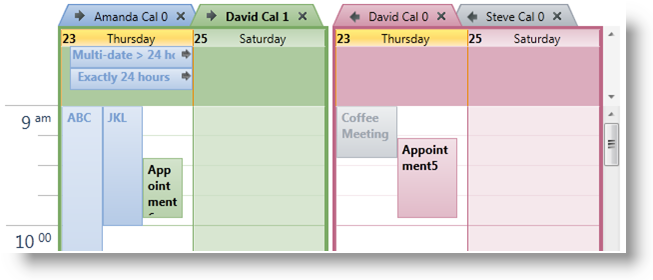
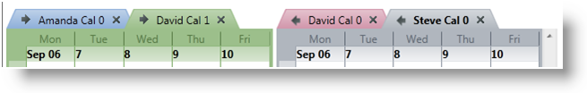
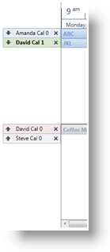

////

|metadata|
{
    "name": "xamschedule-using-control-calendargrouping",
    "controlName": ["xamSchedule"],
    "tags": ["Grouping","How Do I","Scheduling"],
    "guid": "8d54807f-1a33-43fc-892d-90e8531b0be3",  
    "buildFlags": [],
    "createdOn": "2016-05-25T18:21:58.8773664Z"
}
|metadata|
////

= Calendar Grouping

XamSchedule controls can display one or more link:{ApiPlatform}controls.schedules{ApiVersion}~infragistics.controls.schedules.resourcecalendar.html[ResourceCalendars] at a time. The architecture of the controls allows the developer to group the ResourceCalendars into link:{ApiPlatform}controls.schedules{ApiVersion}~infragistics.controls.schedules.calendargroup.html[CalendarGroups]. This can be done by populating the link:{ApiPlatform}controls.schedules{ApiVersion}~infragistics.controls.schedules.xamscheduledatamanager~calendargroups.html[CalendarGroups] collection of the link:{ApiPlatform}controls.schedules{ApiVersion}~infragistics.controls.schedules.xamscheduledatamanager.html[XamScheduleDataManager]. This collection is then used by any link:{ApiPlatform}controls.schedules{ApiVersion}~infragistics.controls.schedules.xamdayview.html[xamDayView], link:{ApiPlatform}controls.schedules{ApiVersion}~infragistics.controls.schedules.xamscheduleview.html[xamScheduleView] or link:{ApiPlatform}controls.schedules{ApiVersion}~infragistics.controls.schedules.xammonthview.html[XamMonthView] controls sharing this DataManager unless the view control’s link:{ApiPlatform}controls.schedules{ApiVersion}~infragistics.controls.schedules.schedulecontrolbase~calendargroupsoverride.html[CalendarGroupsOverride] collection is populated.

*In XAML:*

----
<ig:XamScheduleDataManager>
  <ig:XamScheduleDataManager.CalendarGroups>
    <ig:CalendarGroup InitialCalendarIds="own1,own2[cal1]"
        InitialSelectedCalendarId="own2[cal1]" />
    <ig:CalendarGroup InitialCalendarIds="own2[cal0],own3" />
  </ig:XamScheduleDataManager.CalendarGroups>
</ig:XamScheduleDataManager>
----

The link:{ApiPlatform}controls.schedules{ApiVersion}~infragistics.controls.schedules.calendargroup~initialcalendarids.html[InitialCalendarIds] property accepts a comma delimited string with the calendar identifiers where a calendar is specified in the following format – link:{ApiPlatform}controls.schedules{ApiVersion}~infragistics.controls.schedules.resource~id.html[OwnerId][ link:{ApiPlatform}controls.schedules{ApiVersion}~infragistics.controls.schedules.resourcecalendar~id.html[CalendarId]]. When a CalendarId is omitted the link:{ApiPlatform}controls.schedules{ApiVersion}~infragistics.controls.schedules.resource~primarycalendar.html[primary calendar] of the link:{ApiPlatform}controls.schedules{ApiVersion}~infragistics.controls.schedules.resource.html[OwningResource] is displayed. The link:{ApiPlatform}controls.schedules{ApiVersion}~infragistics.controls.schedules.calendargroup~initialselectedcalendarid.html[InitialSelectedCalendarId] property takes the ID of a single ResourceCalendar in the same format and that is used to identify the calendar that will be selected within the group initially.

The following listing demonstrates is how the developer can specify the same example in code.

*In Visual Basic:*

----
Dim calGroup1 = New CalendarGroup() With { _
        Key .InitialCalendarIds = "own1, own2[cal1]", _
        Key .InitialSelectedCalendarId = "own2[cal1]" _
}
Dim calGroup2 = New CalendarGroup() With { _
        Key .InitialCalendarIds = "own2[cal0], own3" _
}
dataManager.CalendarGroups.Add(calGroup1)
dataManager.CalendarGroups.Add(calGroup2)
----

*In C#:*

----
var calGroup1 = new CalendarGroup {
    InitialCalendarIds = "own1, own2[cal1]",
    InitialSelectedCalendarId = "own2[cal1]"
};
var calGroup2 = new CalendarGroup {
    InitialCalendarIds = "own2[cal0], own3"
};
dataManager.CalendarGroups.Add(calGroup1);
dataManager.CalendarGroups.Add(calGroup2);
----

After the calendars are grouped together, the developer can choose the way the groups are displayed. All the views in xamSchedule support link:{ApiPlatform}controls.schedules{ApiVersion}~infragistics.controls.schedules.calendardisplaymode.html[CalendarDisplay] modes. This feature is controlled by the property link:{ApiPlatform}controls.schedules{ApiVersion}~infragistics.controls.schedules.schedulecontrolbase~calendardisplaymode.html[CalendarDisplayMode] that can be set to one of the following values:

* link:{ApiPlatform}controls.schedules{ApiVersion}~infragistics.controls.schedules.calendardisplaymode.html[Overlay] – if there is more than 1 visible ResourceCalendar in the control then each one will be displayed with a tab header. If there is more than one visible ResourceCalendar in a CalendarGroup then the activities associated with that calendar are displayed as normal but activities associated with all other ResourceCalendars in the group will appear muted.
* link:{ApiPlatform}controls.schedules{ApiVersion}~infragistics.controls.schedules.calendardisplaymode.html[Separate] – every visible ResourceCalendar is displayed in its own group with a header that identifies the calendar.
* link:{ApiPlatform}controls.schedules{ApiVersion}~infragistics.controls.schedules.calendardisplaymode.html[Merged] – there are no tabs or headers. All activities from all the visible ResourceCalendars are shown together.

By default, the CalendarDisplayMode is set to null and each control will choose a default value that mimics the behavior found in Outlook. XamMonthView and xamDayView default to “Overlay” and xamScheduleView defaults to “Separate”.

The following images show how each control appears when the CalendarDisplayMode is set to “Overlay” and there are two CalendarGroups defined with each containing two visible ResourceCalendars.

== xamDayView

== xamMonthView

== xamScheduleView

== Related Topics

link:xamschedule-using-control-visibledates.html[Displaying Dates]

link:xamschedule-using-control-selactivities.html[The Selected Activities Collection]

link:xamschedule-using-control-confday.html[Configuring xamDayView]

link:xamschedule-using-control-confschedule.html[Configuring xamScheduleView]

link:xamschedule-using-control-confmonth.html[Configuring xamMonthView]