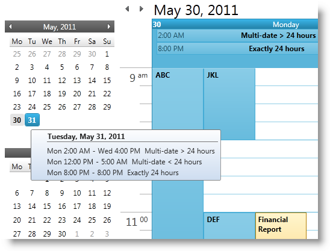

////
|metadata|
{
    "name": "xamschedule-using-control-confdatenavigator",
    "controlName": ["xamSchedule"],
    "tags": ["Editing","Scheduling","Selection"],
    "guid": "ba081c3a-370e-4428-8de3-498da085d995",
    "buildFlags": [],
    "createdOn": "2016-05-25T18:21:58.9263679Z"
}
|metadata|
////

= Configuring xamDateNavigator

This is one of the five topics explaining the views of the xamSchedule controls:

* link:{ApiPlatform}controls.schedules{ApiVersion}~infragistics.controls.schedules.xamdayview.html[xamDayView]
* link:{ApiPlatform}controls.schedules{ApiVersion}~infragistics.controls.schedules.xamscheduleview.html[xamScheduleView]
* link:{ApiPlatform}controls.schedules{ApiVersion}~infragistics.controls.schedules.xammonthview.html[xamMonthView]
* link:{ApiPlatform}controls.schedules{ApiVersion}~infragistics.controls.schedules.xamoutlookcalendarview.html[xamOutlookCalendarView]
* link:{ApiPlatform}controls.schedules{ApiVersion}~infragistics.controls.schedules.xamdatenavigator.html[xamDateNavigator]  _(This is the current topic)_ 

This topic is organized in sections as follows:

* Introduction
* Purpose
* xamDateNavigator Configuration Options
* Related Topics

== Introduction

The xamDateNavigator™ control replicates the date navigator portion of the Outlook 2010 user interface. As a part of the larger xamSchedule system, the navigator control follows many of the existing API patterns established by other schedule visual controls like xamMonthView and xamDayView. (Figure 1)

====== Figure 1: Example of the xamDateNavigator control

The xamDateNavigator is a Silverlgiht/WPF cross platform control derived from the CalendarBase class. Therefore, the control has both a visual and functional resemblance with the xamCalendar™ control. In addition, it exposes properties related to the schedule control suite:

== Purpose

The purpose of this control is to navigate the xamOutlookCalendarView and to provide visual representation of the days with activities and display tooltips with activities information.

== xamDateNavigator Configuration Options

* link:{ApiPlatform}controls.schedules{ApiVersion}~infragistics.controls.schedules.xamdatenavigator~datamanager.html[DataManager] - The xamDateNavigator requires its DataManager property to be set in order to synchronize its color scheme as well as highlight days with activity and display activity tooltips.
+
*In XAML:*
+
[source,xaml]
----
<ig:XamDateNavigator x:Name="myDateNavigator" 
    DataManager="{Binding ElementName=dataManager}" />
----
+
.Note:
[NOTE]
====
the new xamOutlookCalendarView control exposes a DateNavigator property. If this is set to an instance of a xamDateNavigator then the two controls synchronize with each other when dates are selected or scrolled.
====

* link:{ApiPlatform}controls.schedules{ApiVersion}~infragistics.controls.schedules.xamdatenavigator~activitytooltiptemplate.html[ActivityToolTipTemplate] – Use this property to supply a custom template that will be used to show a day’s worth of activity in a tooltip when the user hovers the cursor over a day. This is used only if the ShowActivityTooltips property is set to *true*.
+
*In XAML:*
+
[source,xaml]
----
<ig:XamDateNavigator x:Name="myDateNavigator" 
    ActivityToolTipTemplate="{StaticResource toolTipTemplate}" />
----

* link:{ApiPlatform}controls.schedules{ApiVersion}~infragistics.controls.schedules.xamdatenavigator~showactivitytooltips.html[ShowActivityToolTips] – This property defaults to *true*. If left *true* the control displays a tooltip when the user hovers over a day. The tooltip contains a list of activities for the associated day. If the day doesn’t contain any activity then no tooltip is displayed.
+
*In XAML:*
+
[source,xaml]
----
<ig:XamDateNavigator x:Name="myDateNavigator" 
    ShowActivityToolTips="True" />
----

* link:{ApiPlatform}controls.schedules{ApiVersion}~infragistics.controls.schedules.xamdatenavigator~highlightdaycriteria.html[HighlightDayCriteria] – This enum property determines which days are highlighted (i.e. whose text is bolded). The values are ‘All’, ‘None’, ‘Workdays’ and ‘DaysWithActivity’ which is the default value.
+
*In XAML:*
+
[source,xaml]
----
<ig:XamDateNavigator x:Name="myDateNavigator" 
    HighlightDayCriteria="DaysWithActivity" />
----

== Related Topics

link:xamschedule-using-control-visibledates.html[Displaying Dates]

link:xamschedule-using-control-selactivities.html[The Selected Activities Collection]

link:xamschedule-using-control-calendargrouping.html[Calendar Grouping]

link:xamschedule-using-control-confday.html[Configuring xamDayView]

link:xamschedule-using-control-confschedule.html[Configuring xamScheduleView]

link:xamschedule-using-control-confmonth.html[Configuring xamMonthView]

link:xamschedule-using-control-confoutlookcalendar.html[Configuring xamOutlookCalendarView]