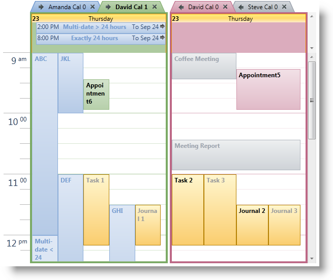

////
|metadata|
{
    "name": "xamschedule-using-control-confday",
    "controlName": ["xamSchedule"],
    "tags": ["How Do I","Scheduling"],
    "guid": "4607f9b5-53ed-42d7-a802-79ee441ee222",
    "buildFlags": [],
    "createdOn": "2016-05-25T18:21:58.8833683Z"
}
|metadata|
////

= Configuring xamDayView

This is one of the five topics explaining the views of the xamSchedule controls:

* link:{ApiPlatform}controls.schedules.v{ProductVersion}~infragistics.controls.schedules.xamdayview.html[xamDayView]  _(This is the current topic)_ 
* link:{ApiPlatform}controls.schedules.v{ProductVersion}~infragistics.controls.schedules.xamscheduleview.html[xamScheduleView]
* link:{ApiPlatform}controls.schedules.v{ProductVersion}~infragistics.controls.schedules.xammonthview.html[xamMonthView]
* link:{ApiPlatform}controls.schedules.v{ProductVersion}~infragistics.controls.schedules.xamoutlookcalendarview.html[xamOutlookCalendarView]
* link:{ApiPlatform}controls.schedules.v{ProductVersion}~infragistics.controls.schedules.xamdatenavigator.html[xamDateNavigator]

This topic is organized in sections as follows:

* Introduction
* Purpose
* Presenting Activities in the Schedule
* Configuring the Data Source
* User Interaction and Usability
* xamDayView Configuration Options
* Related Topics

== Introduction

xamDayView is one of the five view controls included in the XamSchedule family. This view displays one or more days arranged horizontally, where each day is broken up into a series of vertically arranged timeslots based on a specified interval (e.g., 15 minutes). (Figure 1)

====== Figure 1: Example of the xamMonthView control

The timeslots are preceded by 1 or 2 time-zone header areas which indicate the time associated with a given timeslot in a specified time zone. This view also includes a “MultiDay Activity” area where activities whose duration is 24 hours or greater are displayed. Both of these areas support scrolling.

== Purpose

The purpose of this view is to provide hour-based representation of the activities for the days of the week.

== Presenting Activities in the Schedule

The link:{ApiPlatform}controls.schedules.v{ProductVersion}~infragistics.controls.schedules.activitybase.html[activities] are displayed as rectangles filling the timeslots between their link:{ApiPlatform}controls.schedules.v{ProductVersion}~infragistics.controls.schedules.activitybase~start.html[Start] and link:{ApiPlatform}controls.schedules.v{ProductVersion}~infragistics.controls.schedules.activitybase~end.html[End] times.

== Configuring the Data Source

The data for the activities and link:{ApiPlatform}controls.schedules.v{ProductVersion}~infragistics.controls.schedules.resourcecalendar.html[resource calendars] displayed in the view is provided by an instance of link:{ApiPlatform}controls.schedules.v{ProductVersion}~infragistics.controls.schedules.xamscheduledatamanager.html[XamScheduleDataManager]. That instance is configured with the link:{ApiPlatform}controls.schedules.v{ProductVersion}~infragistics.controls.schedules.schedulecontrolbase~datamanager.html[DataManager] property of xamDayView.

== User Interaction and Usability

In XamDayView, users can:

* Navigate through the timeslots and activities using the keyboard
* Create activities with one click of the mouse:

** by selecting timeslots (with the keyboard or mouse) and start typing
** by clicking the “Click to Add” prompt that is displayed when hovering over a time slot

* Resize an activity (that is, change the Start or End of an activity) using the resize grips
* Drag an activity from one schedule to another (that is, among different xamSchedule controls associated with the same xamScheduleDataManager)
* Click and modify the link:{ApiPlatform}controls.schedules.v{ProductVersion}~infragistics.controls.schedules.activitybase~subject.html[Subject] of an activity
* Create a new activity by double-clicking a day (via the activity dialog)
* Edit an activity by double-clicking on it.
* Navigate to an activity using the more activity arrows
* Scroll the schedule using the scrollbar or mouse wheel
* Delete selected activities

** with the Delete key
** from the Activity dialog

* Scroll and resize the calendar group area
* Resize of the multiday activity area

== xamDayView Configuration Options

* link:{ApiPlatform}controls.schedules.v{ProductVersion}~infragistics.controls.schedules.scheduletimecontrolbase~weekdisplaymode.html[WeekDisplayMode] – this setting has three options:

** link:{ApiPlatform}controls.schedules.v{ProductVersion}~infragistics.controls.schedules.weekdisplaymode.html[None] – displays the day or days specified in the link:{ApiPlatform}controls.schedules.v{ProductVersion}~infragistics.controls.schedules.schedulecontrolbase~visibledates.html[VisibleDates] Collection
** link:{ApiPlatform}controls.schedules.v{ProductVersion}~infragistics.controls.schedules.weekdisplaymode.html[Week] – displays all 7 week days
** link:{ApiPlatform}controls.schedules.v{ProductVersion}~infragistics.controls.schedules.weekdisplaymode.html[WorkWeek] – displays the working days of the week. Note that the default Monday to Friday work week can be changed via the link:{ApiPlatform}controls.schedules.v{ProductVersion}~infragistics.controls.schedules.schedulesettings~workdays.html[WorkDays] property in link:{ApiPlatform}controls.schedules.v{ProductVersion}~infragistics.controls.schedules.xamscheduledatamanager~settings.html[Settings] of the link:{ApiPlatform}controls.schedules.v{ProductVersion}~infragistics.controls.schedules.xamscheduledatamanager.html[XamDataManager]

* link:{ApiPlatform}controls.schedules.v{ProductVersion}~infragistics.controls.schedules.scheduletimecontrolbase~showworkinghoursonly.html[ShowWorkingHoursOnly] is a boolean property that allows the developer to show only the working hours of the day. The default (9am-5pm) values can be changed via link:{ApiPlatform}controls.schedules.v{ProductVersion}~infragistics.controls.schedules.schedulesettings~workinghours.html[WorkingHours] property in Settings of the XamDataManager. (See the link:xamschedule-using-manager-working-hours.html[Working Hours topic])
* Secondary Timezone settings – the xamDayView displays one primary timezone header by default. However, there is a property called link:{ApiPlatform}controls.schedules.v{ProductVersion}~infragistics.controls.schedules.scheduletimecontrolbase~secondarytimezonevisibility.html[SecondaryTimeZoneVisibility] that allows the developer to show a secondary Timezone header. There are also properties for setting the link:{ApiPlatform}controls.schedules.v{ProductVersion}~infragistics.controls.schedules.scheduletimecontrolbase~secondarytimezoneid.html[TimeZoneId] and the link:{ApiPlatform}controls.schedules.v{ProductVersion}~infragistics.controls.schedules.scheduletimecontrolbase~secondarytimezonelabel.html[label] for it. Here is a sample:
+
*In Visual Basic:*
+
[source,vb]
----
dayView.SecondaryTimeZoneVisibility = _
    System.Windows.Visibility.Visible
dayView.SecondaryTimeZoneLabel = _
    "SecodaryLabel"
dayView.SecondaryTimeZoneId = _
    "Central Standard Time"
----
+
*In C#:*
+
[source,csharp]
----
dayView.SecondaryTimeZoneVisibility =
    System.Windows.Visibility.Visible;
dayView.SecondaryTimeZoneLabel =
    "SecodaryLabel";
dayView.SecondaryTimeZoneId =
    "Central Standard Time";
----

* MultiDay activity area visibility can be controlled by the developer by setting the link:{ApiPlatform}controls.schedules.v{ProductVersion}~infragistics.controls.schedules.xamdayview~multidayactivityareavisibility.html[MultiDayActivityAreaVisibility] property.
+
*In Visual Basic:*
+
[source,vb]
----
dayView.MultiDayActivityAreaVisibility = _
    System.Windows.Visibility.Visible
----
+
*In C#:*
+
[source,csharp]
----
dayView.MultiDayActivityAreaVisibility =
    System.Windows.Visibility.Visible;
----

* Calendar Display options – there are several settings that come in handy when working with multiple calendars. 
+

** link:{ApiPlatform}controls.schedules.v{ProductVersion}~infragistics.controls.schedules.schedulecontrolbase~calendardisplaymode.html[CalendarDisplayMode] – this property has three valid options: link:{ApiPlatform}controls.schedules.v{ProductVersion}~infragistics.controls.schedules.calendardisplaymode.html[Overlay], link:{ApiPlatform}controls.schedules.v{ProductVersion}~infragistics.controls.schedules.calendardisplaymode.html[Separate] and link:{ApiPlatform}controls.schedules.v{ProductVersion}~infragistics.controls.schedules.calendardisplaymode.html[Merged].
+
*In Visual Basic:*
+
[source,vb]
----
dayView.CalendarDisplayMode = CalendarDisplayMode.Overlay
----
+
*In C#:*
+
[source,csharp]
----
dayView.CalendarDisplayMode = CalendarDisplayMode.Overlay;
----
+

+
*In Visual Basic:*
+
[source,vb]
----
dayView.CalendarDisplayMode = CalendarDisplayMode.Separate
----
+
*In C#:*
+
[source,csharp]
----
dayView.CalendarDisplayMode = CalendarDisplayMode.Separate;
----
+

+
*In Visual Basic:*
+
[source,vb]
----
dayView.CalendarDisplayMode = CalendarDisplayMode.Merged
----
+
*In C#:*
+
[source,csharp]
----
dayView.CalendarDisplayMode = CalendarDisplayMode.Merged;
----
+

** link:{ApiPlatform}controls.schedules.v{ProductVersion}~infragistics.controls.schedules.schedulecontrolbase~showcalendarclosebutton.html[ShowCalendarCloseButton] and link:{ApiPlatform}controls.schedules.v{ProductVersion}~infragistics.controls.schedules.schedulecontrolbase~showcalendaroverlaybutton.html[ShowCalendarOverlayButton] properties control the visibility of calendar buttons.

* Visible Days – the developer can show multiple days for one calendar just by populating the link:{ApiPlatform}controls.schedules.v{ProductVersion}~infragistics.controls.schedules.schedulecontrolbase~visibledates.html[VisibleDates] collection.
+
*In Visual Basic:*
+
[source,vb]
----
'First clear the existing dates and then set the new ones.
dayView.VisibleDates.Clear()
dayView.VisibleDates.Add(New System.DateTime(2010, 9, 23))
dayView.VisibleDates.Add(New System.DateTime(2010, 9, 25))
----
+
*In C#:*
+
[source,csharp]
----
//First clear the existing dates and then set the new ones.
dayView.VisibleDates.Clear();
dayView.VisibleDates.Add(new System.DateTime(2010, 9, 23));
dayView.VisibleDates.Add(new System.DateTime(2010, 9, 25));
----
+

* link:{ApiPlatform}controls.schedules.v{ProductVersion}~infragistics.controls.schedules.scheduletimecontrolbase~timeslotinterval.html[TimeslotInterval] – This property allows the developer to change the default 15-minute timeslots.
+
*In Visual Basic:*
+
[source,vb]
----
dayView.TimeslotInterval = New System.TimeSpan(0, 30, 0)
----
+
*In C#:*
+
[source,csharp]
----
dayView.TimeslotInterval = new System.TimeSpan(0, 30, 0);
----
+

* The single calendars or calendar groups (depending of the value set in the CalendarDisplayMode property) have equal size. In case you have more calendars in one group comparing to the other, some of the tab titles may not be visible. By setting the link:{ApiPlatform}controls.schedules.v{ProductVersion}~infragistics.controls.schedules.schedulecontrolbase~allowcalendargroupresizing.html[AllowCalendarGroupResizing] Boolean property, you enable/disable the end user to resize the calendar groups. When resizing the groups, they continue to have equal size and this leads to a point where their combined size is bigger than the container and at this point a scrollbar will automatically be shown. Double clicking on the resizing point will restore the initial size of the calendar groups.
+
*In Visual Basic:*
+
[source,vb]
----
dayView.CalendarDisplayMode = CalendarDisplayMode.Overlay
----
+
*In C#:*
+
[source,csharp]
----
dayView.CalendarDisplayMode = CalendarDisplayMode.Overlay;
----
+

+
*In Visual Basic:*
+
[source,vb]
----
dayView.CalendarDisplayMode = CalendarDisplayMode.Separate
----
+
*In C#:*
+
[source,csharp]
----
dayView.CalendarDisplayMode = CalendarDisplayMode.Separate;
----
+

* Sometimes the multiday activity area may be smaller to display all activities and an arrow will be displayed to allow the end user to scroll through the activities. You can allow the end user to resize the multiday activity area by setting the Boolean property link:{ApiPlatform}controls.schedules.v{ProductVersion}~infragistics.controls.schedules.xamdayview~allowmultidayactivityarearesizing.html[AllowMultiDayActivityAreaResizing] to true. Also you can use the link:{ApiPlatform}controls.schedules.v{ProductVersion}~infragistics.controls.schedules.xamdayview~multidayactivityareaheight.html[MultiDayActivityAreaHeight] property to specify custom height for it. Double clicking on the resizing point will restore the initial sizing behavior of the multiday activity area and set the MultiDayActivityAreaHeight property to *NaN*.
+
*In Visual Basic:*
+
[source,vb]
----
dayView.AllowMultiDayActivityAreaResizing = True
----
+
*In C#:*
+
[source,csharp]
----
dayView.AllowMultiDayActivityAreaResizing = true;
----
+

== Related Topics

link:xamschedule-using-control-visibledates.html[Displaying Dates]

link:xamschedule-using-control-selactivities.html[The Selected Activities Collection]

link:xamschedule-using-control-calendargrouping.html[Calendar Grouping]

link:xamschedule-using-control-confschedule.html[Configuring xamScheduleView]

link:xamschedule-using-control-confmonth.html[Configuring xamMonthView]

link:xamschedule-using-control-confoutlookcalendar.html[Configuring xamOutlookCalendarView]

link:xamschedule-using-control-confdatenavigator.html[Configuring xamDateNavigator]