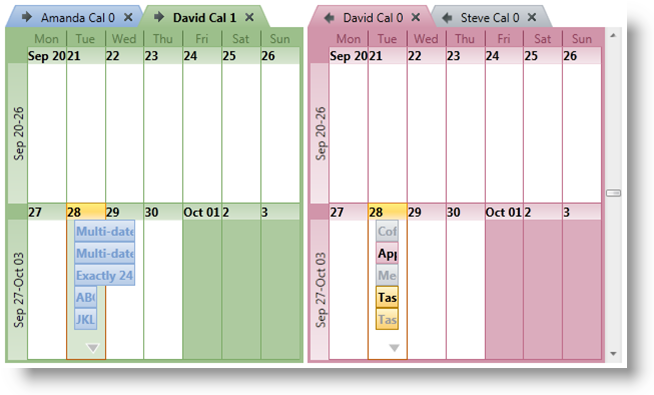

////
|metadata|
{
    "name": "xamschedule-using-control-confmonth",
    "controlName": ["xamSchedule"],
    "tags": ["How Do I","Scheduling"],
    "guid": "0542d0b1-9151-4f91-ba69-88f6c8a55ea9",
    "buildFlags": [],
    "createdOn": "2016-05-25T18:21:58.8963651Z"
}
|metadata|
////

= Configuring xamMonthView

This is one of the five topics explaining the views of the xamSchedule controls:

* link:{ApiPlatform}controls.schedules.v{ProductVersion}~infragistics.controls.schedules.xamdayview.html[xamDayView]
* link:{ApiPlatform}controls.schedules.v{ProductVersion}~infragistics.controls.schedules.xamscheduleview.html[xamScheduleView]
* link:{ApiPlatform}controls.schedules.v{ProductVersion}~infragistics.controls.schedules.xammonthview.html[xamMonthView]  _(This is the current topic)_ 
* link:{ApiPlatform}controls.schedules.v{ProductVersion}~infragistics.controls.schedules.xamoutlookcalendarview.html[xamOutlookCalendarView]
* link:{ApiPlatform}controls.schedules.v{ProductVersion}~infragistics.controls.schedules.xamdatenavigator.html[xamDateNavigator]

This topic is organized in sections as follows:

* Introduction
* Purpose
* Presenting Activities in the Schedule
* Configuring the Data Source
* User Interaction and Usability
* xamMonthView Configuration Options
* Related Topics

== Introduction

xamMonthView is one of the five view controls in the XamSchedule family. It presents a week-based view of the calendar, in which the weeks of the month are arranged vertically going from top to bottom and the days of the week are arranged horizontally. (Figure 1)

== Purpose

The purpose of this view is to provide “the bigger picture” of the activities in the schedule. XamMonthView is targeted as a viewing solution for activities in larger timescales. It supports extended user-interaction capabilities enabling users to interact with the activities in a similar way as in other views of xamSchedule. (See User Interaction and Usability below)

== Presenting Activities in the Schedule

Similar to the other views, the activities are displayed as rectangles stretching through the days between their link:{ApiPlatform}controls.schedules.v{ProductVersion}~infragistics.controls.schedules.activitybase~start.html[Start] and link:{ApiPlatform}controls.schedules.v{ProductVersion}~infragistics.controls.schedules.activitybase~end.html[End] times.

== Configuring the Data Source

The data for the link:{ApiPlatform}controls.schedules.v{ProductVersion}~infragistics.controls.schedules.activitybase.html[activities] and link:{ApiPlatform}controls.schedules.v{ProductVersion}~infragistics.controls.schedules.resourcecalendar.html[resource calendars] displayed in the view is provided by an instance of link:{ApiPlatform}controls.schedules.v{ProductVersion}~infragistics.controls.schedules.xamscheduledatamanager.html[XamScheduleDataManager]. That instance is configured with the link:{ApiPlatform}controls.schedules.v{ProductVersion}~infragistics.controls.schedules.schedulecontrolbase~datamanager.html[DataManager] property of xamMonthView.

== User Interaction and Usability

In XamMonthView, users can:

* Navigate through the days and activities using the keyboard
* Create activities with one click of the mouse:

** by selecting time slot (via keyboard or mouse) and typing directly into it
** by clicking the “Click to Add” prompt that is displayed when hovering over a time slot

* Resize an activity (that is, change the Start or End of an activity) using the resize grips
* Drag an activity from one schedule to another (that is, among different xamSchedule controls associated with the same xamScheduleDataManager)
* Click and modify the link:{ApiPlatform}controls.schedules.v{ProductVersion}~infragistics.controls.schedules.activitybase~subject.html[Subject] of an activity
* Create a new activity by double-clicking a day (via the activity dialog)
* Edit an activity by double-clicking on it
* Navigate to an activity using the more activity arrows
* Scroll the schedule using the scrollbar or mouse wheel
* Delete selected activities

** with the Delete key
** from the Activity dialog

* Scroll and resize the calendar’s group area

*Note:* because the timeslots in this view are actually days, the interactions like creating or resizing activities set the manipulated Start/End times to 12am (or whatever values are defined for the logical day offset and duration).

== xamMonthView Configuration Options

* link:{ApiPlatform}controls.schedules.v{ProductVersion}~infragistics.controls.schedules.xammonthview~showworkingdaysofweekonly.html[ShowWorkingDaysOfWeekOnly] enables displaying working days only (Boolean, default: Monday÷Friday). Uses the working days collection. The default setting can be changed from the link:{ApiPlatform}controls.schedules.v{ProductVersion}~infragistics.controls.schedules.schedulesettings~workdays.html[WorkDays] property in link:{ApiPlatform}controls.schedules.v{ProductVersion}~infragistics.controls.schedules.xamscheduledatamanager.html[XamScheduleDataManager] > link:{ApiPlatform}controls.schedules.v{ProductVersion}~infragistics.controls.schedules.xamscheduledatamanager~settings.html[Settings].
* Calendar Display options – several settings managing the display of multiple calendars (similar to xamDayView)

** link:{ApiPlatform}controls.schedules.v{ProductVersion}~infragistics.controls.schedules.schedulecontrolbase~calendardisplaymode.html[CalendarDisplayMode] – the available options are link:{ApiPlatform}controls.schedules.v{ProductVersion}~infragistics.controls.schedules.calendardisplaymode.html[Overlay], link:{ApiPlatform}controls.schedules.v{ProductVersion}~infragistics.controls.schedules.calendardisplaymode.html[Separate] and link:{ApiPlatform}controls.schedules.v{ProductVersion}~infragistics.controls.schedules.calendardisplaymode.html[Merged]:
+
*In Visual Basic:*
+
[source,vb]
----
monthView.CalendarDisplayMode = CalendarDisplayMode.Overlay
----
+
*In C#:*
+
[source,csharp]
----
monthView.CalendarDisplayMode = CalendarDisplayMode.Overlay;
----
+

+
*In Visual Basic:*
+
[source,vb]
----
monthView.CalendarDisplayMode = CalendarDisplayMode.Separate
----
+
*In C#:*
+
[source,csharp]
----
monthView.CalendarDisplayMode = CalendarDisplayMode.Separate;
----
+

+
*In Visual Basic:*
+
[source,vb]
----
monthView.CalendarDisplayMode = CalendarDisplayMode.Merged
----
+
*In C#:*
+
[source,csharp]
----
monthView.CalendarDisplayMode = CalendarDisplayMode.Merged;
----
+

** link:{ApiPlatform}controls.schedules.v{ProductVersion}~infragistics.controls.schedules.schedulecontrolbase~showcalendarclosebutton.html[ShowCalendarCloseButton] and link:{ApiPlatform}controls.schedules.v{ProductVersion}~infragistics.controls.schedules.schedulecontrolbase~showcalendaroverlaybutton.html[ShowCalendarOverlayButton] – control the visibility of calendar buttons
+
The Overlay Button is available only in Overlay Mode and the Close button is not available in Merged Mode.

* Visible Days – configures the link:{ApiPlatform}controls.schedules.v{ProductVersion}~infragistics.controls.schedules.schedulecontrolbase~visibledates.html[VisibleDates] collection
+
Populate the VisibleDates collection to display particular days. In xamMonthView the view will render the weeks that contain these dates and display up to 6 weeks.
+
*In Visual Basic:*
+
[source,vb]
----
monthView.VisibleDates.Clear()
monthView.VisibleDates.Add(New System.DateTime(2010, 9, 22))
monthView.VisibleDates.Add(New System.DateTime(2010, 9, 28))
----
+
*In C#:*
+
[source,csharp]
----
monthView.VisibleDates.Clear();
monthView.VisibleDates.Add(new System.DateTime(2010, 09, 22));
monthView.VisibleDates.Add(new System.DateTime(2010,09,28));
----
+

* link:{ApiPlatform}controls.schedules.v{ProductVersion}~infragistics.controls.schedules.xammonthview~showweeknumbers.html[ShowWeekNumbers] – when True, displays the week numbers relative to the start of the calendar year (Boolean)
+
This property changes the default header label of the weeks to display the week number.
+
image::images/xamSchedule_Month06.png[]

* link:{ApiPlatform}controls.schedules.v{ProductVersion}~infragistics.controls.schedules.schedulecontrolbase~allowcalendargroupresizing.html[AllowCalendarGroupResizing] – enables/disables the user to resize the calendar groups (Boolean)
+
The individual calendars or calendar groups (depending of the value set in the CalendarDisplayMode property) have equal size. In case you have more calendars in one group comparing to the other, some of the tab titles may not be visible. When the user is resizing the groups, they continue to have equal size and this leads to a point where their combined size is bigger than the container and at this point a scrollbar will automatically be shown. Double clicking the resizing point will restore the initial size of the calendar groups.
+
*In Visual Basic:*
+
[source,vb]
----
monthView.CalendarDisplayMode = CalendarDisplayMode.Overlay
----
+
*In C#:*
+
[source,csharp]
----
monthView.CalendarDisplayMode = CalendarDisplayMode.Overlay;
----
+

+
*In Visual Basic:*
+
[source,vb]
----
monthView.CalendarDisplayMode = CalendarDisplayMode.Separate
----
+
*In C#:*
+
[source,csharp]
----
monthView.CalendarDisplayMode = CalendarDisplayMode.Separate;
----
+
image::images/xamSchedule_monthView-resizing-groups-2.png[]

== Related Topics

link:xamschedule-using-control-visibledates.html[Displaying Dates]

link:xamschedule-using-control-selactivities.html[The Selected Activities Collection]

link:xamschedule-using-control-calendargrouping.html[Calendar Grouping]

link:xamschedule-using-control-confday.html[Configuring xamDayView]

link:xamschedule-using-control-confschedule.html[Configuring xamScheduleView]

link:xamschedule-using-control-confoutlookcalendar.html[Configuring xamOutlookCalendarView]

link:xamschedule-using-control-confdatenavigator.html[Configuring xamDateNavigator]