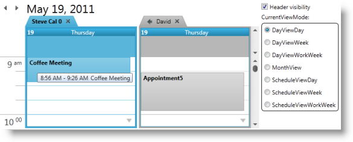

////
|metadata|
{
    "name": "xamschedule-using-control-confoutlookcalendar",
    "controlName": ["xamSchedule"],
    "tags": ["Data Presentation","Scheduling","Selection"],
    "guid": "18635102-7a0e-4a5c-9812-984432d86e5a",
    "buildFlags": [],
    "createdOn": "2016-05-25T18:21:58.9323679Z"
}
|metadata|
////

= Configuring xamOutlookCalendarView

This is one of the five topics explaining the views of the xamSchedule controls:

* link:{ApiPlatform}controls.schedules.v{ProductVersion}~infragistics.controls.schedules.xamdayview.html[xamDayView]
* link:{ApiPlatform}controls.schedules.v{ProductVersion}~infragistics.controls.schedules.xamscheduleview.html[xamScheduleView]
* link:{ApiPlatform}controls.schedules.v{ProductVersion}~infragistics.controls.schedules.xammonthview.html[xamMonthView]
* link:{ApiPlatform}controls.schedules.v{ProductVersion}~infragistics.controls.schedules.xamoutlookcalendarview.html[xamOutlookCalendarView] _(This is the current topic)_ 
* link:{ApiPlatform}controls.schedules.v{ProductVersion}~infragistics.controls.schedules.xamdatenavigator.html[xamDateNavigator]

This topic is organized in sections as follows:

* Introduction
* Purpose
* xamOutlookCalendarView Configuration Options

** Control specific settings
** Replicated Settings

* Related Topics

== Introduction

The xamOutllokCalendarDayView is designed to combine the xamDayView, xamScheduleView and xamMonthView all in one easy-to-use shell. In order to simplify the use of the control, the properties of the underlying views are replicated on the xamOutlookCalendarView which is responsible for passing the values to the appropriate View controls. (Figure 1)

====== Figure 1: Example of the xamOutlookCalendarView control

== Purpose

The purpose of this view is to provide a control that combines the xamDayView, xamScheduleView and xamMonthView all in one easy-to-use shell

== xamOutlookCalendarView Configuration Options

==== Control specific settings

* ViewModes
+
The view mode is controlled by the link:{ApiPlatform}controls.schedules.v{ProductVersion}~infragistics.controls.schedules.xamoutlookcalendarview~currentviewmode.html[CurrentViewMode] property. It returns or sets the current view which indicates which control and the settings of the control to be displayed. Available values include:

** link:{ApiPlatform}controls.schedules.v{ProductVersion}~infragistics.controls.schedules.outlookcalendarviewmode.html[DayViewDay] – Shows a xamDayView control displaying one or more days. If the previous value was DayViewWeek or DayViewWorkWeek the visible days count will not change. If the previous view was different - one day will be shown.
** link:{ApiPlatform}controls.schedules.v{ProductVersion}~infragistics.controls.schedules.outlookcalendarviewmode.html[DayViewWeek] – Shows a xamDayView control displaying a full week.
** link:{ApiPlatform}controls.schedules.v{ProductVersion}~infragistics.controls.schedules.outlookcalendarviewmode.html[DayViewWorkWeek] – Shows a xamDayView control displaying the work week.
** link:{ApiPlatform}controls.schedules.v{ProductVersion}~infragistics.controls.schedules.outlookcalendarviewmode.html[MonthView] – Shows a xamMonthView control.
** link:{ApiPlatform}controls.schedules.v{ProductVersion}~infragistics.controls.schedules.outlookcalendarviewmode.html[ScheduleViewDay] – Shows a xamSchedleView control displaying one or more days. If the previous value was ScheduleViewWeek or ScheduleViewWorkWeek the visible days count will not change. If the previous view was different - one day will be shown.
** link:{ApiPlatform}controls.schedules.v{ProductVersion}~infragistics.controls.schedules.outlookcalendarviewmode.html[ScheduleViewWeek] – Shows a xamScheduleView control displaying a full week.
** link:{ApiPlatform}controls.schedules.v{ProductVersion}~infragistics.controls.schedules.outlookcalendarviewmode.html[ScheduleViewWorkWeek] – Shows a xamScheduleView control displaying the work week.

* Header Area
+
The header area consists of two navigation buttons and a date range. The visibility of the header is set by the link:{ApiPlatform}controls.schedules.v{ProductVersion}~infragistics.controls.schedules.xamoutlookcalendarview~headervisibility.html[HeaderVisibility] property. Text from the date range is available by accessing the read-only link:{ApiPlatform}controls.schedules.v{ProductVersion}~infragistics.controls.schedules.xamoutlookcalendarview~currentviewdaterangetext.html[CurrentViewDateRangeText] property.

* Date Navigation
+
The xamOutlookCalendarView allows users to navigate using the header area navigation buttons. For richer user experience the control exposes the link:{ApiPlatform}controls.schedules.v{ProductVersion}~infragistics.controls.schedules.xamoutlookcalendarview~datenavigator.html[DateNavigator] property. This property allows the you to set a xamDateNavigator instance to use in conjunction with xamOutlookCalendarView to use the built-in automatic synchronization between the controls.

==== Replicated Settings

There are many properties common to all view controls. The XamOutlookCalendarView control replicates these properties in order to simplify the use of the control. This API approach allows you to change the type of the view you are using with minimum effort. Here are some of the common properties:

* link:{ApiPlatform}controls.schedules.v{ProductVersion}~infragistics.controls.schedules.xamoutlookcalendarview~datamanager.html[DataManager]
* link:{ApiPlatform}controls.schedules.v{ProductVersion}~infragistics.controls.schedules.xamoutlookcalendarview~activecalendar.html[ActiveCalendar]
* link:{ApiPlatform}controls.schedules.v{ProductVersion}~infragistics.controls.schedules.xamoutlookcalendarview~calendardisplaymode.html[CalendarDisplayMode]
* link:{ApiPlatform}controls.schedules.v{ProductVersion}~infragistics.controls.schedules.xamoutlookcalendarview~calendargroupsoverride.html[CalendarGroupsOverride]
* link:{ApiPlatform}controls.schedules.v{ProductVersion}~infragistics.controls.schedules.xamoutlookcalendarview~calendargroupsresolved.html[CalendarGroupsResolved]
* link:{ApiPlatform}controls.schedules.v{ProductVersion}~infragistics.controls.schedules.xamoutlookcalendarview~defaultbrushprovider.html[DefaultBrushProvider]
* link:{ApiPlatform}controls.schedules.v{ProductVersion}~infragistics.controls.schedules.xamoutlookcalendarview~selectedactivities.html[SelectedActivities]
* link:{ApiPlatform}controls.schedules.v{ProductVersion}~infragistics.controls.schedules.xamoutlookcalendarview~selectedtimerange.html[SelectedTimeRange]
* link:{ApiPlatform}controls.schedules.v{ProductVersion}~infragistics.controls.schedules.xamoutlookcalendarview~showcalendarclosebutton.html[ShowCalendarCloseButton]
* link:{ApiPlatform}controls.schedules.v{ProductVersion}~infragistics.controls.schedules.xamoutlookcalendarview~showcalendaroverlaybutton.html[ShowCalendarOverlayButton]

Other properties are specific only for Day and Schedule views:

* link:{ApiPlatform}controls.schedules.v{ProductVersion}~infragistics.controls.schedules.xamoutlookcalendarview~currenttimeindicatorvisibility.html[CurrentTimeIndicatorVisibility]
* link:{ApiPlatform}controls.schedules.v{ProductVersion}~infragistics.controls.schedules.xamoutlookcalendarview~primarytimezonelabel.html[PrimaryTimeZoneLabel]
* link:{ApiPlatform}controls.schedules.v{ProductVersion}~infragistics.controls.schedules.xamoutlookcalendarview~secondarytimezoneid.html[SecondaryTimeZoneId]
* link:{ApiPlatform}controls.schedules.v{ProductVersion}~infragistics.controls.schedules.xamoutlookcalendarview~secondarytimezonelabel.html[SecondaryTimeZoneLabel]
* link:{ApiPlatform}controls.schedules.v{ProductVersion}~infragistics.controls.schedules.xamoutlookcalendarview~secondarytimezonevisibility.html[SecondaryTimeZoneVisibility]
* link:{ApiPlatform}controls.schedules.v{ProductVersion}~infragistics.controls.schedules.xamoutlookcalendarview~showworkinghoursonly.html[ShowWorkingHoursOnly]
* link:{ApiPlatform}controls.schedules.v{ProductVersion}~infragistics.controls.schedules.xamoutlookcalendarview~timeslotinterval.html[TimeSlotInterval]
* link:{ApiPlatform}controls.schedules.v{ProductVersion}~infragistics.controls.schedules.xamoutlookcalendarview~workinghourssource.html[WorkingHoursSource]

For more detailed information on these properties please refer to the documentation of the xamSchedule View that the property is replicated from.

== Related Topics

link:xamschedule-using-control-visibledates.html[Displaying Dates]

link:xamschedule-using-control-selactivities.html[The Selected Activities Collection]

link:xamschedule-using-control-calendargrouping.html[Calendar Grouping]

link:xamschedule-using-control-confday.html[Configuring xamDayView]

link:xamschedule-using-control-confschedule.html[Configuring xamScheduleView]

link:xamschedule-using-control-confmonth.html[Configuring xamMonthView]

link:xamschedule-using-control-confdatenavigator.html[Configuring xamDateNavigator]