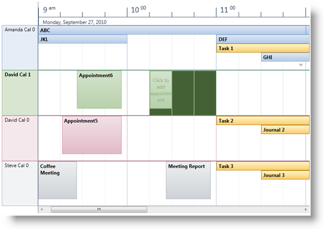
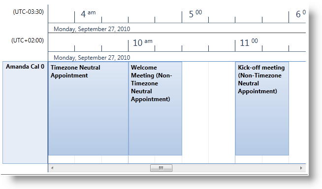
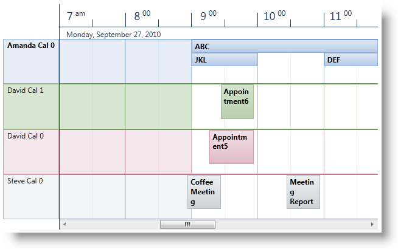
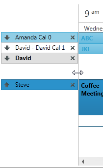

////
|metadata|
{
    "name": "xamschedule-using-control-confschedule",
    "controlName": ["xamSchedule"],
    "tags": ["How Do I","Scheduling"],
    "guid": "18089588-4de3-442b-883b-c6d84bf01187",
    "buildFlags": [],
    "createdOn": "2016-05-25T18:21:58.8893656Z"
}
|metadata|
////

= Configuring xamScheduleView

This is one of the five topics explaining the views of the xamSchedule controls:

* link:{ApiPlatform}controls.schedules{ApiVersion}~infragistics.controls.schedules.xamdayview.html[xamDayView]
* link:{ApiPlatform}controls.schedules{ApiVersion}~infragistics.controls.schedules.xamscheduleview.html[xamScheduleView]  _(This is the current topic)_ 
* link:{ApiPlatform}controls.schedules{ApiVersion}~infragistics.controls.schedules.xammonthview.html[xamMonthView]
* link:{ApiPlatform}controls.schedules{ApiVersion}~infragistics.controls.schedules.xamoutlookcalendarview.html[xamOutlookCalendarView]
* link:{ApiPlatform}controls.schedules{ApiVersion}~infragistics.controls.schedules.xamdatenavigator.html[xamDateNavigator]

This topic is organized in sections as follows:

* Introduction
* Purpose
* Presenting Activities in the Schedule
* Configuring the Data Source
* User Interaction and Usability
* xamScheduleView Configuration Options
* Related Topics

== Introduction

link:{ApiPlatform}controls.schedules{ApiVersion}~infragistics.controls.schedules.xamscheduleview.html[XamScheduleView] is one of the five view controls in the XamSchedule family. This view is similar to the link:{ApiPlatform}controls.schedules{ApiVersion}~infragistics.controls.schedules.xamdayview.html[xamDayView] with a couple of exceptions. The primary difference is that in XamScheduleView the timeslots of the days are displayed horizontally in a single line (as opposed to vertically in a single column for xamDayView). (Figure 1)

====== Figure 1: Example of the xamScheduleView control

== Purpose

This view is meant to provide an easier method of comparing the schedules of one or more link:{ApiPlatform}controls.schedules{ApiVersion}~infragistics.controls.schedules.resourcecalendar.html[calendars]/link:{ApiPlatform}controls.schedules{ApiVersion}~infragistics.controls.schedules.resource.html[resources]. (See User Interaction and Usability below.)

== Presenting Activities in the Schedule

As in xamDayView, the activities are displayed as rectangles filling the timeslots between their link:{ApiPlatform}controls.schedules{ApiVersion}~infragistics.controls.schedules.activitybase~start.html[Start] and link:{ApiPlatform}controls.schedules{ApiVersion}~infragistics.controls.schedules.activitybase~end.html[End] times.

== Configuring the Data Source

The data for the activities and resource calendars displayed in the view is provided by an instance of link:{ApiPlatform}controls.schedules{ApiVersion}~infragistics.controls.schedules.xamscheduledatamanager.html[XamDataManager]. That instance is configured with the link:{ApiPlatform}controls.schedules{ApiVersion}~infragistics.controls.schedules.schedulecontrolbase~datamanager.html[DataManager] property of xamMonthView.

== User Interaction and Usability

In XamScheduleView, users can:

* Navigate through the timeslots and activities using the keyboard
* Create activities with one click of the mouse:

** by selecting time slot (with keyboard or mouse) and typing directly into it
** by clicking the “Click to Add” prompt that is displayed when hovering over a time slot

* Resize an activity (that is, change the Start or End of an activity) using the resize grips
* Drag an activity from one schedule to another (that is, among different xamSchedule controls associated with the same xamScheduleDataManager)
* Click and modify the link:{ApiPlatform}controls.schedules{ApiVersion}~infragistics.controls.schedules.activitybase~subject.html[Subject] of an activity
* Create a new activity by double-clicking a day (via the activity dialog)
* Edit an activity by double-clicking on it
* Navigate to an activity using the more activity arrows
* Scroll the schedule using the scrollbar
* Delete selected activities

** with the Delete key
** from the Activity dialog

* Resize the calendar groups
* Resize the calendar header area

== xamScheduleView Configuration Options

[start=1]
. link:{ApiPlatform}controls.schedules{ApiVersion}~infragistics.controls.schedules.scheduletimecontrolbase~weekdisplaymode.html[WeekDisplayMode] – this setting has three options:

** link:{ApiPlatform}controls.schedules{ApiVersion}~infragistics.controls.schedules.weekdisplaymode.html[None] – displays the day or days specified in the VisibleDays Collection
** link:{ApiPlatform}controls.schedules{ApiVersion}~infragistics.controls.schedules.weekdisplaymode.html[Week] – displays all 7 week days
** link:{ApiPlatform}controls.schedules{ApiVersion}~infragistics.controls.schedules.weekdisplaymode.html[WorkWeek] – displays the working days of the week. Note that the default Monday to Friday work days can be changed via link:{ApiPlatform}controls.schedules{ApiVersion}~infragistics.controls.schedules.schedulesettings~workinghours.html[WorkingDays] property in link:{ApiPlatform}controls.schedules{ApiVersion}~infragistics.controls.schedules.xamscheduledatamanager~settings.html[Settings] of the XamDataManager.

[start=2]
. link:{ApiPlatform}controls.schedules{ApiVersion}~infragistics.controls.schedules.scheduletimecontrolbase~showworkinghoursonly.html[ShowWorkingHoursOnly] is a boolean property that allows the developer to show only the working hours of the day. The default (9am-5pm) values can be changed via link:{ApiPlatform}controls.schedules{ApiVersion}~infragistics.controls.schedules.schedulesettings~workinghours.html[WorkingHours] property in Settings of the XamDataManager. (See the link:xamschedule-using-manager-working-hours.html[Working Hours topic])

[start=3]
. Secondary Timezone settings – the xamScheduleView displays one primary timezone header by default. However there is a property called link:{ApiPlatform}controls.schedules{ApiVersion}~infragistics.controls.schedules.scheduletimecontrolbase~secondarytimezonevisibility.html[SecondaryTimeZoneVisibility] that allows the developer to show a secondary Timezone header. There are also properties for setting the link:{ApiPlatform}controls.schedules{ApiVersion}~infragistics.controls.schedules.scheduletimecontrolbase~secondarytimezoneid.html[TimeZoneId] and the link:{ApiPlatform}controls.schedules{ApiVersion}~infragistics.controls.schedules.scheduletimecontrolbase~secondarytimezonelabel.html[label] for it. Here is a sample:
+
*In Visual Basic:*
+
[source,vb]
----
scheduleView.SecondaryTimeZoneVisibility = _
    System.Windows.Visibility.Visible
scheduleView.SecondaryTimeZoneLabel = _
    "(UTC-03:30)"
scheduleView.SecondaryTimeZoneId = _
    "Newfoundland Standard Time"
----
+
*In C#:*
+
[source,csharp]
----
scheduleView.SecondaryTimeZoneVisibility =
    System.Windows.Visibility.Visible;
scheduleView.SecondaryTimeZoneLabel =
    "(UTC-03:30)";
scheduleView.SecondaryTimeZoneId =
    "Newfoundland Standard Time";
----
+

[start=4]
. link:{ApiPlatform}controls.schedules{ApiVersion}~infragistics.controls.schedules.schedulecontrolbase~calendardisplaymode.html[CalendarDisplayMode] – this property has three valid options – link:{ApiPlatform}controls.schedules{ApiVersion}~infragistics.controls.schedules.calendardisplaymode.html[Overlay], link:{ApiPlatform}controls.schedules{ApiVersion}~infragistics.controls.schedules.calendardisplaymode.html[Separate] and link:{ApiPlatform}controls.schedules{ApiVersion}~infragistics.controls.schedules.calendardisplaymode.html[Merged].
+
[options="header", cols="a,a,a"]
|====
|Overlay|Separate|Merged

|CalendarDisplayMode.Overlay
|CalendarDisplayMode.Separate
|CalendarDisplayMode.Merged

|image::images/xamSchedule_Schedule03.png[]
|image::images/xamSchedule_Schedule04.png[]
|image::images/xamSchedule_Schedule05.png[]

|====
+
When using Overlay and Separate modes the developer can choose to show the Close and Overlay buttons (affects Overlay mode only). The visibility of these buttons lets the end user move the calendars in different groups and allows closing them.
+
*In Visual Basic:*
+
[source,vb]
----
scheduleView.ShowCalendarCloseButton = True
scheduleView.ShowCalendarOverlayButton = True
----
+
*In C#:*
+
[source,csharp]
----
scheduleView.ShowCalendarCloseButton = true;
scheduleView.ShowCalendarOverlayButton = true;
----
+
[options="header", cols="a,a"]
|====
|Overlay|Separate

|CalendarDisplayMode.Overlay
|CalendarDisplayMode.Separate

|image::images/xamSchedule_Schedule06.png[]
|image::images/xamSchedule_Schedule07.png[]

|====

[start=5]
. Visible Days – the developer can show multiple days for one calendar just by populating the link:{ApiPlatform}controls.schedules{ApiVersion}~infragistics.controls.schedules.schedulecontrolbase~visibledates.html[VisibleDates] collection.

[start=6]
. link:{ApiPlatform}controls.schedules{ApiVersion}~infragistics.controls.schedules.scheduletimecontrolbase~timeslotinterval.html[TimeslotInterval] – This property allows the developer to change the default 15-minute timeslots.
+
*In Visual Basic:*
+
[source,vb]
----
scheduleView.TimeslotInterval = New System.TimeSpan(0, 30, 0)
----
+
*In C#:*
+
[source,csharp]
----
scheduleView.TimeslotInterval = new System.TimeSpan(0, 30, 0);
----
+

[start=7]
. The single calendars or calendar groups (depending of the value set in the CalendarDisplayMode property) have equal size. In case you have more calendars in one group comparing to the other you may want the end user to be able to resize these groups. This can be achieved by setting the link:{ApiPlatform}controls.schedules{ApiVersion}~infragistics.controls.schedules.schedulecontrolbase~allowcalendargroupresizing.html[AllowCalendarGroupResizing] Boolean property. Double clicking on the resizing point will restore the initial size of the calendar groups.
+
[options="header", cols="a,a"]
|====
|Overlay|Separate

|CalendarDisplayMode.Overlay
|CalendarDisplayMode.Separate

|image::images/xamSchedule_scheduleView-resizing-groups-1.png[]
|image::images/xamSchedule_scheduleView-resizing-groups-2.png[]

|====

[start=8]
. To allow the end user to resize the calendar header area, set the link:{ApiPlatform}controls.schedules{ApiVersion}~infragistics.controls.schedules.xamscheduleview~allowcalendarheaderarearesizing.html[AllowCalendarHeaderAreaResizing] Boolean property to true. Also you can use the link:{ApiPlatform}controls.schedules{ApiVersion}~infragistics.controls.schedules.xamscheduleview~calendarheaderareawidth.html[CalendarHeaderAreaWidth] property to specify custom width for it. Double clicking on the resizing point will restore the initial calendar header width.
+
*In Visual Basic:*
+
[source,vb]
----
scheduleView.AllowCalendarHeaderAreaResizing = True
----
+
*In C#:*
+
[source,csharp]
----
scheduleView.AllowCalendarHeaderAreaResizing = true;
----
+

== Related Topics

link:xamschedule-using-control-visibledates.html[Displaying Dates]

link:xamschedule-using-control-selactivities.html[The Selected Activities Collection]

link:xamschedule-using-control-calendargrouping.html[Calendar Grouping]

link:xamschedule-using-control-confday.html[Configuring xamDayView]

link:xamschedule-using-control-confmonth.html[Configuring xamMonthView]

link:xamschedule-using-control-confoutlookcalendar.html[Configuring xamOutlookCalendarView]

link:xamschedule-using-control-confdatenavigator.html[Configuring xamDateNavigator]