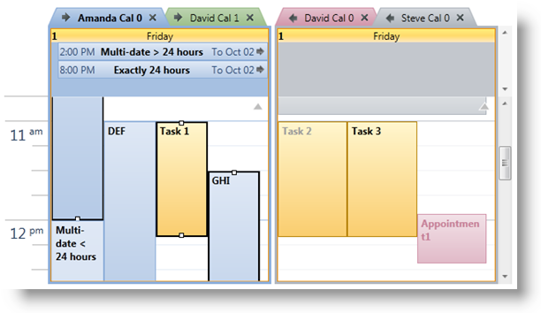

////

|metadata|
{
    "name": "xamschedule-using-control-selactivities",
    "controlName": ["xamSchedule"],
    "tags": ["How Do I","Scheduling","Selection"],
    "guid": "8d2a0489-4486-4586-a03f-94d44b24a625",  
    "buildFlags": [],
    "createdOn": "2016-05-25T18:21:58.8683644Z"
}
|metadata|
////

= The Selected Activities Collection

The xamSchedule includes a number of view controls including link:{ApiPlatform}controls.schedules{ApiVersion}~infragistics.controls.schedules.xamdayview.html[xamDayView], link:{ApiPlatform}controls.schedules{ApiVersion}~infragistics.controls.schedules.xammonthview.html[xamMonthView] and link:{ApiPlatform}controls.schedules{ApiVersion}~infragistics.controls.schedules.xamscheduleview.html[xamScheduleView]. Each of these controls offers the end user the ability to select one or more scheduling activities.

When the user clicks on an activity in one of the xamSchedule view controls the following actions are performed:

[start=1]
. If the activity is not being edited in place then focus is set to the view control.
[start=2]
. If not already active, the link:{ApiPlatform}controls.schedules{ApiVersion}~infragistics.controls.schedules.resourcecalendar.html[ResourceCalendar] that the activity is associated with is activated. This sets the view control’s link:{ApiPlatform}controls.schedules{ApiVersion}~infragistics.controls.schedules.schedulecontrolbase~activecalendar.html[ActiveCalendar] property and raises its link:{ApiPlatform}controls.schedules{ApiVersion}~infragistics.controls.schedules.schedulecontrolbase~activecalendarchanged_ev.html[ActiveCalendarChanged] event.
[start=3]
. If the ResourceCalendar is in a link:{ApiPlatform}controls.schedules{ApiVersion}~infragistics.controls.schedules.calendargroup.html[CalendarGroup] then the group’s link:{ApiPlatform}controls.schedules{ApiVersion}~infragistics.controls.schedules.calendargroupbase~selectedcalendar.html[SelectedCalendar] property is set to the ResourceCalendar.
[start=4]
. All currently selected activities that are associated with different ResourceCalendars are removed from the link:{ApiPlatform}controls.schedules{ApiVersion}~infragistics.controls.schedules.schedulecontrolbase~selectedactivities.html[SelectedActivities] collection.
[start=5]
. If the ‘Ctrl’ key is pressed:

.. If the activity is already in the SelectedActivities collection it is removed.
.. If the activity is not already in the SelectedActivities collection it is added.
.. The link:{ApiPlatform}controls.schedules{ApiVersion}~infragistics.controls.schedules.schedulecontrolbase~selectedactivitieschanged_ev.html[SelectedActivitiesChanged] event is raised.

[start=6]
. If the ‘Ctrl’ key is not pressed:

.. All other activities that are associated with the same ResourceCalendar are removed from the SelectedActivities collection.
.. If the activity is not already in the SelectedActivities collection it is added.
.. If any changes were made to the SelectedActivities collection by 4, 5a and 5b above then the SelectedActivitiesChanged event is raised.

[start=7]
. All activities associated with the SelectedCalendar in their respective CalendarGroups will appear bolder than activities associated with other ResourceCalendars.
[start=8]
. All activities in the SelectedActivities collection will appear with thicker borders than other activities and will display resize handles if resizing of the activity is allowed.

*Note:* The SelectedActivities collection, the ActiveCalendar property and the CalendarGroup’s SelectedCalendar property can be set in code. It is the caller’s responsibility in this case to synchronize these properties to sure they make sense. For example, to select an activity the caller should clear the SelectedActivities collection of activities from other ResourceCalendars and set the ActiveCalendar property appropriately.

The following example shows how to listen for changes in the SelectedActivities collection:

*In Visual Basic:*

----
dayView.SelectedActivitiesChanged += _
    New EventHandler(Of SelectedActivitiesChangedEventArgs) _
   (dayView_SelectedActivitiesChanged)
Private Sub dayView_SelectedActivitiesChanged(sender As Object, _
    e As SelectedActivitiesChangedEventArgs)
        For Each activity As var In dayView.SelectedActivities
        ' here the developer has all the ActivityBase info like
        ' activity.Id and the actual activity in activity.DataItem
        ' property
        Next
End Sub
----

*In C#:*

----
dayView.SelectedActivitiesChanged +=
    new EventHandler<SelectedActivitiesChangedEventArgs>
    (dayView_SelectedActivitiesChanged);
void dayView_SelectedActivitiesChanged(object sender,
    SelectedActivitiesChangedEventArgs e)
{
    foreach (var activity in dayView.SelectedActivities)
    {
        // here the developer has all the ActivityBase info like
        // activity.Id and the actual activity in activity.DataItem
        // property
    }
}
----

== Related Topics

link:xamschedule-using-control-visibledates.html[Displaying Dates]

link:xamschedule-using-control-calendargrouping.html[Calendar Grouping]

link:xamschedule-using-control-confday.html[Configuring xamDayView]

link:xamschedule-using-control-confschedule.html[Configuring xamScheduleView]

link:xamschedule-using-control-confmonth.html[Configuring xamMonthView]