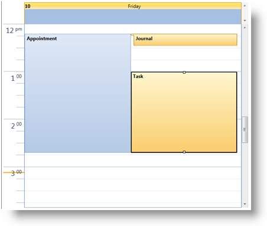
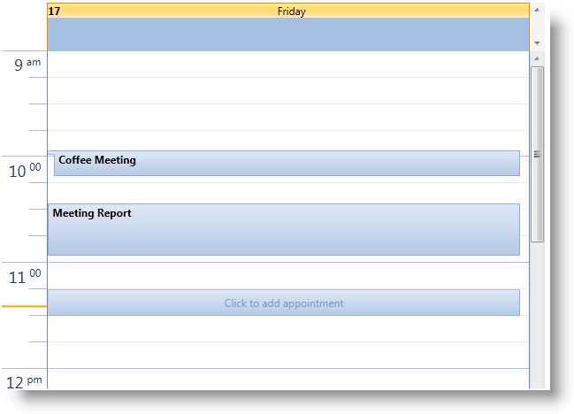

////

|metadata|
{
    "name": "xamschedule-using-enduserinteraction",
    "controlName": ["xamSchedule"],
    "tags": ["How Do I","Recurrences","Scheduling"],
    "guid": "ea4cc988-ecc4-48dc-b7f5-cf9d8ceb21ef",  
    "buildFlags": [],
    "createdOn": "2016-05-25T18:21:58.9023665Z"
}
|metadata|
////

= End User Interaction with Activities

The xamSchedule controls include built-in support for a number of interactions which allow the end user to manipulate and interact with link:{ApiPlatform}controls.schedules{ApiVersion}~infragistics.controls.schedules.resourcecalendar.html[calendars] and link:{ApiPlatform}controls.schedules{ApiVersion}~infragistics.controls.schedules.activitybase.html[activities]. Some activity related interactions may not be allowed depending on the state of the activity, connector or activity settings.

The link:{ApiPlatform}controls.schedules{ApiVersion}~infragistics.controls.schedules.schedulesettings.html[ScheduleSettings] (exposed via the link:{ApiPlatform}controls.schedules{ApiVersion}~infragistics.controls.schedules.xamscheduledatamanager.html[XamScheduleDataManager]’s link:{ApiPlatform}controls.schedules{ApiVersion}~infragistics.controls.schedules.xamscheduledatamanager~settings.html[Settings] property) has a property named link:{ApiPlatform}controls.schedules{ApiVersion}~infragistics.controls.schedules.activitysettings.html[[activity type]Settings] exposed for each activity type (e.g. link:{ApiPlatform}controls.schedules{ApiVersion}~infragistics.controls.schedules.schedulesettings~appointmentsettings.html[AppointmentSettings] affects the link:{ApiPlatform}controls.schedules{ApiVersion}~infragistics.controls.schedules.appointment.html[Appointment] objects). These activity settings may be used to constrain and control the types of user interactions that are allowed by the end user. For example, if the link:{ApiPlatform}controls.schedules{ApiVersion}~infragistics.controls.schedules.activitysettings~allowedit.html[AllowEdit] property is set to False, then that activity type will not allow manipulation of its properties (e.g. editing, resizing, etc.).

Also, link:{ApiPlatform}controls.schedules{ApiVersion}~infragistics.controls.schedules.resource.html[Resource] has an link:{ApiPlatform}controls.schedules{ApiVersion}~infragistics.controls.schedules.resource~islocked.html[IsLocked] property which when set to true prevents the user from adding, removing or editing activities of the resource. Similarly, link:{ApiPlatform}controls.schedules{ApiVersion}~infragistics.controls.schedules.activitybase.html[ActivityBase] has an link:{ApiPlatform}controls.schedules{ApiVersion}~infragistics.controls.schedules.activitybase~islocked.html[IsLocked] property which prevents the user from editing it.

== Drag & Drop

The end user may use a pointing device such as a mouse to drag an activity and thereby change its link:{ApiPlatform}controls.schedules{ApiVersion}~infragistics.controls.schedules.activitybase~start.html[Start] and link:{ApiPlatform}controls.schedules{ApiVersion}~infragistics.controls.schedules.activitybase~end.html[End] time based on the timeslot that the mouse is positioned over. Dragging is supported not just within the control in which the drag started but also amongst all the link:{ApiPlatform}controls.schedules{ApiVersion}~infragistics.controls.schedules.schedulecontrolbase.html[ScheduleControlBase] derived controls (i.e. link:{ApiPlatform}controls.schedules{ApiVersion}~infragistics.controls.schedules.xammonthview.html[XamMonthView], link:{ApiPlatform}controls.schedules{ApiVersion}~infragistics.controls.schedules.xamdayview.html[XamDayView] and link:{ApiPlatform}controls.schedules{ApiVersion}~infragistics.controls.schedules.xamscheduleview.html[XamScheduleView]) whose link:{ApiPlatform}controls.schedules{ApiVersion}~infragistics.controls.schedules.schedulecontrolbase~datamanager.html[DataManager] is set to the same link:{ApiPlatform}controls.schedules{ApiVersion}~infragistics.controls.schedules.xamscheduledatamanager.html[XamScheduleDataManager] as the source control.

In most cases dragging will maintain the original link:{ApiPlatform}controls.schedules{ApiVersion}~infragistics.controls.schedules.activitybase~duration.html[Duration] of the activity but depending on the drop target (i.e. the timeslot over which the mouse is released) the duration of the activity may be changed. For example, dragging an activity whose duration is less than the logical day duration (i.e. 24 hours by default) to the multi-day activity area will change the duration of the activity to the logical day duration. Similarly dragging an activity whose duration is 24 hours or greater into the timeslots of the xamDayView will change the duration to 30 minutes if the link:{ApiPlatform}controls.schedules{ApiVersion}~infragistics.controls.schedules.xamdayview~multidayactivityareavisibility.html[MultiDayActivityAreaVisibility] is not set to Collapsed.

When dragging, holding the Ctrl key indicates that a copy of the original activity should be created.

*Note:* The associated link:{ApiPlatform}controls.schedules{ApiVersion}~infragistics.controls.schedules.xamscheduledatamanager~dataconnector.html[DataConnector] must support creation of new activities in order for this operation to be allowed.

Also, depending on the capabilities of the associated DataConnector, activities may be allowed to be dragged between calendars and even between resources. The ActivitySettings exposes an link:{ApiPlatform}controls.schedules{ApiVersion}~infragistics.controls.schedules.activitysettings~allowdragging.html[AllowDragging] property that may be used to indicate whether activities may only be dragged within the same calendar, between calendars of the same resource or between calendars of any resource.

== Resizing

When an activity is selected, resizing Start and/or End placeholders are shown if the activity is allowed to be resized. The user can drag these to adjust the Start or End time of the activity and therefore the Duration of the activity.

The link:{ApiPlatform}controls.schedules{ApiVersion}~infragistics.controls.schedules.activitysettings~allowresizing.html[AllowResizing] property of the activity settings may be used to control whether the end user is allowed to resize the activity and the type of resize that is allowed.

If the actual Start or End time of an activity is not displayed within the control (e.g. an activity goes from 9/25 12am until 9/28 12am and the control is only displaying 9/26) then the resize indicators will not be displayed for any edge that is out of view.

== Editing

Clicking on the subject of a selected activity will start an "in place" edit operation. After editing the link:{ApiPlatform}controls.schedules{ApiVersion}~infragistics.controls.schedules.activitybase~subject.html[Subject] and pressing the Enter key (or clicking on a timeslot to shift the focus away from the selected activity) the change will be submitted. Clicking Escape will cancel the edit operation.

== Creating

There are several ways to create new activity. The user may double click on a timeslot and the activity dialog will be displayed and initialized based on the time associated with the timeslot clicked. The user may also create a new activity "in place" by selecting one or more timeslots and typing or pressing enter.

Another means for creating an activity is using the "Click to Add" prompt. This is an element displayed in a timeslot after hovering the mouse over the timeslot for a short interval. Clicking on this element will create a new activity for that timeslot and place the end user in an in place edit.

*Note:* Note currently only creation of link:{ApiPlatform}controls.schedules{ApiVersion}~infragistics.controls.schedules.appointment.html[Appointment] entities are supported via the UI. link:{ApiPlatform}controls.schedules{ApiVersion}~infragistics.controls.schedules.task.html[Tasks] and link:{ApiPlatform}controls.schedules{ApiVersion}~infragistics.controls.schedules.journal.html[Journal] activity types cannot be created via the UI

== Deleting

There are two built-in ways to delete an activity via the UI. The end user may select one or more activities in the UI and press the Delete key. To select more than one activity, the end user must hold down the Ctrl key. If a selected activity is an occurrence of a recurring activity, the user will be prompted with a message asking whether to remove the occurrence or the series.

The other way is using the Delete button within the activity dialog. If the activity is an occurrence or the root activity of a recurrence (i.e. the user is editing the "series") then this will either delete the occurrence or the series.

== Related Topics

link:xamschedule-understanding-activities.html[About Activities]

link:xamschedule-using-manager-permission.html[Permission]

link:xamschedule-using-control-confday.html[Configuring xamDayView]

link:xamschedule-using-control-confschedule.html[Configuring xamScheduleView]

link:xamschedule-using-control-confmonth.html[Configuring xamMonthView]