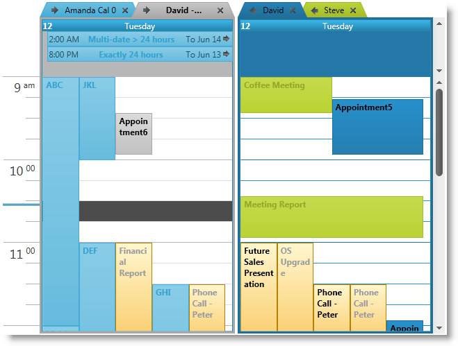
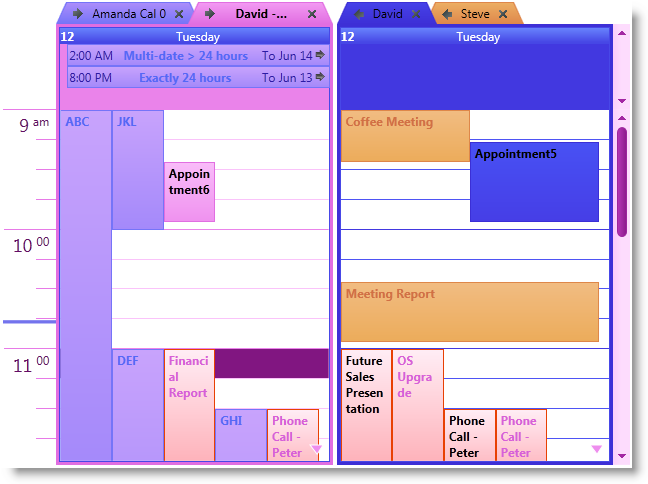

////
|metadata|
{
    "name": "xamschedule-using-styling-washingcolorschemes",
    "controlName": ["xamSchedule"],
    "tags": ["Styling"],
    "guid": "da2cfbc3-b43b-4a39-9879-7ac3785934fe",
    "buildFlags": [],
    "createdOn": "2016-05-25T18:21:58.8423654Z"
}
|metadata|
////

= Washing Color Schemes (xamSchedule)

== Topic Overview

=== Purpose

This topic explains how to change the colors of the  _xamSchedule’s_   color schemes.

=== Required background

The following topics are prerequisites to understanding this topic:

[options="header", cols="a,a"]
|====
|Topic|Purpose

| link:xamschedule-understanding.html[Understanding xamSchedule]
|This topic provides an overview of the _xamSchedule_ control.

| link:xamschedule-using-styling-custom.html[Custom Color Scheme]
|This topic describes how to create custom color schemes for the _xamSchedule_ .

|====

=== In this topic

* <<_Ref332787501,Introduction>>
* <<_Ref332787913, _XamSchedule_   color scheme washing procedure>>
* <<OLE_LINK48,Code Examples>>
* <<_Ref329347147,Washing Color Schemes in XAML – Code Example>>
* <<_Ref329347158,Washing Color Schemes in C# – Code Example>>
* <<_Ref329347164,Washing Color Schemes in Visual Basic – Code Example>>
* <<_Ref332787979,Related Content>>

[[_Ref332787501]]
== Introduction

=== Introduction to color washing

You can use the link:{ApiPlatform}v{ProductVersion}~infragistics.windows.themes.resourcewasher.html[Resource Washer] to wash the  _xamSchedule’s_   color schemes with a specific color, which will change the look and feel of your application completely.

.Note
[NOTE]
====
The  _xamSchedule_   control’s user interface is comprised of several {ProductName} controls ( link:{ApiPlatform}controls.editors.xamcalendar{ApiVersion}~infragistics.controls.editors.xamcalendar.html[xamCalendar], link:{ApiPlatform}controls.menus.xammenu{ApiVersion}~infragistics.controls.menus.xammenu.html[xamMenu] and  pick:[sl=" link:{ApiPlatform}controls.menus.xamribbon{ApiVersion}~infragistics.controls.menus.xamribbon.html[xamRibbon]"]  pick:[wpf=" link:{ApiPlatform}ribbon{ApiVersion}~infragistics.windows.ribbon.xamribbon.html[xamRibbon]"]  , which of these controls are available to  _xamSchedule_   depends on what functions you are using (for example, you might be using link:xamschedule-using-activitydialogs.html[“lightweight” or “full-featured” dialogs]). Consequently, if you want to make the whole user interface consistent you may need to wash the other controls too.
====

[[_Ref332787913]]
== _XamSchedule_   color scheme washing procedure

=== Introduction

Given that the Resource Washer is itself a ResourceDictionary, you should add it to your application or page resources. You can wash both an existing or custom color scheme.

=== Preview

The next two screenshots compare and contrast the  _xamSchedule_   using the standard IG color scheme and the IG color scheme washed using a Magenta color.

Standard IG color scheme applied:

IG color scheme washed with Magenta color applied:

=== Steps

The following steps-by-step instructions demonstrate the basic procedure you are required to perform in order to wash a  _xamSchedule’s_   color scheme. For more information, please refer to the following code examples.
[start=1]
. Create a ResourceWasher

Instantiates an instance of `ResourceWasher` in either XAML or code.
[start=2]
. Configure the ResourceWasher

Configures the `ResourceWasher` for your specific needs (for example, set the  pick:[sl=" link:{ApiPlatform}v{ProductVersion}~infragistics.resourcewasher~washcolor.html[WashColor]"]  pick:[wpf=" link:{ApiPlatform}v{ProductVersion}~infragistics.windows.themes.resourcewasher~washcolor.html[WashColor]"]  and the  pick:[sl=" link:{ApiPlatform}v{ProductVersion}~infragistics.resourcewasher~sourcedictionary.html[SourceDictionary]"]  pick:[wpf=" link:{ApiPlatform}v{ProductVersion}~infragistics.windows.themes.resourcewasher~sourcedictionary.html[SourceDictionary]"]  properties). Please read the link:reswash.html[ResourceWasher’s topics] for additional information on how to use it.
[start=3]
. Add the ResourceWasher in the Resources

Adds the `ResourceWasher` to your Application or Page’s resources.

== Code Examples

=== Code examples summary

The following table lists the code examples included in this topic.

[options="header", cols="a,a"]
|====
|Example|Description

|<<_Ref329347147,Washing Color Schemes in XAML – Code Example>>
|This code example demonstrates how to wash color schemes in XAML

|<<_Ref329347158,Washing Color Schemes in C# – Code Example>>
|This code example demonstrates how to wash color schemes in C#

|<<_Ref329347164,Washing Color Schemes in Visual Basic – Code Example>>
|This code example demonstrates how to wash color schemes in VB

|====

[[_Ref329347147]]
== Washing Color Schemes in XAML – Code Example

=== Description

This code example demonstrates how to wash color schemes in XAML.

=== Code

*In XAML:*

ifdef::wpf[]
----
<Page
  x:Class="IGSchedule.Samples.MyPage"
  xmlns="http://schemas.microsoft.com/winfx/2006/xaml/presentation"
  xmlns:x="http://schemas.microsoft.com/winfx/2006/xaml"
  xmlns:mc="http://schemas.openxmlformats.org/markup-compatibility/2006"
  xmlns:d="http://schemas.microsoft.com/expression/blend/2008"
  mc:Ignorable="d"
  ...
  xmlns:ig="http://schemas.infragistics.com/xaml"
  xmlns:igThemes="http://infragistics.com/Themes" >
  <Page.Resources>
    <ig Themes :ResourceWasher WashColor="Magenta">
      <ig Themes :ResourceWasher.SourceDictionary>
        <ResourceDictionary>
          
        </ResourceDictionary>
      </ig Themes :ResourceWasher.SourceDictionary>
    </ig Themes :ResourceWasher>
  </Page.Resources>
  <ig:XamDayView x:Name="dayView" ... />
</Page>
----
endif::wpf[]

[[_Ref329347158]]
== Washing Color Schemes in C# – Code Example

=== Description

This code example demonstrates how to wash color schemes in C#.

=== Code

*In C#:*

[source,csharp]
----
// create an instance of the IG color scheme
IGColorScheme igcs = new IGColorScheme();
// create new style, which will set the "ColorScheme"
// of the xamSchedule's data manager and the value
// will be the IG color scheme instance we've created above
System.Windows.Style style = new System.Windows.Style();
style.TargetType = typeof(XamScheduleDataManager);
style.Setters.Add(new Setter()
{
    Property = XamScheduleDataManager.ColorSchemeProperty,
    Value = igcs
});
// add this style in the merged dictionaries of a
// ResourceDictionary, which is set as in the
// "SourceDictionary" property of the Resource Washer
ResourceDictionary rd = new ResourceDictionary();
rd.Add("style1", style);
ResourceWasher rw = new ResourceWasher();
rw.SourceDictionary = rd;
// set the color you want to wash the color scheme with
rw.WashColor = Colors.Magenta;
// set the washed color scheme to the xamSchedule's data manager
this.dataManager.ColorScheme = igcs;
----

[[_Ref329347164]]
== Washing Color Schemes in Visual Basic – Code Example

=== Description

This code example demonstrates how to wash color schemes in VB.

=== Code

*In Visual Basic:*

[source,vb]
----
' create an instance of the IG color scheme
Dim igcs As New IGColorScheme()
' create new style, which will set the "ColorScheme"
' of the xamSchedule's data manager and the value
' will be the IG color scheme instance we've created above
Dim style As New System.Windows.Style()
style.TargetType = GetType(XamScheduleDataManager)
style.Setters.Add(New Setter() With { _
      .[Property] = XamScheduleDataManager.ColorSchemeProperty, _
      .Value = igcs _
})
' add this style in the merged dictionaries of a
' ResourceDictionary, which is set as in the
' "SourceDictionary" property of the Resource Washer
Dim rd As New ResourceDictionary()
rd.Add("style1", style)
Dim rw As New ResourceWasher()
rw.SourceDictionary = rd
' set the color you want to wash the color scheme with
rw.WashColor = Colors.Magenta
' set the washed color scheme to the xamSchedule's data manager
Me.dataManager.ColorScheme = igcs
----

[[_Ref332787979]]
== Related Content

=== Topics

The following topics provide additional information related to this topic.

[options="header", cols="a,a"]
|====
|Topic|Purpose

| link:reswash-about.html[About Resource Washer]
|This topic introduces you to the `Resource Washer`.

| link:reswash-using.html[Using Resource Washer]
|This topic introduces you to the `Resource Washer` component where you learn to change the overall color schemes of your applications.

| link:xamschedule-using-styling-custom.html[Custom Color Scheme]
|Explains the creation of _xamSchedule's_ Custom Color Schemes.

|====