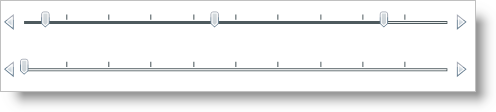

////

|metadata|
{
    "name": "xamslider-about-xamslider",
    "controlName": ["xamSlider"],
    "tags": ["Getting Started"],
    "guid": "{D22E2274-1215-41F8-9684-993F0219822F}",  
    "buildFlags": [],
    "createdOn": "2016-05-25T18:21:59.0093343Z"
}
|metadata|
////

= About xamSlider

The xamSlider™ family of controls allows your end users to specify a value or range of values by sliding a thumb in a xamSlider control. The xamSlider family of controls consists of four types of sliders that can be categorized according to its data type and/or functionality. The one you use in your application will depend on the functionality you want to implement.

* xamNumericSlider™ - A slider that can display a single thumb for selecting a double value.
* xamDateTimeSlider™ - A slider that can display a single thumb for selecting a DateTime value.
* xamNumericRangeSlider™ - A slider that can display multiple thumbs for selecting multiple double values or a range of double values.
* xamDateTimeRangeSlider™ - A slider that can display multiple thumbs for selecting multiple DateTime values or a range of DateTime values.

ifdef::sl,wpf[]

endif::sl,wpf[]

ifdef::win-phone[]

endif::win-phone[]

== Related Topics

link:xamslider-getting-started-with-xamslider.html[Getting Started with xamSlider]

link:xamslider-using-xamslider.html[Using xamSlider]