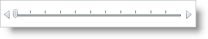

////
|metadata|
{
    "name": "xamslider-adding-a-single-value-slider-to-your-application",
    "controlName": ["xamSlider"],
    "tags": ["Getting Started"],
    "guid": "{2385A9B1-A0C7-4FAB-9CBB-84A7878F00B2}",
    "buildFlags": [],
    "createdOn": "2016-05-25T18:21:59.0293705Z"
}
|metadata|
////

= Adding a Single-Value Slider to Your Application

== Before You Begin

You can add the single-value sliders, i.e., xamNumericSlider™or xamDateTimeSlider™, to your application using the same pattern as any control found in Microsoft® {PlatformName}™. This pattern involves using a layout container and adding the control to the Children collection of the layout container.

== What You Will Accomplish

You will add a xamNumericSlider control to your application. When you run the finished project, you should see a xamNumericSlider control in your browser that looks similar to the screen shot below.

== Follow these Steps

[start=1]
. Create a {PlatformName} project.

[start=2]
. In the Solution Explorer, add the following references:

** {ApiPlatform}{DllVersion}dll
** {ApiPlatform}Controls.Editors.XamSlider.{DllVersion}dll

[start=3]
. Place using/Imports directives in your code-behind or add an XML namespace definition for xamSlider™.
+
*In XAML:*
+
[source,xaml]
----
xmlns:ig="http://schemas.infragistics.com/xaml"
----
+
*In Visual Basic:*
+
[source,vb]
----
Imports Infragistics.Controls.Editors
----
+
*In C#:*
+
[source,csharp]
----
using Infragistics.Controls.Editors;
----

[start=4]
. Add an instance of the xamNumericSlider control to default Grid layout panel named "LayoutRoot". If you are doing this in procedural code, you can handle the UserControl's Loaded event and place the code in the event handler.
+
Unlike the range sliders, the single-value sliders automatically create a xamSlider thumb for you. You do not have to set a single-value slider's link:{ApiPlatform}controls.editors.xamslider{ApiVersion}~infragistics.controls.editors.xamsimplesliderbase`1~thumb.html[Thumb] property unless you want to modify the thumb's properties.
+
--
** Set its Name property to xamNumericSlider1.
** Set its link:{ApiPlatform}controls.editors.xamslider{ApiVersion}~infragistics.controls.editors.xamnumericslider~minvalue.html[MinValue] property to 0.
** Set its link:{ApiPlatform}controls.editors.xamslider{ApiVersion}~infragistics.controls.editors.xamnumericslider~maxvalue.html[MaxValue] property to 100.
--
+
*In XAML:*
+
[source,xaml]
----
<ig:XamNumericSlider  
    Name="xamNumericSlider1" 
    MinValue="0" 
    MaxValue="100">
    <!--TODO: Add SliderTickMarks objects to the TickMarks collection-->
</ig:XamNumericSlider >
----
+
*In Visual Basic:*
+
[source,vb]
----
Dim xamNumericSlider1 As XamNumericSlider
Private Sub UserControl_Loaded(ByVal sender As Object, ByVal e As RoutedEventArgs)
    xamNumericSlider1 = New xamNumericSlider With {.MinValue = 0, .MaxValue = 100}
    Me.LayoutRoot.Children.Add(xamNumericSlider1)
    'TODO: Add SliderTickMarks objects to the TickMarks collection
End Sub
----
+
*In C#:*
+
[source,csharp]
----
XamNumericSlider xamNumericSlider1;
private void UserControl_Loaded(object sender, RoutedEventArgs e)
{
    xamNumericSlider1 = new xamNumericSlider
    {
        MinValue = 0,
        MaxValue = 100
    };
    this.LayoutRoot.Children.Add(xamNumericSlider1);
    //TODO: Add SliderTickMarks objects to the TickMarks collection
}
----

[start=5]
. Add a link:{ApiPlatform}controls.editors.xamslider{ApiVersion}~infragistics.controls.editors.slidertickmarks.html[SliderTickMarks] object to the xamNumericSlider control's link:{ApiPlatform}controls.editors.xamslider{ApiVersion}~infragistics.controls.editors.slidertickmarks`1.html[TickMarks] collection. For DateTime slider controls, i.e., xamDateTimeSlider or xamDateTimeRangeSlider, you have to add link:{ApiPlatform}controls.editors.xamslider{ApiVersion}~infragistics.controls.editors.datetimeslidertickmarks.html[DateTimeSliderTickMarks] objects to their TickMarks collection instead of SliderTickMarks objects.
+
--
** Set its link:{ApiPlatform}controls.editors.xamslider{ApiVersion}~infragistics.controls.editors.slidertickmarksbase~numberoftickmarks.html[NumberOfTickMarks] property to 10.
** Set its link:{ApiPlatform}controls.editors.xamslider{ApiVersion}~infragistics.controls.editors.slidertickmarksbase~usefrequency.html[UseFrequency] property to False. The xamSlider controls will ignore the NumberOfTickMarks property if you do not set the UseFrequency property to False.
--
+
*In XAML:*
+
[source,xaml]
----
<ig:XamNumericSlider.TickMarks>
    <ig:SliderTickMarks NumberOfTickMarks="10" UseFrequency=" />
</ig:XamNumericSlider.TickMarks>
----
+
*In Visual Basic:*
+
[source,vb]
----
Dim majorTickMarks As New SliderTickMarks With {.NumberOfTickMarks = 10, .UseFrequency = True}
Me.xamNumericSlider1.TickMarks.Add(majorTickMarks)
----
+
*In C#:*
+
[source,csharp]
----
SliderTickMarks majorTickMarks = new SliderTickMarks
{
    NumberOfTickMarks = 10,
    UseFrequency = false
};
this.xamNumericSlider1.TickMarks.Add(majorTickMarks);
----

[start=6]
. Run the project.

== Related Topics

link:xamslider-about-xamslider.html[About xamSlider]

link:xamslider-adding-a-range-slider-to-your-application.html[Adding a Range Slider to Your Application]

link:xamslider-using-xamslider.html[Using xamSlider]