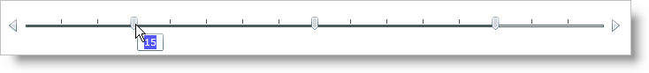

////

|metadata|
{
    "name": "xamslider-tooltips",
    "controlName": ["xamSlider"],
    "tags": ["Getting Started","How Do I"],
    "guid": "{BC688A4F-1211-44B9-A882-F558A148472E}",  
    "buildFlags": [],
    "createdOn": "2016-05-25T18:21:59.0863384Z"
}
|metadata|
////

= ToolTips

== Before You Begin

You can display ToolTips on the xamSlider™ control. ToolTips allow your end users to see the value of the slider’s thumb whenever it is moused over. ToolTips for the xamSlider control are also fully customizable.

This topic assumes that you already have a xamSlider control on your page, for more information, see the link:xamslider-getting-started-with-xamslider.html[Getting Started with xamSlider] topic.

== What You Will Accomplish

After following the steps in this topic you have visible ToolTips that have been styled.

== Follow these Steps

[start=1]
. Set the link:{ApiPlatform}controls.editors.xamslider.v{ProductVersion}~infragistics.controls.editors.xamslidernumericthumb.html[xamSliderNumericThumb] object’s link:{ApiPlatform}controls.editors.xamslider.v{ProductVersion}~infragistics.controls.editors.xamsliderthumbbase~tooltipvisibility.html[ToolTipVisibility] property to Visible.

Add tags for the link:{ApiPlatform}controls.editors.xamslider.v{ProductVersion}~infragistics.controls.editors.xamsliderthumbbase~tooltiptemplate.html[ToolTipTemplate] property to xamSliderNumericThumb.

*In XAML:*

----
<ig:XamSliderNumericThumb Value="15" InteractionMode="Push" ToolTipVisibility="Visible">
   <ig:XamSliderNumericThumb.ToolTipTemplate>
      <!-- Add DataTemplate -->                
   </ig:XamSliderNumericThumb.ToolTipTemplate>
</ig:XamSliderNumericThumb>
----

[start=2]
. Create a DataTemplate.

Add a Grid panel to the DataTemplate.

Add a Rectangle to the Grid panel.

Set the following properties on the Rectangle:

** Fill – Blue
** Opacity – 0.65

*In XAML:*

----
<DataTemplate>
   <Grid>
      <Rectangle Fill="Blue" Opacity="0.65"/>
      <StackPanel HorizontalAlignment="Center" VerticalAlignment="Center">
         <!-- Add TextBlock -->                
      </StackPanel>
   </Grid>
</DataTemplate>
----

[start=3]
. Add a TextBox control to the StackPanel container. Set the following properties:

** Text – {Binding}
** Foreground – White

*In XAML:*

----
<TextBlock Foreground="White" Text="{Binding}"/>
----

[start=4]
. Save and run your application.

== Related Topics

link:xamslider-interaction-modes.html[Interaction Modes]

link:xamslider-xamslider-thumbs.html[xamSlider Thumbs]

link:xamslider-xamslider-tick-marks.html[xamSlider Tick Marks]

link:xamslider-value-tick-marks.html[Value Tick Marks]

link:xamslider-retrieve-the-thumb-values.html[Retrieve the Thumb Values]

link:xamslider-programmatically-add-or-remove-thumbs-at-runtime.html[Programmatically Add or Remove Thumbs at Runtime]