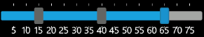
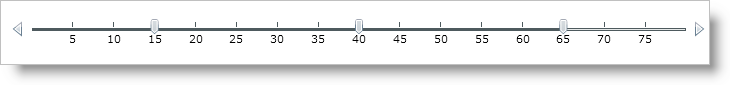

////

|metadata|
{
    "name": "xamslider-value-tick-marks",
    "controlName": ["xamSlider"],
    "tags": ["Getting Started","How Do I"],
    "guid": "{B0018632-4571-49CA-9CA9-D09B612DFA3D}",  
    "buildFlags": [],
    "createdOn": "2016-05-25T18:21:59.0923486Z"
}
|metadata|
////

= Value Tick Marks

== Before You Begin

By default the tick marks are displayed as ticks on the slider; however you can override this default setting and display the value of the tick mark instead.

There are no standard left, right, top bottom tick marks. Everything depends on the data template

This topic assumes that you already have a xamSlider™ control on your page, for more information, see the link:xamslider-getting-started-with-xamslider.html[Getting Started with xamSlider] topic.

== What You Will Accomplish

You will display the value of the tick mark, similar to labels.

== Follow these Steps

[start=1]
. Add a grid resource.

*In XAML:*

----
<Grid.Resources>
   <!— Add DataTemplate -->
</Grid.Resources>
----

[start=2]
. Add a data template. This data template will bind to the value of the tick mark and display that value.

*In XAML:*

----
<DataTemplate x:Key="HorizontalTick">
   <Border >
      <TextBlock Text="{Binding}" Margin="0,60,0,0"/>
   </Border>
</DataTemplate>
----

[start=3]
. Within the link:{ApiPlatform}controls.editors.xamslider.v{ProductVersion}~infragistics.controls.editors.slidertickmarks.html[SliderTickMarks], set the link:{ApiPlatform}controls.editors.xamslider.v{ProductVersion}~infragistics.controls.editors.slidertickmarksbase~horizontaltickmarkstemplate.html[HorizontalTickMarksTemplate] property to the data template you created.

*In XAML:*

----
<ig:XamNumericRangeSlider Grid.Row="1" MinValue="0"   MaxValue="80" Height="100" Margin="10">
   <ig:XamSliderNumericThumb Value="15" InteractionMode="Push"/>
   <ig:XamSliderNumericThumb Value="40" />
   <ig:XamSliderNumericThumb Value="65" InteractionMode="Lock"/>
   <ig:XamNumericRangeSlider.TickMarks>
      <ig:SliderTickMarks TickMarksFrequency="5" UseFrequency="True"/>
      <ig:SliderTickMarks TickMarksFrequency="5" UseFrequency="True" HorizontalTickMarksTemplate="{StaticResource HorizontalTick}"/>
   </ig:XamNumericRangeSlider.TickMarks>
</ig:XamNumericRangeSlider>
----

[start=4]
. Save and run your application.

ifdef::win-phone[]

endif::win-phone[]

ifdef::sl,wpf[]

endif::sl,wpf[]

== Related Topics

* link:xamslider-interaction-modes.html[Interaction Modes]
* link:xamslider-xamslider-thumbs.html[xamSlider Thumbs]
* link:xamslider-xamslider-tick-marks.html[xamSlider Tick Marks]
* link:xamslider-retrieve-the-thumb-values.html[Retrieve the Thumb Values]
* link:xamslider-programmatically-add-or-remove-thumbs-at-runtime.html[Programmatically Add or Remove Thumbs at Runtime]