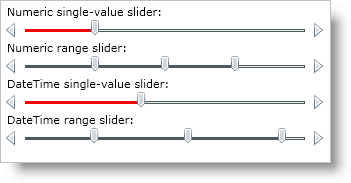
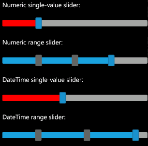

////

|metadata|
{
    "name": "xamslider-xamslider-thumbs",
    "controlName": ["xamSlider"],
    "tags": ["Getting Started","How Do I"],
    "guid": "{AE3824A6-3F7B-4AAA-AE04-537F932F9F97}",  
    "buildFlags": [],
    "createdOn": "2016-05-25T18:21:59.0413754Z"
}
|metadata|
////

= xamSlider Thumbs

In order for your end users to interact with the xamSlider™ controls, you must add a thumb that they can drag. The type of thumb you use will depend on the type of slider you are using. For example, if you are using xamNumericRangeSlider™ or xamNumericSlider™, you must use link:{ApiPlatform}controls.editors.xamslider.v{ProductVersion}~infragistics.controls.editors.xamslidernumericthumb.html[xamSliderNumericThumb] objects. On the other hand, if you are using xamDateTimeRangeSlider™ or xamDateTimeSlider™, you must use the link:{ApiPlatform}controls.editors.xamslider.v{ProductVersion}~infragistics.controls.editors.xamsliderdatetimethumb.html[xamSliderDateTimeThumb] objects. The two types of thumbs are not interchangeable; however, they both share these commonly used properties (in addition to properties inherited from the Control class):

* link:{ApiPlatform}controls.editors.xamslider.v{ProductVersion}~infragistics.controls.editors.xamsliderthumbbase~isactive.html[IsActive]
* link:{ApiPlatform}controls.editors.xamslider.v{ProductVersion}~infragistics.controls.editors.xamsliderthumbbase~isdragenabled.html[IsDragEnabled]
* link:{ApiPlatform}controls.editors.xamslider.v{ProductVersion}~infragistics.controls.editors.xamsliderthumb`1~issnaptotickenabled.html[IsSnapToTickEnabled]
* link:{ApiPlatform}controls.editors.xamslider.v{ProductVersion}~infragistics.controls.editors.xamsliderthumb`1~istrackfillvisible.html[IsTrackFillVisible]
* link:{ApiPlatform}controls.editors.xamslider.v{ProductVersion}~infragistics.controls.editors.xamsliderthumbbase~interactionmode.html[InteractionMode]
* link:{ApiPlatform}controls.editors.xamslider.v{ProductVersion}~infragistics.controls.editors.xamsliderbase~trackfillbrush.html[TrackFillBrush]
* link:{ApiPlatform}controls.editors.xamslider.v{ProductVersion}~infragistics.controls.editors.xamsliderbase~trackfillstyle.html[TrackFillStyle]
* link:{ApiPlatform}controls.editors.xamslider.v{ProductVersion}~infragistics.controls.editors.xamnumericslider~value.html[Value]

The range sliders will not add a default thumb for you; therefore, you must add the thumbs to the range slider's link:{ApiPlatform}controls.editors.xamslider.v{ProductVersion}~infragistics.controls.editors.xamrangeslider`1~thumbs.html[Thumbs] collection. However, the single-value sliders will create a default thumb for you; therefore, you only need to the set a single-value slider's link:{ApiPlatform}controls.editors.xamslider.v{ProductVersion}~infragistics.controls.editors.xamsimplesliderbase`1~thumbproperty.html[Thumb] property if you want to modify the thumb's properties.

ifdef::sl,wpf[]

endif::sl,wpf[]

ifdef::win-phone[]

endif::win-phone[]

The following example code demonstrates adding and setting thumb properties.

*In XAML:*

----
<StackPanel>
    <!--Numeric single-value slider-->
    <TextBlock Text="Numeric single-value slider:" />
    <ig:XamNumericSlider  
        Name="xamNumericSlider1" 
        MinValue="0" 
        MaxValue="100">
        <ig:XamNumericSlider.Thumb>
            <ig:XamSliderNumericThumb TrackFillBrush="Red" Value="25" />
        </ig:XamNumericSlider.Thumb>
    </ig:XamNumericSlider >
    <!--Numeric range slider-->
    <TextBlock Text="Numeric range slider:" />
    <ig:XamNumericRangeSlider 
        Name="xamNumericRangeSlider1" 
        MinValue="0" 
        MaxValue="100">
        <!--You do not have declare tags for the slider's Thumbs collection-->
        <ig:XamSliderNumericThumb InteractionMode="Free" Value="25" />
        <ig:XamSliderNumericThumb InteractionMode="Lock" Value="50" />
        <ig:XamSliderNumericThumb InteractionMode="Push" Value="75" />
    </ig:XamNumericRangeSlider>
    <!--DateTime single-value slider-->
    <TextBlock Text="DateTime single-value slider:" />
    <ig:XamDateTimeSlider 
        Name="xamDateTimeSlider1" 
        MinValue="1/1/2009" 
        MaxValue="12/31/2009">
        <ig:XamDateTimeSlider.Thumb>
            <ig:XamSliderDateTimeThumb TrackFillBrush="Red" Value="6/1/2009" />
        </ig:XamDateTimeSlider.Thumb>
    </ig:XamDateTimeSlider>
    <!--DateTime range slider-->
    <TextBlock Text="DateTime range slider:" />
    <ig:XamDateTimeRangeSlider 
        Name="xamDateTimeRangeSlider1" 
        MinValue="1/1/2009" 
        MaxValue="12/31/2009">
        <!--You do not have declare tags for the slider's Thumbs collection-->
        <ig:XamSliderDateTimeThumb InteractionMode="Free" Value="4/1/2009" />
        <ig:XamSliderDateTimeThumb InteractionMode="Lock" Value="8/1/2009"/>
        <ig:XamSliderDateTimeThumb InteractionMode="Push" Value="12/1/2009" />
    </ig:XamDateTimeRangeSlider>
</StackPanel>
----

*In Visual Basic:*

----
Imports Infragistics.Controls.Interactions
Imports Infragistics
...
'Numeric single-value slider
Dim numericThumb As New XamSliderNumericThumb()
numericThumb.TrackFillBrush = New SolidColorBrush(Colors.Red)
numericThumb.Value = 25
Me.xamNumericSlider1.Thumb = numericThumb
'Numeric range slider
Dim numericRangeThumb1 As New XamSliderNumericThumb()
numericRangeThumb1.InteractionMode = SliderThumbInteractionMode.Free
numericRangeThumb1.Value = 25
Dim numericRangeThumb2 As New XamSliderNumericThumb()
numericRangeThumb2.InteractionMode = SliderThumbInteractionMode.Lock
numericRangeThumb2.Value = 50
Dim numericRangeThumb3 As New XamSliderNumericThumb()
numericRangeThumb3.InteractionMode = SliderThumbInteractionMode.Push
numericRangeThumb3.Value = 75
Me.xamNumericRangeSlider1.Thumbs.Add(numericRangeThumb1)
Me.xamNumericRangeSlider1.Thumbs.Add(numericRangeThumb2)
Me.xamNumericRangeSlider1.Thumbs.Add(numericRangeThumb3)
'DateTime single-value slider
Dim datetimeThumb As New XamSliderDateTimeThumb()
datetimeThumb.TrackFillBrush = new SolidColorBrush(Colors.Red)
datetimeThumb.Value = New DateTime(2009, 6, 1)
Me.xamDateTimeSlider1.Thumb = datetimeThumb
'DateTime range slider
Dim datetimeRangeThumb1 As New XamSliderDateTimeThumb()
datetimeRangeThumb1.InteractionMode = SliderThumbInteractionMode.Free
datetimeRangeThumb1.Value = New DateTime(2009, 4, 1)
Dim datetimeRangeThumb2 As New XamSliderDateTimeThumb()
datetimeRangeThumb2.InteractionMode = SliderThumbInteractionMode.Lock
datetimeRangeThumb2.Value = New DateTime(2009, 8, 1)
Dim datetimeRangeThumb3 As New XamSliderDateTimeThumb()
datetimeRangeThumb3.InteractionMode = SliderThumbInteractionMode.Push
datetimeRangeThumb3.Value = New DateTime(2009, 12, 1)
Me.xamDateTimeRangeSlider1.Thumbs.Add(datetimeRangeThumb1)
Me.xamDateTimeRangeSlider1.Thumbs.Add(datetimeRangeThumb2)
Me.xamDateTimeRangeSlider1.Thumbs.Add(datetimeRangeThumb3)
...
----

*In C#:*

----
using Infragistics.Controls.Interactions;
using Infragistics;
...
//Numeric single-value slider
xamSliderNumericThumb numericThumb = new XamSliderNumericThumb
{
    TrackFillBrush = new SolidColorBrush(Colors.Red),
    Value = 25
};
this.xamNumericSlider1.Thumb = numericThumb;
//Numeric range slider
xamSliderNumericThumb numericRangeThumb1 = new XamSliderNumericThumb
{
    InteractionMode = SliderThumbInteractionMode.Free,
    Value = 25
};
xamSliderNumericThumb numericRangeThumb2 = new XamSliderNumericThumb
{
    InteractionMode = SliderThumbInteractionMode.Lock,
    Value = 50
};
xamSliderNumericThumb numericRangeThumb3 = new XamSliderNumericThumb
{
    InteractionMode = SliderThumbInteractionMode.Push,
    Value = 75
};
this.xamNumericRangeSlider1.Thumbs.Add(numericRangeThumb1);
this.xamNumericRangeSlider1.Thumbs.Add(numericRangeThumb2);
this.xamNumericRangeSlider1.Thumbs.Add(numericRangeThumb3);
//DateTime single-value slider
xamSliderDateTimeThumb datetimeThumb = new XamSliderDateTimeThumb
{
    TrackFillBrush = new SolidColorBrush(Colors.Red),
    Value = new DateTime(2009, 6, 1)
};
this.xamDateTimeSlider1.Thumb = datetimeThumb;
//DateTime range slider
xamSliderDateTimeThumb datetimeRangeThumb1 = new XamSliderDateTimeThumb
{
    InteractionMode = SliderThumbInteractionMode.Free,
    Value = new DateTime(2009, 4, 1)
};
xamSliderDateTimeThumb datetimeRangeThumb2 = new XamSliderDateTimeThumb
{
    InteractionMode = SliderThumbInteractionMode.Lock,
    Value = new DateTime(2009, 8, 1)
};
xamSliderDateTimeThumb datetimeRangeThumb3 = new XamSliderDateTimeThumb
{
    InteractionMode = SliderThumbInteractionMode.Push,
    Value = new DateTime(2009, 12, 1)
};
this.xamDateTimeRangeSlider1.Thumbs.Add(datetimeRangeThumb1);
this.xamDateTimeRangeSlider1.Thumbs.Add(datetimeRangeThumb2);
this.xamDateTimeRangeSlider1.Thumbs.Add(datetimeRangeThumb3);
...
----

== Related Topics

link:xamslider-about-xamslider.html[About xamSlider]

link:xamslider-getting-started-with-xamslider.html[Getting Started with xamSlider]

link:xamslider-xamslider-tick-marks.html[xamSlider Tick Marks]

link:xamslider-interaction-modes.html[Interaction Modes]

ifdef::wpf,sl[]
link:xamslider-tooltips.html[ToolTips]
endif::wpf,sl[]

link:xamslider-value-tick-marks.html[Value Tick Marks]

link:xamslider-retrieve-the-thumb-values.html[Retrieve the Thumb Values]

link:xamslider-programmatically-add-or-remove-thumbs-at-runtime.html[Programmatically Add or Remove Thumbs at Runtime]