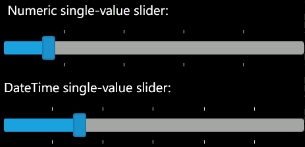

////

|metadata|
{
    "name": "xamslider-xamslider-tick-marks",
    "controlName": ["xamSlider"],
    "tags": ["Getting Started","How Do I","Styling"],
    "guid": "{8ACC1064-03D7-4B94-8326-A8DF8437BABE}",  
    "buildFlags": [],
    "createdOn": "2016-05-25T18:21:59.0483764Z"
}
|metadata|
////

= xamSlider Tick Marks

The xamSlider™ controls have tick marks that help your end users distinguish values on the control. The type of tick marks you use will depend on the type of slider you are using. For example, if you are using a numeric slider, i.e., xamNumericSlider™ or xamNumericRangeSlider™, you must use link:{ApiPlatform}controls.editors.xamslider{ApiVersion}~infragistics.controls.editors.slidertickmarks.html[SliderTickMarks] objects. On the other hand, if you are using a DateTime slider, i.e., xamDateTimeSlider™ or xamDateTimeRangeSlider™, you must use the link:{ApiPlatform}controls.editors.xamslider{ApiVersion}~infragistics.controls.editors.datetimeslidertickmarks.html[DateTimeSliderTickMarks] objects. The two types of tick marks are not interchangeable. However, they both share these commonly used properties:

* link:{ApiPlatform}controls.editors.xamslider{ApiVersion}~infragistics.controls.editors.slidertickmarksbase~horizontaltickmarkstemplate.html[HorizontalTickMarksTemplate]
* link:{ApiPlatform}controls.editors.xamslider{ApiVersion}~infragistics.controls.editors.slidertickmarksbase~includesliderends.html[IncludeSliderEnds]
* link:{ApiPlatform}controls.editors.xamslider{ApiVersion}~infragistics.controls.editors.slidertickmarksbase~numberoftickmarks.html[NumberOfTickMarks]
* link:{ApiPlatform}controls.editors.xamslider{ApiVersion}~infragistics.controls.editors.slidertickmarks`1~tickmarksvalues.html[TickMarksValues]
* link:{ApiPlatform}controls.editors.xamslider{ApiVersion}~infragistics.controls.editors.slidertickmarks`1~tickmarksfrequency.html[TickMarksFrequency]
* link:{ApiPlatform}controls.editors.xamslider{ApiVersion}~infragistics.controls.editors.slidertickmarksbase~usefrequency.html[UseFrequency]
* link:{ApiPlatform}controls.editors.xamslider{ApiVersion}~infragistics.controls.editors.slidertickmarksbase~verticaltickmarkstemplate.html[VerticalTickMarksTemplate]

In addition to the properties already mentioned, the DateTimeSliderTickMarks object also exposes a link:{ApiPlatform}controls.editors.xamslider{ApiVersion}~infragistics.controls.editors.datetimeslidertickmarks~frequencytype.html[FrequencyType] property that you can set to a link:{ApiPlatform}controls.editors.xamslider{ApiVersion}~infragistics.controls.editors.frequencytype.html[FrequencyType] enum value. The xamDateTimeSlider and xamDateTimeRangeSlider controls will use the TickMarksFrequency property in conjunction with the FrequencyType property to arrange their tick marks. You can think of the TickMarksFrequency property as a scalar value and the FrequencyType property as the unit of measure. For example, if your values range from 1/1/2009 to 12/31/2009 and you set the TickMarksFrequency property to 3, you need to set the FrequencyType property to determine whether tick marks should be displayed every 3 days, months, years, etc.

ifdef::win-phone[]

endif::win-phone[]

ifdef::sl,wpf[]

endif::sl,wpf[]

The following example code demonstrates adding and setting tick mark properties.

*In XAML:*

----
<StackPanel>
    <!--single value numeric slider with tick marks every 20th interval-->
    <TextBlock Text=" Numeric single-value slider:" />
    <ig:XamNumericSlider  Name="xamNumericSlider1" MinValue="0" MaxValue="100">
        <ig:XamNumericSlider .TickMarks>
            <ig:SliderTickMarks TickMarksFrequency="20" UseFrequency="True" />
        </ig:XamNumericSlider .TickMarks>
    </ig:XamNumericSlider >
    <!--single value DateTime slider with tick marks every 2 months-->
    <TextBlock Text="DateTime single-value slider:" />
    <ig:XamDateTimeSlider Name="xamDateTimeSlider1" MinValue="1/1/2009" MaxValue="12/31/2009">
        <ig:XamDateTimeSlider.TickMarks>
            <ig:DateTimeSliderTickMarks 
                TickMarksFrequency="2" 
                FrequencyType="Months" 
                UseFrequency="True" />
        </ig:XamDateTimeSlider.TickMarks>
    </ig:XamDateTimeSlider>
</StackPanel>
----

*In Visual Basic:*

----
Imports Infragistics.Controls.Interactions
Imports Infragistics
...
'Tick marks for a single value numeric slider
Dim numericTickMarks As New SliderTickMarks With {.TickMarksFrequency = 20, .UseFrequency = True}
Me.xamNumericSlider1.TickMarks.Add(numericTickMarks)
'Tick marks for a single value DateTime slider
Dim dateTickMarks As New DateTimeSliderTickMarks With {.TickMarksFrequency = 2, .FrequencyType = FrequencyType.Months, .UseFrequency = True}
Me.xamDateTimeSlider1.TickMarks.Add(dateTickMarks)
...
----

*In C#:*

----
using Infragistics.Controls.Interactions;
using Infragistics;
...
//Tick marks for a single value numeric slider
SliderTickMarks numericTickMarks = new SliderTickMarks
{
    TickMarksFrequency = 20,
    UseFrequency = true
};
this.xamNumericSlider1.TickMarks.Add(numericTickMarks);
//Tick marks for a single value DateTime slider
DateTimeSliderTickMarks dateTickMarks = new DateTimeSliderTickMarks
{
    TickMarksFrequency = 2,
    FrequencyType = FrequencyType.Months,
    UseFrequency = true
};
this.xamDateTimeSlider1.TickMarks.Add(dateTickMarks);
...
----

== Related Topics

link:xamslider-about-xamslider.html[About xamSlider]

link:xamslider-getting-started-with-xamslider.html[Getting Started with xamSlider]

link:xamslider-xamslider-thumbs.html[xamSlider Thumbs]

link:xamslider-interaction-modes.html[Interaction Modes]

ifdef::wpf,sl[]
link:xamslider-tooltips.html[ToolTips]
endif::wpf,sl[]

link:xamslider-value-tick-marks.html[Value Tick Marks]

link:xamslider-retrieve-the-thumb-values.html[Retrieve the Thumb Values]

link:xamslider-programmatically-add-or-remove-thumbs-at-runtime.html[Programmatically Add or Remove Thumbs at Runtime]