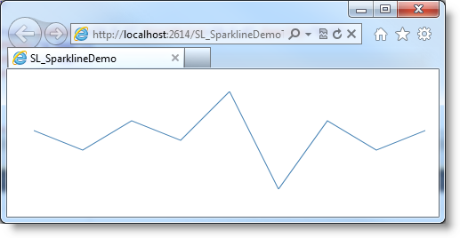

////
|metadata|
{
    "name": "xamsparkline-adding-a-sparkline-to-a-page",
    "controlName": ["xamSparkline"],
    "tags": ["Charting","Getting Started"],
    "guid": "aad36aba-a922-4b92-a918-9484040722e1",
    "buildFlags": [],
    "createdOn": "2016-05-25T18:21:59.294358Z"
}
|metadata|
////

= Adding xamSparkline to a Page

== Topic Overview

=== Purpose

This topic demonstrates, with code examples, how to add the link:{ApiPlatform}controls.charts.xamsparkline{ApiVersion}.html[xamSparkline]™ control to a page. If you want to display  _xamSparkline_   inside grid cells, refer to the Sparkline Column topic.

=== Required background

The following table lists the materials required as a prerequisite to understanding this topic.

[options="header", cols="a,a"]
|====
|Topic|Purpose

| link:xamsparkline-xamsparkline-overview.html[xamSparkline Overview]
|This topic provides an overview of the _xamSparkline_ control, its benefits, and the supported chart types.

| link:xamsparkline-configuring-xamsparkline.html[Configuring xamSparkline]
|This topic provides an overview of the possible ways to configure the _xamSparkline_ control. Links to the detailed configurations (available in separate topics) are provided as well.

|====

=== In this topic

This topic contains the following sections:

* <<_Ref320004748,Code Example: Adding a Sparkline to a Page>>

** <<Description,Description>>
** <<_Ref317075471,Preview>>
** <<_Ref317075581,Prerequisites>>
** <<_Ref317075479,Overview>>
** <<_Ref317075486,Steps>>

* <<_Ref317075104,Related Content>>

== Adding a Sparkline to a Page – Conceptual Overview

=== Introduction

Though  _xamSparkline_   is designed with the idea to be inserted in much small spaces such as grid cells or in-line with text, it has the capability to be displayed as a stand-alone control, e.g. in web pages.

With the default settings, the Sparkline will display the Line type with gray color and line thickness of 1 pixel. The line color or thickness is customizable.

The Sparkline will take up the entire space of the container it resides on unless the width and height are specified, which are optional. Resizing the container or the browser window will automatically resize the Sparkline that is hosted in the container.

=== Requirements

The following table summarizes the requirements for adding the  _xamSparkline_   control.

[cols="a,a"]
|====
|Assembly references
|Add the following assembly references in your project: 

* {ApiPlatform}Controls.Charts.XamSparkline.v{ProductVersion} 

* {ApiPlatform}DataVisualization.v{ProductVersion} 

* {ApiPlatform}v{ProductVersion}

|Namespaces
|*In XAML:* 

[source,xaml]
---- 
Namespaces xmlns:ig="http://schemas.infragistics.com/xaml" 
---- 

|Data
|One-dimensional data that contains numeric values. 

.Note 

[NOTE] 

==== 

With the Win/Loss type of Sparkline, only two values will be used for the chart – the highest one and the lowest one. The rest of the values in the data set will be ignored, but the number of data points will be considered. In other words, if the data consists of 5 positive values and 2 negative values, theWinLoss will display 5 bars above zero (all identical size matching the highest value) and 2 negative bars below zero (all identical size matching the lowest value). 

====

|====

=== Overview

Following is a conceptual overview of the process.

*Referencing the data model*

*Adding the xamSparkline control*

[[_Ref317075039]]
[[_Ref320004748]]
== Adding a Sparkline to a Page – Code Example

=== Description

The procedure that follows demonstrates how to add a Sparkline on a page using the Line type of Sparkline.

For this purpose you would need to create a class data model populated with numeric values for the data points and string field for displaying the first and last labels.

[[_Ref317075471]]

=== Preview

Following is a preview of the final result.

[[_Ref317075581]]

=== Prerequisites

To complete the procedure, you need the following:

* a {PlatformName} project

[[_Ref317075479]]

=== Overview

Following is a conceptual overview of the process.

*Defining the data model*

*Populating the data*

*Referencing the data model*

*Adding the _xamSparkline_ control*

*Verifying the result*

[[_Ref317075486]]

=== Steps

The following steps demonstrate how to add a Sparkline to the page.
[start=1]
. Define the data model.

Create a class definition to represent the data model for the Sparkline. At least two numeric fields is needed by  _xamSparkline_   control in order to render the Sparkline.

*In C#:*

[source,csharp]
----
public class TestDataItem
    {
        private string _label;
        public string Label
        {
            get { return _label; }
            set { _label = value; }
        }
        private double? _value;
        public double? Value
        {
            get { return _value; }
            set { _value = value; }
        }
    }
----

*In Visual Basic:*

[source,vb]
----
Public Class TestDataItem
      Private _label As String
      Public Property Label() As String
            Get
                  Return _label
            End Get
            Set
                  _label = value
            End Set
      End Property
      Private _value As System.Nullable(Of Double)
      Public Property Value() As System.Nullable(Of Double)
            Get
                  Return _value
            End Get
            Set
                  _value = value
            End Set
      End Property
End Class
----
[start=2]
. Populate the data.

The following code creates a list of records containing numeric and string values. The chart will use the numeric field to plot data, and the string can be used to display the first and last labels on the horizontal (X) axis. The numeric values can also be displayed as labels.

*In C#:*

[source,csharp]
----
public class TestData : ObservableCollection<TestDataItem>
    {
        public TestData()
        {
            Add(new TestDataItem { Label = "Label1", Value = 3 });
            Add(new TestDataItem { Label = "Label2", Value = 1 });
            Add(new TestDataItem { Label = "Label3", Value = 4 });
            Add(new TestDataItem { Label = "Label4", Value = 2 });
            Add(new TestDataItem { Label = "Label5", Value = 7 });
            Add(new TestDataItem { Label = "Label6", Value = -3 });
            Add(new TestDataItem { Label = "Label7", Value = 4 });
            Add(new TestDataItem { Label = "Label8", Value = 1 });
            Add(new TestDataItem { Label = "Label9", Value = 3 });
        }
    }
----

*In Visual Basic:*

[source,vb]
----
Public Class TestData
   Inherits ObservableCollection(Of TestDataItem)
      Public Sub New()
      Add(New TestDataItem() With {.Label = "Label1", .Value = 3})
      Add(New TestDataItem() With {.Label = "Label2", .Value = 1})
      Add(New TestDataItem() With {.Label = "Label3", .Value = 4})
      Add(New TestDataItem() With {.Label = "Label4", .Value = 2})
      Add(New TestDataItem() With {.Label = "Label5", .Value = 7})
      Add(New TestDataItem() With {.Label = "Label6", .Value = -3})
      Add(New TestDataItem() With {.Label = "Label7", .Value = 4})
      Add(New TestDataItem() With {.Label = "Label8", .Value = 1})
      Add(New TestDataItem() With {.Label = "Label9", .Value = 3})
   End Sub
End Class
----
[start=3]
. Reference the data model.

Add the necessary namespaces in the UserControl, Window or Page section of the XAML file to reference the local classes.

*In XAML:*

[source,xaml]
----
xmlns:local="clr-namespace:SparklineDemo"
----

Build (compile) the application at this point so the data model can be referenced.

The following code demonstrates adding a namespace and referencing the local classes. Specifying the key (`x``:Key`) in the resource allows binding the  _xamSparkline_   to the underlying data as a static resource.

*In XAML:*

[source,xaml]
----
<UserControl.Resources>
    <local:TestData x:Key="testdata"/>        
</UserControl.Resources>
----
[start=4]
. Add the xamSparkline control.

The following code demonstrates adding the  _xamSparkline_   with the minimum code and property settings required for display.

*In XAML:*

[source,xaml]
----
<ig:XamSparkline 
    ItemsSource="{Binding Source={StaticResource testdata}}"
Name="xamSparkline1"
    ValueMemberPath="Value"/>
----

*In C#:*

[source,csharp]
----
this.xamSparkline1.ItemsSource = new TestData();
this.xamSparkline1.DisplayType = Infragistics.Controls.Charts.SparklineDisplayType.Line;
this.xamSparkline1.ValueMemberPath = "Value";
----

*In Visual Basic:*

[source,vb]
----
Me.xamSparkline1.ItemsSource = new TestData()
Me.xamSparkline1.DisplayType = Infragistics.Controls.Charts.SparklineDisplayType.Line
Me.xamSparkline1.ValueMemberPath = "Value"
----
[start=5]
. Verify the result.

Build and run your project to verify the result. If you have implemented the steps correctly, the displayed Sparkline should look like the one in the <<_Ref317075471,Preview>> above.

[[_Ref317075104]]
== Related Content

=== Topics

The following topics provide additional information related to this topic.

[options="header", cols="a,a"]
|====
|Topic|Purpose

| link:xamsparkline-xamsparkline-property-reference.html[xamSparkline Property Reference]
|This topic explains the featured properties of the _xamSparkline_ control.

ifdef::sl,wpf[]
| pick:[sl,wpf=" link:xamgrid-sparkline-column.html[Sparkline Column]"] 
|
ifdef::sl,wpf[] 

This topic introduces the Sparkline column type of the _xamGrid_™ control and demonstrates its use. 

endif::sl,wpf[]
endif::sl,wpf[]

|====