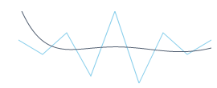

////

|metadata|
{
    "name": "xamsparkline-adding-a-trend-line",
    "controlName": ["xamSparkline"],
    "tags": ["Charting","How Do I"],
    "guid": "73ae046e-e5b3-49cd-bf13-9229625a2bc3",  
    "buildFlags": [],
    "createdOn": "2016-05-25T18:21:59.2043533Z"
}
|metadata|
////

= Adding a Trend Line

== Topic Overview

=== Purpose

This topic explains, with code examples, how to add a trend line over a link:{ApiPlatform}controls.charts.xamsparkline{ApiVersion}.html[xamSparkline]™ control.

=== Required background

The following table lists the topics required as a prerequisite to understanding this topic.

[options="header", cols="a,a"]
|====
|Topic|Purpose

| link:xamsparkline-xamsparkline-overview.html[xamSparkline Overview]
|This topic provides an overview of the _xamSparkline_ control, its benefits, and the supported chart types.

| link:xamsparkline-configuring-xamsparkline.html[Configuring xamSparkline]
|This topic provides an overview of the possible ways to configure the _xamSparkline_ control. Links to the detailed configurations (available in separate topics) are provided as well.

|====

== Adding a Trend Line

=== Overview

The trend line displays in the  _xamSparkline_   control as another layer on top of the Sparkline layer. To display a trend line, use the link:{ApiPlatform}controls.charts.xamsparkline{ApiVersion}~infragistics.controls.charts.xamsparkline~trendlinetype.html[TrendLineType] property.

The trend lines are calculated according to the algorithm specified by the link:{ApiPlatform}controls.charts.xamsparkline{ApiVersion}~infragistics.controls.charts.xamsparkline~trendlinetype.html[TrendLineType] property using the values of the data that the chart is bound to. The supported trend lines are listed and explained in the xamSparkline Overview topic.

Trend line types can be displayed only one at a time. (No multiple trend lines can be displayed simultaneously.)

By default, the trend line is not displayed.

=== Specifying the trend line type

The following table maps the  _xamSparkline_   trend line types to the link:{ApiPlatform}controls.charts.xamsparkline{ApiVersion}~infragistics.controls.charts.xamsparkline~trendlinetype.html[TrendLineType] property settings that deliver them.

[options="header", cols="a,a"]
|====
|Trend line type|TrendLineType property setting

|Qubic Fit
|QubicFit

|Cumulative Average
|CumulativeAverage

|Exponential Average
|ExponentialAverage

|Exponential Fit
|ExponentialFit

|Linear Fit
|LinearFit

|Logarithmic Fit
|LogarithmicFit

|Modified Average
|ModifiedAverage

|Power Low Fit
|PowerLawFit

|Quadratic Fit
|QuadraticFit

|Quartic Fit
|QuarticFit

|Quintic Fit
|QuinticFit

|Simple Average
|SimpleAverage

|Weighted Average
|WeightedAverage

|====

=== Example

The screenshot below demonstrates how the Sparkline looks as a result of the following settings:

[options="header", cols="a,a"]
|====
|Property|Value

| link:{ApiPlatform}controls.charts.xamsparkline{ApiVersion}~infragistics.controls.charts.xamsparkline~trendlinetype.html[TrendLineType]
|QuinticFit

|====

=== Code Example

The following code demonstrates setting of the link:{ApiPlatform}controls.charts.xamsparkline{ApiVersion}~infragistics.controls.charts.xamsparkline~trendlinetype.html[TrendLineType] property to QuinticFit.

*In XAML:*

[source,xaml]
----
<igSparkline:XamSparkline TrendLineType="QuinticFit"/>
----

*In C#:*

[source,csharp]
----
this.xamSparkline1.TrendLineType = SparklineTrendType.CuinticFit;
----

*In Visual Basic:*

[source,vb]
----
Me.xamSparkline1.TrendLineType = SparklineTrendType.CuinticFit
----

=== Configuring the Trend Line

The Trend Line can be configured in the following aspects:

* Trend line type
* Trend line period
* Trend line color
* Trend line thickness

For details on how to configure the trend lines, refer to the link:xamsparkline-configuring-the-trend-line.html[Configuring the Trend Line] topic.

[[_Ref317078582]]
== Related Content

=== Topics

The following topics provide additional information related to this topic.

[options="header", cols="a,a"]
|====
|Topic|Purpose

| link:xamsparkline-xamsparkline-overview.html[xamSparkline Overview]
|This topic provides an overview of the _xamSparkline_ control, its benefits, and the supported chart types.

| link:xamsparkline-configuring-xamsparkline.html[Configuring xamSparkline]
|This topic provides an overview of the possible ways to configure the _xamSparkline_ control. Links to the detailed configurations (available in separate topics) are provided as well.

| link:xamsparkline-configuring-the-trend-line.html[Configuring the Trend Line]
|This topic explains, with code examples, how to configure the trend line of _xamSparkline_ for custom appearance and color.

| link:xamsparkline-xamsparkline-property-reference.html[xamSparkline Property Reference]
|This topic explains the featured properties of the _xamSparkline_ control.

|====