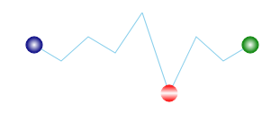

////

|metadata|
{
    "name": "xamsparkline-configuring-markers",
    "controlName": ["xamSparkline"],
    "tags": ["Charting","How Do I","Layouts"],
    "guid": "bd81f107-75b4-4b4f-aad4-49273427ea9c",  
    "buildFlags": [],
    "createdOn": "2016-05-25T18:21:59.2103536Z"
}
|metadata|
////

= Configuring Markers

== Topic Overview

=== Purpose

This topic demonstrates, with code examples, how to configure and customize the markers for link:{ApiPlatform}controls.charts.xamsparkline{ApiVersion}.html[xamSparkline]™ control.

=== Required background

The following table lists the topics required as a prerequisite to understanding this topic.

[options="header", cols="a,a"]
|====
|Topic|Purpose

| link:xamsparkline-xamsparkline-overview.html[xamSparkline Overview]
|This topic provides an overview of the _xamSparkline_ control, its benefits, and the supported chart types.

| link:xamsparkline-configuring-xamsparkline.html[Configuring xamSparkline]
|This topic provides an overview of the possible ways to configure the _xamSparkline_ control. Links to the detailed configurations (available in separate topics) are provided as well.

| link:xamsparkline-defining-markers.html[Defining Markers]
|This topic demonstrates, with code examples, how to define the markers for _xamSparkline_ control.

|====

=== In this topic

* <<_Ref317083829,>>Configuring Markers – Conceptual Overview

** <<_Ref317161385,Overview>>
** <<Property_Settings,Property settings>>

* <<_Ref319939969,Configuring the Markers – Code Example>>

** <<Description,Description>>
** <<_Ref319940027,Preview>>
** <<_Ref319940034,Property settings>>
** <<_Ref319940040,Code>>

* <<_Ref317161501,Related Content>>

[[_Ref317083829]]
== Configuring Markers – Conceptual Overview

[[_Ref317161385]]

=== Overview

Markers, as it is explained in link:xamsparkline-defining-markers.html[Defining Markers] topic, are symbols (circular colored icons) overlaid on the Sparkline to indicate the individual data points based on X/Y coordinates.

Markers can be customized to have an appearance of your choice. By default, markers are not set to display. In order to display any marker, you need to set the visibility property to  _Visible_   such as the following:`MarkerVisibility``="Visible"` 

Markers can be configured in the following aspects:

* Brush
* Size

[[Property_Settings]]

=== Property settings

The following table maps the configuration tasks to the corresponding markers’ property settings.

[options="header", cols="a,a,a"]
|====
|In order to:|Use this property:|And set it to:

|[[_Hlk319427977]] 

Change the color of the marker
| link:{ApiPlatform}controls.charts.xamsparkline{ApiVersion}~infragistics.controls.charts.xamsparkline~markerbrush.html[MarkerBrush]
|The HTML name or hexadecimal code of the color

|Change the size of the marker
| link:{ApiPlatform}controls.charts.xamsparkline{ApiVersion}~infragistics.controls.charts.xamsparkline~markersize.html[MarkerSize]
|The desired numeric value (in pixels)

|====

[[_Ref319939969]]
== Configuring the Markers – Code Example

[[Description]]

=== Description

The code below demonstrates how to configure the first, last and negative markers.

[[_Ref319940027]]

=== Preview

[[_Ref319940034]]

=== Property settings

[options="header", cols="a,a"]
|====
|Property|Setting

| link:{ApiPlatform}controls.charts.xamsparkline{ApiVersion}~infragistics.controls.charts.xamsparkline~firstmarkervisibility.html[FirstMarkerVisibility]
| _Visible_ 

| link:{ApiPlatform}controls.charts.xamsparkline{ApiVersion}~infragistics.controls.charts.xamsparkline~lastmarkervisibility.html[LastMarkerVisibility]
| _Visible_ 

| link:{ApiPlatform}controls.charts.xamsparkline{ApiVersion}~infragistics.controls.charts.xamsparkline~negativemarkervisibility.html[NegativeMarkerVisibility]
| _Visible_ 

| link:{ApiPlatform}controls.charts.xamsparkline{ApiVersion}~infragistics.controls.charts.xamsparkline~firstmarkersize.html[FirstMarkerSize]
|9

| link:{ApiPlatform}controls.charts.xamsparkline{ApiVersion}~infragistics.controls.charts.xamsparkline~lastmarkersize.html[LastMarkerSize]
|9

| link:{ApiPlatform}controls.charts.xamsparkline{ApiVersion}~infragistics.controls.charts.xamsparkline~negativemarkersize.html[NegativeMarkerSize]
|9

| link:{ApiPlatform}controls.charts.xamsparkline{ApiVersion}~infragistics.controls.charts.xamsparkline~firstmarkerbrush.html[FirstMarkerBrush]
| _LinearGradientBrush_ 

| link:{ApiPlatform}controls.charts.xamsparkline{ApiVersion}~infragistics.controls.charts.xamsparkline~lastmarkerbrush.html[LastMarkerBrush]
| _LinearGradientBrush_ 

| link:{ApiPlatform}controls.charts.xamsparkline{ApiVersion}~infragistics.controls.charts.xamsparkline~negativemarkerbrush.html[NegativeMarkerBrush]
| _LinearGradientBrush_ 

|====

[[_Ref319940040]]

=== Code

*In XAML:*

[source,xaml]
----
<ig:XamSparkline
    NegativeMarkerVisibility="Visible"
    NegativeMarkerSize="9"
    FirstMarkerVisibility="Visible"
    FirstMarkerSize="9"
    LastMarkerVisibility="Visible"
    LastMarkerSize="9">
    <ig:XamSparkline.NegativeMarkerBrush>
        <LinearGradientBrush EndPoint="0.5,1" StartPoint="0.5,0">
            <GradientStop Color="Red" Offset="0"/>
            <GradientStop Color="White" Offset=".5"/>
            <GradientStop Color="Red" Offset="1"/>
        </LinearGradientBrush>
    </ig:XamSparkline.NegativeMarkerBrush>
    <ig:XamSparkline.FirstMarkerBrush>
        <RadialGradientBrush GradientOrigin="0.5,0.5" >
            <GradientStop Color="Navy" Offset="1"/>
            <GradientStop Color="White" Offset="0"/>
        </RadialGradientBrush>
    </ig:XamSparkline.FirstMarkerBrush>
    <ig:XamSparkline.LastMarkerBrush>
        <RadialGradientBrush GradientOrigin="0.5,0.5">
            <GradientStop Color="Green" Offset="1"/>
            <GradientStop Color="White" Offset="0"/>
        </RadialGradientBrush>
    </ig:XamSparkline.LastMarkerBrush>
</ig:XamSparkline>
----

[[_Ref317161501]]
== Related Content

=== Topics

The following topics provide additional information related to this topic.

[options="header", cols="a,a"]
|====
|Topic|Purpose

| link:xamsparkline-xamsparkline-overview.html[xamSparkline Overview]
|This topic provides an overview of the _xamSparkline_ control, its benefits, and the supported chart types.

| link:xamsparkline-configuring-xamsparkline.html[Configuring xamSparkline]
|This topic provides an overview of the possible ways to configure the _xamSparkline_ control. Links to the detailed configurations (available in separate topics) are provided as well.

| link:xamsparkline-xamsparkline-property-reference.html[xamSparkline Property Reference]
|This topic explains the featured properties of the _xamSparkline_ control.

|====