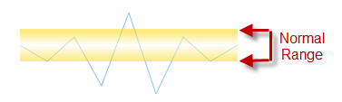

////

|metadata|
{
    "name": "xamsparkline-configuring-the-normal-range",
    "controlName": ["xamSparkline"],
    "tags": ["Charting","How Do I","Layouts"],
    "guid": "52797b6e-1ae8-430f-ab9f-05e25d553ff1",  
    "buildFlags": [],
    "createdOn": "2016-05-25T18:21:59.2173546Z"
}
|metadata|
////

= Configuring the Normal Range

== Topic Overview

=== Purpose

This topic explains, with code examples, how to configure and customize the appearance of the Normal Range of the link:{ApiPlatform}controls.charts.xamsparkline.v{ProductVersion}.html[xamSparkline]™ control.

=== Required background

The following table lists the topics required as a prerequisite to understanding this topic.

[options="header", cols="a,a"]
|====
|Topic|Purpose

| link:xamsparkline-xamsparkline-overview.html[xamSparkline Overview]
|This topic provides an overview of the _xamSparkline_ control, its benefits, and the supported chart types.

| link:xamsparkline-configuring-xamsparkline.html[Configuring xamSparkline]
|This topic provides an overview of the ways to configure the _xamSparkline_ control. Links to the detailed configurations (available in separate topics) are provided as well.

|====

=== In this topic

This topic contains the following sections:

* <<_Ref317087505,Configuring the NormalRange – Conceptual Overview>>

** <<_Ref317163220,Overview>>
** <<Property_Settings,Property Settings>>

* <<Configuring_the_Normal_Range_Code_Example,Configuring the Normal Range - Code Example>>

** <<Description,Description>>
** <<Preview,Preview>>
** <<Property_Settings_2,Property Settings>>
** <<_Ref317178255,Code>>

* <<_Ref317163399,Related Content>>

[[_Ref317087505]]
== Configuring the Normal Range – Conceptual Overview

[[_Ref317163220]]

=== Overview

By default, the normal range is not displayed. When enabled, the normal range has light gray color fill by default. The minimum settings required for displaying the Normal Range are the visibility, the position of the bottom border of the range, and the position of the upper border of range.

The Normal Range can be customized in the following aspects:

* width and position
* fill (gradient and color)

These settings are managed, respective properties:

* link:xamsparkline-xamsparkline-property-reference.html#NormalRangeMaximum[NormalRangeMaximum]

* link:xamsparkline-xamsparkline-property-reference.html#NormalRangeMinimum[NormalRangeMinimum]

* link:xamsparkline-xamsparkline-property-reference.html#NormalRangeFill[NormalRangeFill]

[[Property_Settings]]

=== Property settings

The following table maps the configuration tasks to the corresponding Normal Range property settings.

[options="header", cols="a,a,a"]
|====
|In order to:|Use this property:|And set it to:

|Specify the width and position of the Normal Range
| link:xamsparkline-xamsparkline-property-reference.html#NormalRangeMinimum[NormalRangeMinimum]
|The desired number (integer)

|
| link:xamsparkline-xamsparkline-property-reference.html#NormalRangeMaximum[NormalRangeMaximum]
|n The desired umber (integer)

|Set the fill (gradient and color) of the Normal Range
| link:xamsparkline-xamsparkline-property-reference.html#NormalRangeFill[NormalRangeFill]
|The desired color, such as _SolidColorBrush_ or one of the gradient color brushes

|====

[[Configuring_the_Normal_Range_Code_Example]]
== Configuring the Normal Range – Code Example

[[Description]]

=== Description

This example demonstrates how to configure a Normal Range of golden color and gradient fill that gets lighter to white at the middle. The Normal Range is 4 value levels wide and is placed between value levels 1 and 5.

This is achieved through customizing the link:{ApiPlatform}controls.charts.xamsparkline{ApiVersion}~infragistics.controls.charts.xamsparkline~normalrangefill.html[NormalRangeFill] property of  _xamSparkline_  . The Opacity property is used, too, in order to make sure the chart is visible through the range.

[[Preview]]

=== Preview

[[Property_Settings_2]]

=== Property settings

[options="header", cols="a,a"]
|====
|Property|Setting

| link:{ApiPlatform}controls.charts.xamsparkline{ApiVersion}~infragistics.controls.charts.xamsparkline~normalrangevisibility.html[NormalRangeVisibility]
| _Visible_ 

| link:{ApiPlatform}controls.charts.xamsparkline{ApiVersion}~infragistics.controls.charts.xamsparkline~normalrangemaximum.html[NormalRangeMaximum]
|5

| link:{ApiPlatform}controls.charts.xamsparkline{ApiVersion}~infragistics.controls.charts.xamsparkline~normalrangeminimum.html[NormalRangeMinimum]
|1

| link:{ApiPlatform}controls.charts.xamsparkline{ApiVersion}~infragistics.controls.charts.xamsparkline~normalrangefill.html[NormalRangeFill]
|LinearGradientBrush

|====

[[_Ref317178255]]

=== Code

*In XAML:*

[source,xaml]
----
<ig:XamSparkline 
    NormalRangeVisibility="Visible"
    NormalRangeMaximum="5" 
    NormalRangeMinimum="1">
    <ig:XamSparkline.NormalRangeFill>
        <LinearGradientBrush 
            EndPoint="0.5,1" StartPoint="0.5,0" Opacity="0.5">
            <GradientStop Color="Gold" Offset="0.100"/>
            <GradientStop Color="White" Offset="0.500"/>
            <GradientStop Color="Gold" Offset="0.988"/>
        </LinearGradientBrush>
    </ig:XamSparkline.NormalRangeFill>
</ig:XamSparkline>
----

[[_Ref317163399]]
== Related Content

=== Topics

The following topics provide additional information related to this topic.

[options="header", cols="a,a"]
|====
|Topic|Purpose

| link:xamsparkline-xamsparkline-property-reference.html[xamSparkline Property Reference]
|This topic explains the featured properties of the _xamSparkline_ control.

|====