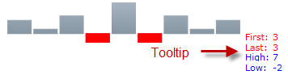

////

|metadata|
{
    "name": "xamsparkline-configuring-the-tooltip",
    "controlName": ["xamSparkline"],
    "tags": ["Charting","How Do I","Tips and Tricks"],
    "guid": "e4b44283-6a8d-4caa-8a31-5d905228173d",  
    "buildFlags": [],
    "createdOn": "2016-05-25T18:21:59.2233858Z"
}
|metadata|
////

= Configuring the Tooltip

== Topic Overview

=== Purpose

This topic explains, with code examples, how to configure and customize a tooltip in a link:{ApiPlatform}controls.charts.xamsparkline{ApiVersion}.html[xamSparkline]™.

=== Required background

The following table lists the topics required as a prerequisite to understanding this topic.

[options="header", cols="a,a"]
|====
|Type|Content

|Concepts
|
* Data templates 
|====

=== Topics

[options="header", cols="a,a"]
|====
|Topic|Purpose 

| link:xamsparkline-xamsparkline-overview.html[xamSparkline Overview] 

|This topic provides an overview of the _xamSparkline_ control, its benefits and the supported chart types. 

| link:xamsparkline-configuring-xamsparkline.html[Configuring xamSparkline] 

|This topic provides an overview of the possible ways to configure the _xamSparkline_ control. Links to the detailed configurations (available in separate topics) are provided as well. 

| link:xamsparkline-adding-a-tooltip.html[Adding a Tooltip] 

|This topic explains, with code examples, how to add a tooltip in _xamSparkline_ control. 

|==== 

=== In this topic

This topic contains the following sections:

* <<_Ref319997461,Introduction>>
* <<_Ref318973062,Tooltip Configuration Aspects>>
* <<_Ref318973093,Code Example: Configuring the Tooltip Using a Data Template>>

** <<_Ref319065250,Overview>>
** <<_Ref319940726,Property settings>>
** <<_Ref319940733,Preview>>
** <<_Ref319940740,Code>>

* <<_Ref317078582,Related Content>>

[[_Ref319997461]]
== Introduction

[[_Ref319088121]]

=== Introduction

Before any customization, the tooltip needs to be enabled, making it visible by setting the ToolTipVisibility property to  _true_  .

There are two ways to customize the tooltip, depending on what the link:{ApiPlatform}controls.charts.xamsparkline{ApiVersion}~infragistics.controls.charts.xamsparkline~tooltip.html[ToolTip] property is set to display:

* String – By setting the link:{ApiPlatform}controls.charts.xamsparkline{ApiVersion}~infragistics.controls.charts.xamsparkline~tooltip.html[ToolTip] property to a string such as:

`ToolTip="Testing the Tooltip"`

* Data Template – when the link:{ApiPlatform}controls.charts.xamsparkline{ApiVersion}~infragistics.controls.charts.xamsparkline~tooltip.html[ToolTip] property is set to a `DataTemplate`, the `DataContext` object of that DataTemplate is set to a link:{ApiPlatform}controls.charts.xamsparkline{ApiVersion}~infragistics.controls.charts.sparklinetooltipcontext.html[SparklineTooltipContext], which exposes four properties that can be customized in the DataTemplate, those properties are link:{ApiPlatform}controls.charts.xamsparkline{ApiVersion}~infragistics.controls.charts.sparklinetooltipcontext~first.html[First], link:{ApiPlatform}controls.charts.xamsparkline{ApiVersion}~infragistics.controls.charts.sparklinetooltipcontext~last.html[Last], link:{ApiPlatform}controls.charts.xamsparkline{ApiVersion}~infragistics.controls.charts.sparklinetooltipcontext~high.html[High], and link:{ApiPlatform}controls.charts.xamsparkline{ApiVersion}~infragistics.controls.charts.sparklinetooltipcontext~low.html[Low].

In most cases, it is recommended to use a Data Template for the customization. Using a string is not as useful as the Data Template, because the Data Template provides more flexibility to implement the appearance of the tooltip than simply setting the Tooltip to a string. For example, you can

[[_Ref318973062]]
== Tooltip Configuration Aspects

=== Tooltip configuration aspects summary

The following table lists the configurable aspects of the tooltip.

[options="header", cols="a,a,a"]
|====
|Configurable aspects|Details|Properties

|Tooltip content
|You can set the tooltip to display a custom text, or if, DataTemplate is used, further customizations of the content are possible, like displaying the data points together with some text.
| link:{ApiPlatform}controls.charts.xamsparkline{ApiVersion}~infragistics.controls.charts.xamsparkline~tooltip.html[ToolTip]

|Which data points to display
|The configurable data points are the First, Last, High and Low values.
|
* link:{ApiPlatform}controls.charts.xamsparkline{ApiVersion}~infragistics.controls.charts.sparklinetooltipcontext~first.html[First] 

* link:{ApiPlatform}controls.charts.xamsparkline{ApiVersion}~infragistics.controls.charts.sparklinetooltipcontext~last.html[Last] 

* link:{ApiPlatform}controls.charts.xamsparkline{ApiVersion}~infragistics.controls.charts.sparklinetooltipcontext~high.html[High] 

* link:{ApiPlatform}controls.charts.xamsparkline{ApiVersion}~infragistics.controls.charts.sparklinetooltipcontext~low.html[Low] 

|DataTemplate elements
|Refer to DataTemplate (MSDN) article for details.
|Any element that can be used in DataTemplate and supports binding e.g. the `Text` property of `TextBlock`.

|====

[[_Ref318973093]]
== Code Example: Configuring the Tooltip Using a Data Template

[[_Ref319065250]]

=== Overview

In the following code, a data template uses all available properties in the link:{ApiPlatform}controls.charts.xamsparkline{ApiVersion}~infragistics.controls.charts.sparklinetooltipcontext.html[SparklineToolTipContext] object ( link:{ApiPlatform}controls.charts.xamsparkline{ApiVersion}~infragistics.controls.charts.sparklinetooltipcontext~first.html[First], link:{ApiPlatform}controls.charts.xamsparkline{ApiVersion}~infragistics.controls.charts.sparklinetooltipcontext~last.html[Last], link:{ApiPlatform}controls.charts.xamsparkline{ApiVersion}~infragistics.controls.charts.sparklinetooltipcontext~high.html[High] and link:{ApiPlatform}controls.charts.xamsparkline{ApiVersion}~infragistics.controls.charts.sparklinetooltipcontext~low.html[Low]) to achieve the following customized look:

* Font size – 10

* Different color for the different data points:

* The first and last data point – red

* The highest and lowest data point – blue

[[_Ref319065259]]

=== Property settings

The following table maps the Sparkline Tooltip to property settings.

[options="header", cols="a,a"]
|====
|Use this property:|And set it to:

| link:{ApiPlatform}controls.charts.xamsparkline{ApiVersion}~infragistics.controls.charts.xamsparkline~tooltipvisibility.html[ToolTipVisibility]
|_Visible_

| link:{ApiPlatform}controls.charts.xamsparkline{ApiVersion}~infragistics.controls.charts.xamsparkline~tooltip.html[ToolTip]
|_DataTemplate_

|====

[[_Ref319065317]]

=== Preview

[[_Ref319065326]]

=== Code

*In XAML:*

[source,xaml]
----
<ig:XamSparkline ToolTipVisibility="Visible" />
<ig:XamSparkline.ToolTip>
    <DataTemplate>
        <Grid>
            <Grid.RowDefinitions>
                <RowDefinition />
                <RowDefinition />
                <RowDefinition />
                <RowDefinition />
            </Grid.RowDefinitions>
            <Grid.ColumnDefinitions>
                <ColumnDefinition />
                <ColumnDefinition />
            </Grid.ColumnDefinitions>
            <TextBlock Grid.Row="0" Grid.Column="0" Text="First: " Foreground="Red"/>
            <TextBlock Grid.Row="0" Grid.Column="1" Text="{Binding First}" Foreground="Red" />
            <TextBlock Grid.Row="1" Grid.Column="0" Text="Last: " Foreground="Red"/>
            <TextBlock Grid.Row="1" Grid.Column="1" Text="{Binding Last}" Foreground="Red"/>
            <TextBlock Grid.Row="2" Grid.Column="0" Text="High: " Foreground="Blue"/>
            <TextBlock Grid.Row="2" Grid.Column="1" Text="{Binding High}" Foreground="Blue"/>
            <TextBlock Grid.Row="3" Grid.Column="0" 
Text="Low: " Foreground="Blue"/>
            <TextBlock Grid.Row="3" Grid.Column="1" Text="{Binding Low}" Foreground="Blue"/>
         </Grid>                        
     </DataTemplate>
</ig:XamSparkline.ToolTip>
----

[[_Ref317078582]]
== Related Content

=== Topics

The following topics provide additional information related to this topic.

[options="header", cols="a,a"]
|====
|Topic|Purpose

| link:xamsparkline-xamsparkline-overview.html[xamSparkline Overview]
|This topic provides an overview of the _xamSparkline_ control, its benefits, and the supported chart types.

| link:xamsparkline-configuring-xamsparkline.html[Configuring xamSparkline]
|This topic provides an overview of the possible ways to configure the _xamSparkline_ control. Links to the detailed configurations (available in separate topics) are provided as well.

| link:xamsparkline-adding-a-tooltip.html[Adding a Tooltip]
|This topic explains, with code examples, how to add a tooltip in _xamSparkline_ control.

| link:xamsparkline-xamsparkline-property-reference.html[xamSparkline Property Reference]
|This topic explains the featured properties of the _xamSparkline_ control.

|====