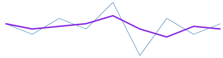

////

|metadata|
{
    "name": "xamsparkline-configuring-the-trend-line",
    "controlName": ["xamSparkline"],
    "tags": ["Charting","How Do I","Layouts"],
    "guid": "76dd1700-4a5a-4b0d-a4c5-00292523b2fa",  
    "buildFlags": [],
    "createdOn": "2016-05-25T18:21:59.2293858Z"
}
|metadata|
////

= Configuring the Trend Line

== Topic Overview

=== Purpose

This topic explains, with code examples, how to configure the trend line of link:{ApiPlatform}controls.charts.xamsparkline.v{ProductVersion}.html[xamSparkline]™ for custom appearance and color.

=== Required background

The following table lists the topics required as a prerequisite to understanding this topic.

[options="header", cols="a,a"]
|====
|Topic|Purpose

| link:xamsparkline-xamsparkline-overview.html[xamSparkline Overview]
|This topic provides an overview of the _xamSparkline_ control, its benefits, and the supported chart types.

| link:xamsparkline-configuring-xamsparkline.html[Configuring xamSparkline]
|This topic provides an overview of the possible ways to configure the _xamSparkline_ control. Links to the detailed configurations (available in separate topics) are provided as well.

| link:xamsparkline-adding-a-trend-line.html[Adding a Trend Line]
|This topic explains, with code example, how to add a trend line over the _xamSparkline_ control.

|====

== Configuring the Trend Line – Conceptual Overview

=== Overview

By default, the trend line is not displayed in the Sparkline chart. The minimum setting for displaying the trend line is enabling it by setting the TrendLineVisibilty property to `Visible.` A Trend Line configured with the minimum settings a line (based on selected trend line type) is a gray horizontal directional line with line thickness of 1 pixel.

The Trend Line can be customized in the following aspects:

* Type – numerous trend line types are supported. For details, refer to the link:xamsparkline-xamsparkline-features.html#Trend_Lines[Supported trend linetypes] text block of the link:xamsparkline-xamsparkline-features.html[xamSparkline Features] topic.
* Line color
* Line thickness
* Line period – used for calculating the moving average of the trend line. Applicable to trend lines of Average types only (not for Fit types). For example, you can set the line period for Simple Average or Exponential Average trend lines, but not for Linear Fit or [other] type of Fit trend lines.

Each of these aspects is managed through a dedicated property. See the Property settings text block for details.

=== Property settings

The following table maps the configuration tasks to the corresponding Trend Line property settings.

[options="header", cols="a,a,a"]
|====
|In order to:|Use this property:|And set it to:

|[[_Hlk319427977]] 

Specify the trend line type
| link:xamsparkline-xamsparkline-property-reference.html#TrendLineType[TrendLineType]
|The desired trend line type

|Change the color of the trend line
| link:xamsparkline-xamsparkline-property-reference.html#TrendLineBrush[TrendLineBrush]
|The HTML name or hexadecimal code of the color

|Change the thickness of the trend line
| link:xamsparkline-xamsparkline-property-reference.html#TrendLineThickness[TrendLineThickness]
|The desired numeric value (in pixels)

|Change the period of the trend line
| link:xamsparkline-xamsparkline-property-reference.html#TrendLinePeriod[TrendLinePeriod]
|The desired numeric value (integer)

|====

== Configuring the Trend Line – Code Example

=== Description

The code below demonstrates how to configure a red trend line of Simple Average type that is 3 pixels thick and have a period of 2.

=== Preview

[[_Hlk319431233]]

=== Property settings

[options="header", cols="a,a"]
|====
|Property|Setting

| link:{ApiPlatform}controls.charts.xamsparkline.v{ProductVersion}~infragistics.controls.charts.xamsparkline~trendlinetype.html[TrendLineType]
| __SimpleAverage__ 

| link:{ApiPlatform}controls.charts.xamsparkline.v{ProductVersion}~infragistics.controls.charts.xamsparkline~trendlinebrush.html[TrendLineBrush]
|Red

| link:{ApiPlatform}controls.charts.xamsparkline.v{ProductVersion}~infragistics.controls.charts.xamsparkline~trendlinethickness.html[TrendLineThickness]
|3

| link:{ApiPlatform}controls.charts.xamsparkline.v{ProductVersion}~infragistics.controls.charts.xamsparkline~trendlineperiod.html[TrendLinePeriod]
|2

|====

=== Code

*In XAML:*

[source,xaml]
----
<igSparkline:XamSparkline 
               TrendLineType="SimpleAverage"
                TrendLineBrush="Red"
                TrendLinePeriod="2"
                TrendLineThickness="3"/>
----

*In C#:*

[source,csharp]
----
this.xamSparkline1.TrendLineType = 
SparklineTrendType.SimpleAverage;
            this.xamSparkline1.TrendLineBrush = new SolidColorBrush(Colors.Red);
            this.xamSparkline1.TrendLinePeriod = 2;
            this.xamSparkline1.TrendLineThickness = 3;
----

*In Visual Basic:*

[source,vb]
----
Me.xamSparkline1.TrendLineType = SparklineTrendType.SimpleAverage
Me.xamSparkline1.TrendLineBrush = New SolidColorBrush(Colors.Red)
Me.xamSparkline1.TrendLinePeriod = 2
Me.xamSparkline1.TrendLineThickness = 3
----

[[_Ref317078582]]
== Related Content

=== Topics

The following topics provide additional information related to this topic.

[options="header", cols="a,a"]
|====
|Topic|Purpose

| link:xamsparkline-xamsparkline-property-reference.html[xamSparkline Property Reference]
|This topic explains the featured properties of the _xamSparkline_ control.

|====