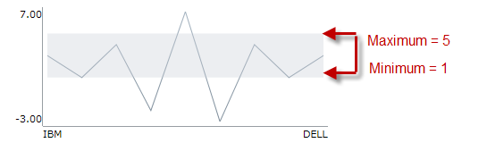

////

|metadata|
{
    "name": "xamsparkline-defining-a-normal-range",
    "controlName": ["xamSparkline"],
    "tags": ["API","Charting","Layouts"],
    "guid": "cd91bf69-eeb4-422d-b97a-d62402997c6f",  
    "buildFlags": [],
    "createdOn": "2016-05-25T18:21:59.2493562Z"
}
|metadata|
////

= Defining a Normal Range

== Topic Overview

=== Purpose

This topic explains, with code examples, how to define a Normal Range in link:{ApiPlatform}controls.charts.xamsparkline.v{ProductVersion}.html[xamSparkline]™.

=== Required background

The following table lists the topics required as a prerequisite to understanding this topic.

[options="header", cols="a,a"]
|====
|Topic|Purpose

| link:xamsparkline-xamsparkline-overview.html[xamSparkline Overview]
|This topic provides an overview of the _xamSparkline_ control, its benefits, and the supported chart types.

| link:xamsparkline-configuring-xamsparkline.html[Configuring xamSparkline]
|This topic provides an overview of the possible ways to configure the _xamSparkline_ control. Links to the detailed configurations (available in separate topics) are provided as well.

|====

=== In this topic

This topic contains the following sections:

* <<_Ref317087505,Defining a Normal Range>>

** <<_Ref317163220,Overview>>
** <<_Ref317163245,Property settings>>
** <<_Ref317163255,Example>>
** <<_Ref317178255,Code>>

* <<_Ref317163399,Related Content>>

[[_Ref317087505]]
== Defining a Normal Range

[[_Ref317163220]]

=== Overview

The Normal Range is a horizontal stripe representing some pre-defined meaningful range when the data is being visualized. The Normal Range can be set as a shaded area outlined with the desired color.

The Normal Range can be wider than the maximum data points or beyond. It can also be as thin as a line, to serve as threshold indicator for instance. You can also configure the width and the appearance (outline, fill, and color) of the Normal Range.

The minimum settings required for displaying the Normal Range are the visibility, the bottom border of the range, and the top border of range. These settings are managed, respectively, by the following properties :

* link:xamsparkline-xamsparkline-property-reference.html#NormalRangeVisibility[NormalRangeVisibility]

* link:xamsparkline-xamsparkline-property-reference.html#NormalRangeMaximum[NormalRangeMaximum]

* link:xamsparkline-xamsparkline-property-reference.html#NormalRangeMinimum[NormalRangeMinimum]

By default, the Normal Range is not displayed.When enabled, the Normal Range shows with light gray color appearance.

[[_Ref317163245]]

=== Property settings

The following table maps the tasks related to displaying markers to the property settings that configure them.

[options="header", cols="a,a,a"]
|====
|In order to:|Use this property:|And set it to:

|Display the Normal Range
| link:{ApiPlatform}controls.charts.xamsparkline{ApiVersion}~infragistics.controls.charts.xamsparkline~normalrangevisibility.html[NormalRangeVisibility]
| _Visible_ 

|Hide the Normal Range
| link:{ApiPlatform}controls.charts.xamsparkline{ApiVersion}~infragistics.controls.charts.xamsparkline~normalrangevisibility.html[NormalRangeVisibility]
| _Collapsed_ 

|Set the bottom border
| link:{ApiPlatform}controls.charts.xamsparkline{ApiVersion}~infragistics.controls.charts.xamsparkline~normalrangeminimum.html[NormalRangeMinimum]
| _Numeric value_ 

|Set the the top border
| link:{ApiPlatform}controls.charts.xamsparkline{ApiVersion}~infragistics.controls.charts.xamsparkline~normalrangemaximum.html[NormalRangeMaximum]
| _Numeric value_ 

|====

[[_Ref317163255]]

=== Example

The screenshot below demonstrates how the Sparkline looks as a result of the following settings:

[options="header", cols="a,a"]
|====
|Property|Value

| link:{ApiPlatform}controls.charts.xamsparkline{ApiVersion}~infragistics.controls.charts.xamsparkline~normalrangevisibility.html[NormalRangeVisibility]
|_Visible_

| link:{ApiPlatform}controls.charts.xamsparkline{ApiVersion}~infragistics.controls.charts.xamsparkline~normalrangeminimum.html[NormalRangeMinimum]
|_1_

| link:{ApiPlatform}controls.charts.xamsparkline{ApiVersion}~infragistics.controls.charts.xamsparkline~normalrangemaximum.html[NormalRangeMaximum]
|_5_

|====

[[_Ref317178255]]

=== Code

The Normal Range can be configured in the following aspects:

* Visibility

* Width ( _defined by setting the top and bottom border settings, see_   <<_Ref317163245,Property settings>>  _._  )

* Fill color ( _By default the range is filled with light gray_   _._  )

The following code uses the minimum of the property setting to display the normal range. The link:{ApiPlatform}controls.charts.xamsparkline{ApiVersion}~infragistics.controls.charts.xamsparkline~normalrangefill.html[NormalRangeFill] property is not required. It displays light-gray by default, as it is shown in the preview above, although it can be changed with desired color.

*In XAML:*

[source,xaml]
----
<igSparkline:XamSparkline 
   NormalRangeVisibility="Visible"
   NormalRangeMaximum="5"
   NormalRangeMinimum="1" />
----

*In C#:*

[source,csharp]
----
this.xamSparkline1.NormalRangeVisibility = System.Windows.Visibility.Visible;
this.xamSparkline1.NormalRangeMaximum = 5;
this.xamSparkline1.NormalRangeMinimum = 1;
----

*In Visual Basic:*

[source,vb]
----
Me.xamSparkline1.NormalRangeVisibility = System.Windows.Visibility.Visible
Me.xamSparkline1.NormalRangeMaximum = 5
Me.xamSparkline1.NormalRangeMinimum = 1
----

[[_Ref317163399]]
== Related Content

=== Topics

The following topics provide additional information related to this topic.

[options="header", cols="a,a"]
|====
|Topic|Purpose

| link:xamsparkline-xamsparkline-overview.html[xamSparkline Overview]
|This topic provides an overview of the _xamSparkline_ control, its benefits, and the supported chart types.

| link:xamsparkline-configuring-xamsparkline.html[Configuring xamSparkline]
|This topic provides an overview of the possible ways to configure the _xamSparkline_ control. Links to the detailed configurations (available in separate topics) are provided as well.

| link:xamsparkline-configuring-the-normal-range.html[Configuring the Normal Range]
|This topic provides an overview of the possible ways to configure the _xamSparkline_ control. Links to the detailed configurations (available in separate topics) are provided as well.

| link:xamsparkline-xamsparkline-property-reference.html[xamSparkline Property Reference]
|This topic explains the featured properties of the _xamSparkline_ control.

|====