////
|metadata|
{
    "name": "xamsparkline-xamsparkline-features",
    "controlName": ["xamSparkline"],
    "tags": ["API","Charting","Getting Started"],
    "guid": "9769d0b8-bfa2-422f-9d58-c45d892e33d6",
    "buildFlags": [],
    "createdOn": "2016-05-25T18:21:59.2813577Z"
}
|metadata|
////

= xamSparkline Features

== Topic Overview

=== Purpose

This topic provides an overview of the configurable visual elements of link:{ApiPlatform}controls.charts.xamsparkline{ApiVersion}.html[xamSparkline]™ control and the features that manage these visual elements.

=== Required background

The following table lists the topics required as a prerequisite to understanding this topic.

[options="header", cols="a,a"]
|====
|Topic|Purpose

| link:xamsparkline-xamsparkline-overview.html[xamSparkline Overview]
|This topic provides an overview of the _xamSparkline_ control, its benefits, and the supported chart types.

|====

=== In this topic

This topic contains the following sections:

* <<Introduction,Introduction>>
* <<Configurable_Visual_Elements_of_xamSparkline_and_Related_Properties,Configurable Visual Elements of xamSparkline and Related Properties>>

** <<_Ref318913385,Configurable visual elements summary>>
** <<_Ref318913402,Configurable visual elements and related properties>>

* <<xamSparkline_Features_Summary,xamSparkline Features Summary>>
* <<Markers,Markers>>

** <<_Ref318913434,Markers overview>>
** <<_Ref318913445,Marker types>>

* <<Trend_Lines,Trend Line>>

** <<_Ref318913575,Trend Line overview>>
** <<_Ref318913584,Trend Line types>>

* <<Normal_Range,Normal Range>>
* <<Interpolating_Unknown_Values,Interpolating Unknown Values>>

** <<_Ref318913700,Interpolating Unknown Values overview>>
** <<_Ref318913707,Supported Sparkline types>>

* <<Axes,Axes>>

** <<_Ref318913728,Axes overview>>
** <<_Ref318913738,Axes customization>>

* <<Tooltips,Tooltip>>

** <<_Ref318913754,Tooltip overview>>
** <<_Ref318913762,Tooltip customization>>

* <<Related_Topics,Related Topics>>

[[Introduction]]

== Introduction

=== Introduction to the xamSparkline visual elements and features

The  _xamSparkline_   control has several visual elements and corresponding features through which these elements can be configured and customized. The primary benefit of Sparkline compared to other charting controls is that it can render in a limited space such as a grid cell with all its visual elements shown. With that in mind, the Sparkline cannot display every label of the data points. It only allows showing high and low values on Y axis, and first and last values on X axis.

The Sparkline has the ability to mark the data points with elliptical icons to indicate the highest, lowest, first, last and negative values. The markers can be customized with desired shape, color or images, etc.

It allows displaying the (X/Y) axis, which takes up the space from the chart by decreasing the chart size in order to accommodate area for the axis and labels.

[[Configurable_Visual_Elements_of_xamSparkline_and_Related_Properties]]
== Configurable Visual Elements of  _xamSparkline_   and Related Properties

[[_Ref318913385]]

=== Configurable visual elements summary

The following screenshot depicts the visual elements of the  _xamSparkline_   control. The elements that are configurable through properties are listed below. None of these visual elements is displayed by default.

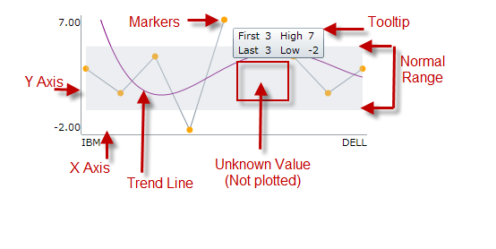

*Configurable Visual Elements:* 

* Markers

* Trend Line

* Normal Range

* Unknown Values

* Axis

* Tooltip

[[_Ref318913402]]

=== Configurable visual elements and related properties

The following table maps the visual elements of the  _xamSparkline_   control and the properties that configure them.

[options="header", cols="a,a"]
|====
|Visual Element|Property

|Markers
| link:{ApiPlatform}controls.charts.xamsparkline{ApiVersion}~infragistics.controls.charts.xamsparkline~markervisibility.html[MarkerVisibility]

|Trend Line
| link:{ApiPlatform}controls.charts.xamsparkline{ApiVersion}~infragistics.controls.charts.xamsparkline~trendlinetype.html[TrendLineType]

|Normal Range
| link:{ApiPlatform}controls.charts.xamsparkline{ApiVersion}~infragistics.controls.charts.xamsparkline~normalrangevisibility.html[NormalRangeVisibility]

|Plotted or Unplotted Unknown Value
| link:{ApiPlatform}datavisualization{ApiVersion}~infragistics.controls.charts.unknownvalueplotting.html[UnknownValuePlotting]

|Axis
| link:{ApiPlatform}controls.charts.xamsparkline{ApiVersion}~infragistics.controls.charts.xamsparkline~horizontalaxisvisibility.html[HorizontalAxisVisibility] link:{ApiPlatform}controls.charts.xamsparkline{ApiVersion}~infragistics.controls.charts.xamsparkline~verticalaxisvisibility.html[VerticalAxisVisibility]

|Tooltip
|Tooltip

|====

[[xamSparkline_Features_Summary]]
== _xamSparkline_   Features Summary

=== Features summary chart

The following table summarizes the main features of the  _xamSparkline_   control. The features are explained in further detail in the text blocks following the table.

[options="header", cols="a,a"]
|====
|*Feature*|* Description*

|<<Markers,Markers>>
|image::images/Sparkline_Visual_Elements_2.png[]
Markers are symbols overlaid on the Sparkline to indicate the individual data points based on X/Y coordinates.

|<<Trend_Lines,Trend Line>>
|image::images/Sparkline_Visual_Elements_3.png[]
Trend lines are lines drawn from the starting point to the end point indicating the trending direction and movement of the series, so that the viewer can evaluate the tendencies in the data and mentally extrapolate past, future, or unknown values.

|<<Normal_Range,Normal Range>>
|image::images/Sparkline_Visual_Elements_4.png[]
The Normal range is a horizontal stripe representing some pre-defined meaningful range when the data is being visualized.

|<<Interpolating_Unknown_Values,Interpolating Unknown Values>>
|image::images/Sparkline_Visual_Elements_5.png[]
_xamSparkline_ can detect unknown values ( _null or double.NaN_ ) and render the space for the unknown values using a specified interpolation algorithm.

|<<Axes,Axes>>
|image::images/Sparkline_Visual_Elements_6.png[]
_xamSparkline_ allows displaying the X and Y axes (both or only one of them) with corresponding labels.

|<<Tooltips,Tooltip>>
|image::images/Sparkline_Visual_Elements_7.png[]
_xamSparkline_ can display a tooltip when the mouse is hovered over the Sparkline.

|====

[[Markers]]

== Markers

[[_Ref318913434]]

=== Markers overview

Markers are symbols overlaid on a single data point to indicate the individual data points plotted on the chart based on the X/Y coordinates.

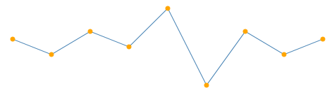

The Markers in  _xamSparkline_   can be specified to identify the data points based on the data and/or the location of the data points.

[[_Ref318913445]]

=== Marker types

The following table displays the supported Marker types.

[options="header", cols="a,a"]
|====
|*Marker type*|*Description*

|All data points
|image::images/Sparkline_Visual_Elements_9.png[]
Markers are displayed on all data points.

|First and last data points
|image::images/Sparkline_Visual_Elements_10.png[]
Two markers are displayed – on the first and on the last data point.

|Top and bottom data points
|image::images/Sparkline_Visual_Elements_11.png[]
Two markers are displayed – on the highest and on the lowest data point.

|Negative data points
|image::images/Sparkline_Visual_Elements_12.png[]
Markers are displayed on the negative data points. If there is more than one negative data point, all of them will be marked.

|====

==== Related Topics:

* link:xamsparkline-configuring-markers.html[Configuring Markers]

[[Trend_Lines]]
== Trend Line

[[_Ref318913575]]

=== Trend Line overview

Trend lines are lines drawn from the starting point to the end point indicating the trending direction and movement of the series, so that the viewer can evaluate the tendencies in the data and mentally extrapolate past, future, or unknown values.

image::images/Sparkline_Visual_Elements_13.png[]

The Trend Line feature enables you to choose among several formulas for generating a trending directional line. The formula to use is specified in the link:{ApiPlatform}controls.charts.xamsparkline{ApiVersion}~infragistics.controls.charts.xamsparkline~trendlinetype.html[TrendLineType] property. The Trend Line renders in front of the series data so it is always visible.

[[_Ref318913584]]

=== Supported trend line types

The following table displays the supported trend line types. Each trend line type is drawn based on the calculation formula of its type.

[options="header", cols="a,a,a"]
|====
|*Trend Line type*2|*Description*| link:xamsparkline-xamsparkline-property-reference.html#TrendLineType[TrendLineType]  * property setting*

|Simple Average

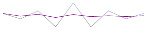
|SimpleAverage is a set of numbers, each of which is the average of a corresponding subset of data points. Also known as Simple Moving Average
|_SimpleAverage_

|Modified Average

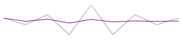
|Modified Average shows the moving average value over a set period. Used to emphasize the direction of the trend and smooth out the fluctuation.
|_ModifiedAverage_

|Exponential Average

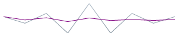
|Exponental Average is similar to simple average with weight factor added to it. This type of average is known to react faster to recent changes of the trend.
| _ExponentialAverage_ 

|Cumulative Average

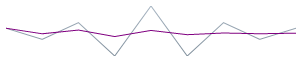
|Cumulative Average is an ordered data points with calculated average of all data up to the current point.
| _CumulativeAverage_ 

|Weighted Average

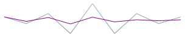
|Weighted Average is any average that has multiplying factor to give weight to data at different positions.
| _WeightedAverage_ 

|Cubic Fit

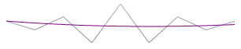
|Uses polynomial mathematical functions to specify a cubic fit trend line on a series.
| _CubicFit_ 

|Exponential Fit

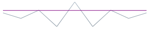
|Uses exponential mathematical functions to specify an exponential fit trend line on a series.
| _ExponentialFit_ 

|Line Fit

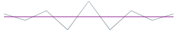
|The best-fiting straight trend line.
| _LineFit_ 

|Logarithmic Fit

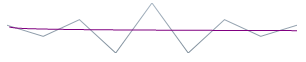
|The best-fitting curved line. Used when the rate of change in the data increases or decreases quickly and then levels out. This type of trend line is most useful with sufficient data.
| _LogarithmicFit_ 

|Power Low Fit

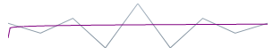
|Power Low trend line is a curved line that uses power function to draw a line. It is best to avoid zero (0) point as it is not valid for power function. Sparkline will not produce any errors, it will plot the o point, but from the power trend line prospective the result will not be accurate. Power trend line is used with data sets that compare measurements that increase at a specific rate.
| _PowerLowFit_ 

|Quadratic Fit

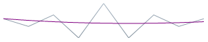
|Uses quadratic equation to form a trend line. It shows the overall effect of the high and low data points with the accuracy of a linear curve.
| _QuadraticFit_ 

|Quartic Fit

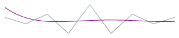
|Uses quartic polynomial to specify a trend line on series.
| _QuarticFit_ 

|Quintic Fit

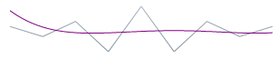
|Uses quintic polynomial to specify a trend line on a series.
| _QuinticFit_ 

|====

==== Related Topics:

* link:xamsparkline-configuring-the-trend-line.html[Configuring the Trend Line]

[[Normal_Range]]
== Normal Range

=== Normal Range overview

The Normal Range is a horizontal stripe drawn to represent some pre-defined meaningful range when the data is being visualized.

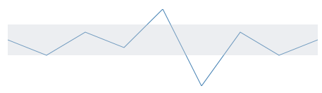

The typical use of the Normal Range is to indicate what values are considered normal or good. For example, if the Sparkline represented the person’s heart rate over time, the normal range of 60-100 beats per minute would be the range to be highlighted as Normal, and the data points outside of this range would be easy to identify.

The range width and position is determined by the link:xamsparkline-xamsparkline-property-reference.html#NormalRangeMaximum[NormalRangeMinimum] and link:xamsparkline-xamsparkline-property-reference.html#NormalRangeMinimum[NormalRangeMaximum] properties.

==== Related Topics:

* link:xamsparkline-configuring-the-normal-range.html[Configuring the Normal Range]

[[Interpolating_Unknown_Values]]
== Interpolating Unknown Values

[[_Ref318913700]]

=== Interpolating Unknown Values overview

The  _xamSparkline_   can detect unknown values and render the space for the unknown values using a specified interpolation algorithm.

If there are missing values in the data (typical “unknown” values found in data are  _null_   and  _double.NaN_  ),  _xamSparkline_   can render in the space with unknown values by linear interpolation. The following table demonstrates the difference in a Sparkline plotted from the same data set (containing missing values) without using Unknown Values Plotting and with it.

[options="header", cols="a,a"]
|====
|*Plotting of unknown values applied?*|*Preview*

|No
|image::images/Sparkline_Visual_Elements_28.png[]

|Yes
|image::images/Sparkline_Visual_Elements_29.png[]

|====

This feature is managed through the link:xamsparkline-xamsparkline-property-reference.html#UnknownValuePlotting[UnknownValuePlotting] property. The allowed values are  _DontPlot_   and  _LinearInterpolate_  .

[[_Ref318913707]]

=== Supported Sparkline types

The following Sparkline types support Unknown Values Plotting:

* Area
* Line

The Column and Win/Loss types do not interpolate unknown values. These Sparkline types will always display a blank space where unknown values are present.

==== Related Topics:

* link:xamsparkline-interpolating-unknown-values.html[Interpolating Unknown Values]

[[Axes]]
== Axes

[[_Ref318913728]]

=== Axes overview

The Sparkline allows displaying the X and Y axes (both or only one of them) with corresponding labels.

[cols="a,a,a"]
|====
|image::images/Sparkline_Visual_Elements_30.png[]
|image::images/Sparkline_Visual_Elements_31.png[]
|image::images/Sparkline_Visual_Elements_32.png[]

|====

[[_Ref318913738]]

=== Axes customization

The axes of the  _xamSparkline_   control can be customized in the following aspects:

* Visibility

The visibility of the X and Y axis are managed by separate properties ( link:{ApiPlatform}controls.charts.xamsparkline{ApiVersion}~infragistics.controls.charts.xamsparkline~horizontalaxisvisibility.html[HorizontalAxisVisibility] and link:{ApiPlatform}controls.charts.xamsparkline{ApiVersion}~infragistics.controls.charts.xamsparkline~verticalaxisvisibility.html[VerticalAxisVisibility], respectively) so it is possible to have only one of them displayed.

* Label

** Label text

You can add descriptive labels to the X axis. This capability is managed by the link:xamsparkline-xamsparkline-property-reference.html#LabelMemberPath[LabelMemberPath] property.

* Label font

The label fonts can be customized using the typical font-related control properties: link:http://msdn.microsoft.com/en-us/library/system.windows.controls.control.foreground.aspx[Foreground], link:http://msdn.microsoft.com/en-us/library/system.windows.controls.control.fontfamily.aspx[FontFamily], link:http://msdn.microsoft.com/en-us/library/system.windows.controls.control.fontsize.aspx[FontSize], link:http://msdn.microsoft.com/en-us/library/system.windows.controls.control.fontstyle.aspx[FontStyle], and link:http://msdn.microsoft.com/en-us/library/system.windows.controls.control.fontstretch.aspx[FontStretch]. Therefore, it is not possible to use a different font for each axis.

==== Related Topics:

* link:xamsparkline-configuring-xamsparkline.html[Configuring xamSparkline]

[[Tooltips]]
== Tooltip

[[_Ref318913754]]

=== Tooltip overview

The  _xamSparkline_   can display a tooltip when the mouse is hovered over the Sparkline. The tooltip is designed to display the high, low, first, and last data points.

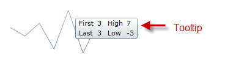

Tooltips are managed by the link:xamsparkline-xamsparkline-property-reference.html#ToolTip[ToolTip] property.

[[_Ref318913762]]

=== Tooltip customization

The tooltips of the  _xamSparkline_   can be customized in the following aspects:

* Label text
* Label font
* Label color
* Font size

For more information about customizing the tooltip refer to the link:xamsparkline-configuring-the-tooltip.html[Configuring the Tooltip] topic.

==== Related Topics:

* link:xamsparkline-configuring-the-tooltip.html[Configuring the Tooltip]

[[Related_Topics]]
== Related Content

=== Topics

The following topics provide additional information related to this topic.

[options="header", cols="a,a"]
|====
|Topic|Purpose

| link:xamsparkline-xamsparkline-overview.html[xamSparkline Overview]
|This topic provides an overview of the _xamSparkline_ control, its benefits, and the supported chart types.

| link:xamsparkline-configuring-xamsparkline.html[Configuring xamSparkline]
|This topic provides an overview of the possible ways to configure the _xamSparkline_™ control. Links to the detailed configurations (available in separate topics) are provided as well.

| link:xamsparkline-xamsparkline-property-reference.html[xamSparkline Property Reference]
|This topic explains the featured properties of the _xamSparkline_™ control.

|====