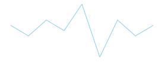

////

|metadata|
{
    "name": "xamsparkline-xamsparkline-overview",
    "controlName": ["xamSparkline"],
    "tags": ["Charting","Getting Started"],
    "guid": "f2452365-ae3d-48ce-a70b-182c9cb8f93d",  
    "buildFlags": [],
    "createdOn": "2016-05-25T18:21:59.2683575Z"
}
|metadata|
////

= xamSparkline Overview

== Topic Overview

=== Purpose

This topic provides an overview of the link:{ApiPlatform}controls.charts.xamsparkline{ApiVersion}.html[xamSparkline]™ control, its benefits, and the supported chart types.

== Sparkline Types

=== Sparkline Types Overview

The following table summarizes the Sparkline types.

[options="header", cols="a,a"]
|====
| *Type* | *Description* 

| _Line_ 
|Displays the Line chart type of Sparkline with numeric data, connecting the data points with line segments. At least two data points have to be supplied in order to visualize the data in Sparkline.

| _Area_ 
|Displays the Area chart type of Sparkline with numeric data. This is similar to line type with additional step of closing the area after each line is drawn. At least two data points have to be supplied in order to visualize the data in Sparkline.

| _Column_ 
|Displays the Column chart type of Sparkline with numeric data. Some may refer to it as vertical bars. This type can render a single data point, but it would require specifying the minimum value range property (Minimum) in Sparkline so the supplied single data point can be visible, otherwise the value will be treated as the minimum value and will not be visible.

| _WinLoss_ 
|This type is similar in its visual appearance to Column chart type, in which the value of each column is equal to either the positive maximum (for positive values) or the negative minimum (for negative value) of the data set. The idea is to indicate a win or a loss scenario. 

For the Win/Loss chart to display properly, the data set must have both positive and negative values.

|====

=== Line

=== Area

=== Column

image::images/Sparkline_Overview_3.png[]

=== WinLoss

== Related Content

=== Topics

The following topics provide additional information related to this topic.

[options="header", cols="a,a"]
|====
| *Topic* | *Purpose* 

| link:xamsparkline-adding-xamsparkline.html[Adding xamSparkline]
|This topic provides an overview of the _xamSparkline_ control, its benefits, and the supported chart types.

| link:xamsparkline-configuring-xamsparkline.html[Configuring xamSparkline]
|This topic provides an overview of the possible ways to configure the _xamSparkline_ control. Links to the detailed configurations (available in separate topics) are provided as well.

| link:xamsparkline-xamsparkline-property-reference.html[xamSparkline Property Reference]
|This topic explains the featured properties of the _xamSparkline_ control.

|====