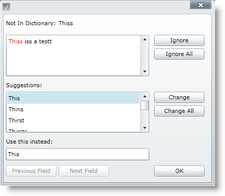

////

|metadata|
{
    "name": "xamspellchecker-about-xamspellchecker",
    "controlName": ["xamSpellChecker"],
    "tags": ["Getting Started"],
    "guid": "{C330F7E4-91B7-41A2-9B85-9DF58E65A2E4}",  
    "buildFlags": [],
    "createdOn": "2016-05-25T18:21:59.1333792Z"
}
|metadata|
////

= About xamSpellChecker

The xamSpellChecker control is a completely customizable dialog that provides a spelling correction user interface to your end user. The user interface is displayed to your end user when misspelled words are located in their text.

Some of the xamSpellChecker control features include:

* Dictionary Support – The xamSpellChecker control comes standard with dictionaries for nine different languages, including Dutch, English (American, Australian, British and Canadian), French, German, Spanish and Portuguese.
* SpellChecker Dialog – The xamSpellChecker control’s spell checking dialog can be launched on validation or on a button click. This dialog will then guide your end user through the spelling mistakes they have made and allow them to ignore the word or change the word to a suggested word.

*About the Spell Check Dialog Window*

When xamSpellChecker™ encounters a misspelled word, it displays the SpellCheckDialog box. It has several useful options for dealing with misspelled words in a document. While xamSpellChecker is checking the spelling through the SpellCheckDialog box, it will go through each misspelled word one at a time until all errors are ignored or corrected.

Below is an image of the SpellCheckDialog box. The different parts of the dialog box are described in greater detail below.

* *Not in Dictionary* -- The text box below displays the misspelled word.
* *Ignore* -- Clicking Ignore causes the spell checker to ignore this one instance of the misspelled word and continue on to the next misspelled word.
* *Ignore All* -- Ignore All ignores the current instance of the misspelled word as well as all future instances. Ignore All essentially "tricks" the spell checker into thinking the word is in the dictionary; however, the next time a spell check dialog box is opened, it will not remember these settings.
* *Change* -- Upon clicking this button, the misspelled word will be replaced with the word selected from the Suggestions list. This will replace only the current instance of the word.
* *Change All* -- Clicking Change All will replace all occurrences of the misspelled word in the entire document to the word selected from the Suggestions list.
* *Suggestions* -- The list in the Suggestions box represents all of the possible suggestions for the misspelled word. If you select a suggestion and click Change; the misspelled word will be replaced with the selected word.

== Related Topics

link:xamspellchecker-adding-xamspellchecker-to-your-page.html[Adding xamSpellChecker to Your Page]

link:xamspellchecker-using-xamspellchecker.html[Using xamSpellChecker]