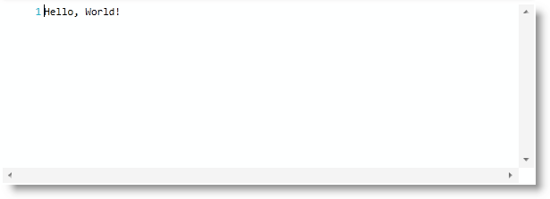

////

|metadata|
{
    "name": "xamsyntaxeditor-adding-to-your-page",
    "controlName": ["xamSyntaxEditor"],
    "tags": ["Getting Started","How Do I"],
    "guid": "6f0676f6-c8ce-4a4f-9d55-d03bb436fbe5",  
    "buildFlags": [],
    "createdOn": "2016-05-25T18:21:59.3213599Z"
}
|metadata|
////

= Adding xamSyntaxEditor to Your Page

== Topic Overview

=== Purpose

This topic provides you with systematic instructions designed to help you get the  _xamSyntaxEditor™_   up and running as quickly as possible.

=== Required background

The following topics are prerequisites to understanding this topic:

[options="header", cols="a,a"]
|====
|Topic|Purpose

| link:xamsyntaxeditor-overview.html[ _xamSyntaxEditor_ Overview]
|In this topic, you will find information to help you better understand the _xamSyntaxEditor’s_ functions.

|====

=== In this topic

This topic contains the following sections:

* <<_Ref331770884, Adding  _xamSyntaxEditor_   to Your Page >>
** <<_Ref331770890,Introduction>>
** <<_Ref331770895,Preview>>
** <<_Ref331770901,Steps>>

* <<_Ref331770905, Related Content >>

[[_Ref331770884]]
== Adding  _xamSyntaxEditor_   to Your Page

[[_Ref331770890]]

=== Introduction

This procedure provides systematic instructions for adding the  _xamSyntaxEditor_   to your page.

[[_Ref331770895]]

=== Preview

The following screenshot illustrates a  _xamSyntaxEditor_   with the text, “Hello, World!”. This is representative of how the  _xamSyntaxEditor_   previews the result.

[[_Ref331770901]]

=== Steps

The following steps demonstrate how to add the  _xamSyntaxEditor_   to your page.

=== 1. Assembly references

Add the following assembly references in your project:

*{ApiPlatform}v{ProductVersion}*

*{ApiPlatform}Documents.TextDocument.v{ProductVersion}*

*{ApiPlatform}Controls.Editors.XamSyntaxEditor.v{ProductVersion}*

=== 2. Namespaces

Add the following namespaces:

*In XAML:*

[source,xaml]
----
xmlns:ig="http://schemas.infragistics.com/xaml"
----

*In C#:*

[source,csharp]
----
using Infragistics.Controls.Editors;
using Infragistics.Documents;
----

*In Visual Basic:*

[source,vb]
----
Imports Infragistics.Controls.Editors
Imports Infragistics.Documents
----

=== 3. Create xamSyntaxEditor

Create and put the  _xamSyntaxEditor_   on your page.

*In XAML:*

[source,xaml]
----
<ig:XamSyntaxEditor x:Name="xamSyntaxEditor1">
</ig:XamSyntaxEditor>
----

=== 4. Create TextDocument

Create the `TextDocument` and set it to the  _xamSyntaxEditor_  ’s “Document” property.

*In XAML:*

[source,xaml]
----
<ig:XamSyntaxEditor.Document>
  <ig:TextDocument />
</ig:XamSyntaxEditor.Document>
----

*In C#:*

[source,csharp]
----
TextDocument td = new TextDocument();
this.xamSyntaxEditor1.Document = td;
----

*In Visual Basic:*

[source,vb]
----
Dim td As New TextDocument()
Me.xamSyntaxEditor1.Document = td
----

=== 5. Add some text

Using the link:{ApiPlatform}documents.textdocument{ApiVersion}~infragistics.documents.textdocument~initializetext.html[InitializeText] method, add some text in the `TextDocument`.

*In C#:*

[source,csharp]
----
td.InitializeText("Hello, World!");
----

*In Visual Basic:*

[source,vb]
----
td.InitializeText("Hello, World!")
----

[[_Ref331770905]]
== Related Content

=== Topics

The following topics provide additional information related to this topic.

[options="header", cols="a,a"]
|====
|Topic|Purpose

| link:xamsyntaxeditor-configuring.html[Configuring _xamSyntaxEditor_ ]
|This section is a gateway to important conceptual and task-based information that will help you use various functions and features provided by the _xamSyntaxEditor_ cross platform control.

|====