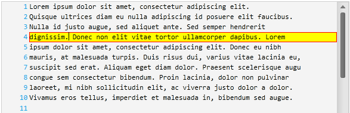

////

|metadata|
{
    "name": "xamsyntaxeditor-currentlinehl",
    "controlName": ["xamSyntaxEditor"],
    "tags": ["Data Presentation","Editing"],
    "guid": "10bd103a-9ef7-459b-9946-1b4e3dcba8dc",  
    "buildFlags": [],
    "createdOn": "2016-05-25T18:21:59.4963613Z"
}
|metadata|
////

= Current Line Highlighting (xamSyntaxEditor)

== Topic Overview

=== Purpose

This topic explains the current line highlighting feature.

=== Required background

The following topics are prerequisites to understanding this topic:

[options="header", cols="a,a"]
|====
|Topic|Purpose

| link:xamsyntaxeditor-overview.html[ _xamSyntaxEditor_ Overview]
|In this topic, you will find information to help you better understand the _xamSyntaxEditor’s_ functions.

| link:xamsyntaxeditor-editing-support-overview.html[Editing Support Overview]
|This topic covers the text editing capabilities of the _xamSyntaxEditor_ control from both the developer and user’s perspective.

|====

=== In this topic

This topic contains the following sections:

* <<_Ref343683034, Introduction >>
* <<_Ref343683007, Feature Configuration Summary >>
* <<_Ref343682982, Enable/Disable the Current Line Highlighting >>
* <<_Ref343682991, Set the Current Line Highlighting Background Brush >>
* <<_Ref343850371, Set the Current Line Highlighting Border Brush >>
* <<_Ref343683027, Related Content >>

[[_Ref343683034]]
== Introduction

=== Current line highlighting summary

The current line highlighting feature highlights the line containing the caret. You can specify both the background and border brushes for the current line highlight.

The following screenshot shows the  _xamSyntaxEditor_   with the current line highlighting feature enabled:

[[_Ref343683007]]
== Feature Configuration Summary

=== Feature configuration summary chart

The following table lists the  _xamSyntaxEditor_   control’s configurable aspects of the current line highlighting feature. Additional information follows the table.

[options="header", cols="a,a,a"]
|====
|Configurable aspect|Details|Properties

|<<_Ref343682982,Enable/Disable the Current Line Highlighting>>
|Show/hide the current line highlighting
|
* link:{ApiPlatform}controls.editors.xamsyntaxeditor{ApiVersion}~infragistics.controls.editors.xamsyntaxeditor~currentlinehighlightvisibility.html[CurrentLineHighlightVisibility] 

|<<_Ref343682991,Set the Current Line Highlighting Background Brush>>
|Sets the background brush of the current line highlight
|
* link:{ApiPlatform}controls.editors.xamsyntaxeditor{ApiVersion}~infragistics.controls.editors.xamsyntaxeditor~currentlinehighlightbackgroundbrush.html[CurrentLineHighlightBackgroundBrush] 

|<<_Ref343850371,Set the Current Line Highlighting Border Brush>>
|Sets the border brush of the current line highlight
|
* link:{ApiPlatform}controls.editors.xamsyntaxeditor{ApiVersion}~infragistics.controls.editors.xamsyntaxeditor~currentlinehighlightborderbrush.html[CurrentLineHighlightBorderBrush] 

|====

[[_Ref343682982]]
== Enable/Disable the Current Line Highlighting

=== Overview

Use the  _xamSyntaxEditor_   control’s `CurrentLineHighlightVisibility` property to enable/disable current line highlighting.

=== Property settings

[options="header", cols="a,a,a"]
|====
|In order to:|Use this property:|And set it to:

|Enable current line highlighting feature
|`CurrentLineHighlightVisibility`
|`Visibility.Visible`

|Disable the current line highlighting feature
|`CurrentLineHighlightVisibility`
|`Visibility.Collapsed`

|====

=== Code

The following code snippet demonstrates how to enable current line highlighting:

*In C#:*

[source,csharp]
----
this.xamSyntaxEditor1.CurrentLineHighlightVisibility = Visibility.Visible;
----

*In Visual Basic:*

[source,vb]
----
Me.xamSyntaxEditor1.CurrentLineHighlightVisibility = Visibility.Visible
----

[[_Ref343682991]]
== Set the Current Line Highlighting Background Brush

=== Overview

Use the  _xamSyntaxEditor_   control’s `CurrentLineHighlightBackgroundBrush` property to set the brush used to draw the background of the current line highlight.

=== Property settings

[options="header", cols="a,a,a"]
|====
|In order to:|Use this property:|And set it to:

|Set a brush for drawing the background of the current line highlight
|`CurrentLineHighlightBackgroundBrush`
|An object of type link:http://msdn.microsoft.com/en-us/library/system.windows.media.brush.aspx[Brush]

|====

=== Code

The following code example demonstrates how to set a solid yellow color brush for drawing the background of the current line highlight:

*In C#:*

[source,csharp]
----
this.xamSyntaxEditor1.CurrentLineHighlightBackgroundBrush =
    new SolidColorBrush(Colors.Yellow);
----

*In Visual Basic:*

[source,vb]
----
Me.xamSyntaxEditor1.CurrentLineHighlightBackgroundBrush = _
    New SolidColorBrush(Colors.Yellow)
----

[[_Ref343850371]]
== Set the Current Line Highlighting Border Brush

=== Overview

Use the  _xamSyntaxEditor_   control’s `CurrentLineHighlightBorderBrush` property to set the brush used to draw the border of the current line highlight.

=== Property settings

[options="header", cols="a,a,a"]
|====
|In order to:|Use this property:|And set it to:

|Set a brush for drawing the border of the current line highlight
|`CurrentLineHighlightBorderBrush`
|An object of type link:http://msdn.microsoft.com/en-us/library/system.windows.media.brush.aspx[Brush]

|====

=== Code

The following code example demonstrates how to set a solid red color brush for drawing the border of the current line highlight:

*In C#:*

[source,csharp]
----
this.xamSyntaxEditor1.CurrentLineHighlightBorderBrush =
    new SolidColorBrush(Colors.Magenta);
----

*In Visual Basic:*

[source,vb]
----
Me.xamSyntaxEditor1.CurrentLineHighlightBorderBrush = _
    New SolidColorBrush(Colors.Magenta)
----

[[_Ref343683027]]
== Related Content

=== Topics

The following topics provide additional information related to this topic.

[options="header", cols="a,a"]
|====
|Topic|Purpose

| link:xamsyntaxeditor-changing-font-and-styles.html[Changing Fonts and Styles]
|This topic provides information on how to change the presention of the document’s content inside the _xamSyntaxEditor_ .

| link:xamsyntaxeditor-splitting.html[Splitting]
|This topic will help you understand the document splitting capability of the _xamSyntaxEditor_ and how to customize it.

| link:xamsyntaxeditor-syntax-highlighting.html[Syntax Highlighting]
|This topic provides information about text colorization, based on the `TextDocument`’s associated language.

|====

=== Samples

The following sample provides additional information related to this topic.

[options="header", cols="a,a"]
|====
|Sample|Purpose

| pick:[sl=" link:{SamplesURL}/syntax-editor/#/editor-customizations[Editor Customizations]"] pick:[wpf=" link:{SamplesURL}/syntax-editor/editor-customizations[Editor Customizations]"] 
|This sample demonstrates how to customize the _xamSyntaxEditor_ .

|====