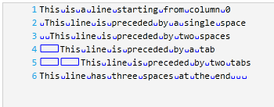

////

|metadata|
{
    "name": "xamsyntaxeditor-custom-adornments",
    "controlName": ["xamSyntaxEditor"],
    "tags": ["Application Blocks","Editing"],
    "guid": "6b641155-092e-4383-ba16-03a0c8e69a70",  
    "buildFlags": [],
    "createdOn": "2016-05-25T18:21:59.4773599Z"
}
|metadata|
////

= Custom Adornments (xamSyntaxEditor)

== Topic Overview

=== Purpose

This topic explains adornments and the process of creating custom adornments.

=== Required background

The following topics are prerequisites to understanding this topic:

[options="header", cols="a,a"]
|====
|Topic|Purpose

| link:xamsyntaxeditor-overview.html[ _xamSyntaxEditor_ Overview]
|In this topic, you will find information to help you better understand the _xamSyntaxEditor’s_ functions.

| link:xamsyntaxeditor-editing-support-overview.html[Editing Support Overview]
|This topic covers the text editing capabilities of the _xamSyntaxEditor_ control from both the developer and user’s perspective.

|====

=== In this topic

This topic contains the following sections:

* <<_Ref339446274, Introduction >>
* <<_Ref340582068, Create a Custom Adornment >>
* <<_Ref339446338, Code Examples >>
** <<_Ref340582135,Code Example: Create your Custom Adornment Generator Provider>>
** <<_Ref340569984,Code Example: Create your Custom Adornment Generator>>
** <<_Ref340582157,Code Example: Instantiate and Register your Custom Adornment Generator Provider>>

* <<_Ref339446363, Related Content >>

[[_Ref339446274]]
== Introduction

=== Adornments summary

Adornments are visual elements displayed in the  _xamSyntaxEditor_   _™_   control’s text editing area that display visual user cues. Adornments are very flexible and may be rendered in either their own custom rendering layer or in any of the predefined rendering layers. The  _xamSyntaxEditor_   control provides an extensible API that allows you to create your own adornments and adornment layers. These are the same APIs used internally by the  _xamSyntaxEditor_   for implementing several  _xamSyntaxEditor’s_   features - Caret, link:xamsyntaxeditor-selection.html[Selection] and link:xamsyntaxeditor-error-reporting.html[Error Reporting].

[[_Ref340582068]]
== Create a Custom Adornment

=== Introduction

By following the steps below you will create a custom adornment, which marks all whitespaces in the current document.

=== Preview

The following screenshot is a preview of the result. The spaces are marked with dots and tabs are marked with arrows.

=== Prerequisites

To complete the procedure, you need to know how to link:xamsyntaxeditor-adding-to-your-page.html[add  _xamSyntaxEditor_   to your page].

=== Overview

Following is a conceptual overview of the process:

*1. Creating an `AdornmentGeneratorProvider` class derived from adornment generator provider. This class is responsible for creating instances of your adornment generator class wheneverthe control requests one.*

*2. Registering your derived `AdornmentGeneratorProvider` with the `ServicesManager`,exposed on the TextDocument’s Language.*

*3. Creating a derived `SyntaxEditorAdornmentGeneratorBase` class from adornment generator. This class is responsible for rendering the actual adornments into a specific document view. Instances of this class will be automatically created by the `AdornmentGeneratorProvider` you registered in step 2.*

=== Steps

The following steps demonstrate how to create a custom adornment.

=== 1. Create an adornment generator provider by deriving a class from AdornmentGeneratorProvider.

Create a class extending from the link:{ApiPlatform}controls.editors.xamsyntaxeditor.v{ProductVersion}~infragistics.controls.editors.adornmentgeneratorprovider_members.html[AdornmentGeneratorProvider] and implements the link:{ApiPlatform}controls.editors.xamsyntaxeditor.v{ProductVersion}~infragistics.controls.editors.adornmentgeneratorprovider~createadornmentgenerator.html[CreateAdornmentGenerator] method, which, in turn, instantiates and returns an instance of your link:{ApiPlatform}controls.editors.xamsyntaxeditor.v{ProductVersion}~infragistics.controls.editors.syntaxeditoradornmentgeneratorbase_members.html[SyntaxEditorAdornmentGeneratorBase] derived class. When the  _xamSyntaxEditor_   invokes this method, it supplies the related link:{ApiPlatform}controls.editors.xamsyntaxeditor.v{ProductVersion}~infragistics.controls.editors.documentviewbase_members.html[DocumentViewBase]. It is a good idea to pass it along to the adornment, because the `DocumentViewBase` contains all the context the adornment needs to access view and control information.

.Note
[NOTE]
====
Please refer to the <<_Ref340582135,related code example>> for more information on deriving an AdornementGeneratorProvider class to create an adornment generator provider.
====

=== 2. Register your derived adornment generator provider with the ServicesManager exposed on the TextDocument’s Language.

Create a page and add the  _xamSyntaxEditor_   control. Use the link:{ApiPlatform}documents.textdocument.v{ProductVersion}~infragistics.documents.parsing.servicesmanager.html[ServicesManager]’s link:{ApiPlatform}documents.textdocument.v{ProductVersion}~infragistics.documents.parsing.servicesmanager~registerservice.html[RegisterService] method to register the adornment generator provider.

.Note
[NOTE]
====
Please refer to the <<_Ref340582157,related code example>> for additional information on using your TextDocument’s `ServicesManager` to register a derived adornment generator provider.
====

=== 3. Create an adornment generator by deriving a class from SyntaxEditorAdornmentGeneratorBase.

Create an adornment generator class extending from the `SyntaxEditorAdornmentGeneratorBase` class. When invoking the base constructor you can associate the adornment generator with one of the predefined adornment layers or create a new layer for your adornment and specify its z-order position with respect to the other layers.

Use the `AdornmentLayer` property to access the adornment layer’s link:{ApiPlatform}controls.editors.xamsyntaxeditor.v{ProductVersion}~infragistics.controls.editors.primitives.adornmentlayer~addadornment.html[AddAdornment] method to add the elements associated with your adornment generator.

In most cases, you will also add a handler to the document view’s link:{ApiPlatform}controls.editors.xamsyntaxeditor.v{ProductVersion}~infragistics.controls.editors.documentviewbase~layoutchanged_ev.html[LayoutChanged] event to update the adornments whenever the visible lines change.

Override the `OnRefreshAdornments` method, invoked by the  _xamSyntaxEditor_   whenever its settings change.

Override the `OnUnloaded` method to remove any added adornment elements and free up any other resources in use.

.Note
[NOTE]
====
Please refer to the <<_Ref340569984,related code example>> for additional information on deriving `SyntaxEditorAdornmentGeneratorBase` classes.
====

[[_Ref339446338]]
== Code Examples

=== Code examples summary

The following table lists the code examples included in this topic.

[options="header", cols="a,a"]
|====
|Example|Description

|<<_Ref340582135,Code Example: Create your Custom Adornment Generator Provider>>
|This code example demonstrates creating a custom adornment generator provider.

|<<_Ref340569984,Code Example: Create your Custom Adornment Generator>>
|This code example demonstrates creating a custom adornment generator. The custom adornment generator in this example replaces all the typed spaces and tabs in the current document with identifying symbols.

|<<_Ref340582157,Code Example: Instantiate and Register your Custom Adornment Generator Provider>>
|This code example demonstrates registering your custom adornment generator provider in your TextDocument’s language provided service manager.

|====

[[_Ref340582135]]
== Code Example: Create your Custom Adornment Generator Provider

=== Description

This code example shows how to create a custom adornment generator provider.

=== Code

*In C#:*

[source,csharp]
----
public class WhiteSpaceAdornmentProvider : AdornmentGeneratorProvider
{
    public override SyntaxEditorAdornmentGeneratorBase CreateAdornmentGenerator(DocumentViewBase documentView)
    {
        WhiteSpaceAdornment adornment = new WhiteSpaceAdornment(documentView);
        return adornment;
    }
}
----

*In Visual Basic:*

[source,vb]
----
Public Class WhiteSpaceAdornmentProvider
    Inherits AdornmentGeneratorProvider
    Public Overrides Function CreateAdornmentGenerator(documentView As DocumentViewBase) As SyntaxEditorAdornmentGeneratorBase
        Dim adornment As New WhiteSpaceAdornment(documentView)
        Return adornment
    End Function
End Class
----

[[_Ref340569984]]
== Code Example: Create your Custom Adornment Generator

=== Description

This code example shows how to create a custom adornment generator that replaces all spaces and tabs in the current document with symbols.

=== Code

*In C#:*

[source,csharp]
----
// this adornment will draw symbols to indicate tabs and spaces
public class WhiteSpaceAdornment : SyntaxEditorAdornmentGeneratorBase
{
    private AdornmentInfo adornmentInfo;
    private Canvas adornmentCanvas;
    private bool _adornmentsInitialized;
    // The adornment will draw symbols in its own layer defined between
        // the Caret layer and the Text Foreground layer
    public WhiteSpaceAdornment(DocumentViewBase dv) :
        base(dv, new AdornmentLayerInfo("WhiteSpaceLayer",
            new string[] { AdornmentLayerKeys.CaretLayer },
            new string[] { AdornmentLayerKeys.TextForegroundLayer }))
    {
        // listen for layout changed so that the whitespace marks will be
        // redrawn when scrolling the document
        this.DocumentView.LayoutChanged += UpdateWhiteSpaces;
        InitializeAdornments();
    }
    private void InitializeAdornments()
    {
        if (this._adornmentsInitialized || this.AdornmentLayer == null) return;
 // create a canvas for showing the whitespace marks
        this.adornmentCanvas = new Canvas();
        this.adornmentCanvas.Width = this.DocumentView.TextAreaBounds.Width;
        this.adornmentCanvas.Height = this.DocumentView.TextAreaBounds.Height;
        // add the adornment and position the canvas at 0,0 with respect to the editing area
        this.adornmentInfo =
            this.AdornmentLayer.AddAdornment(this.adornmentCanvas, new Point(0, 0), null);
        this._adornmentsInitialized = true;
    }
    protected override void OnTextAreaInitialized()
    {
        base.OnTextAreaInitialized();
        // initialize the adornment after the text area of the editor is initialized
        this.InitializeAdornments();
    }
    // create new geometries to update the whitespace marks
    private void UpdateWhiteSpaces(object sender, EventArgs e)
    {
        // obtain all visible lines
        DocumentViewLineCollection visLines = this.DocumentView.VisibleLines;
        // clear old geometry
        this.adornmentCanvas.Children.Clear();
        // iterate over all visible lines
        foreach (DocumentViewLine visLine in visLines)
        {
            SnapshotLineInfo sli = visLine.SnapshotLineInfo;
            // iterate over the characters in a single line
            for (int charIndex = 0; charIndex < sli.Length; charIndex++)
            {
                char ch = sli.GetCharacter(charIndex);
                if (ch.Equals('\t'))
                {
                    // if the adornment encounter a tab - create the tab mark
                    Rect bounds = GetCharBounds(charIndex, visLine, sli);
                    Path path = CreateTabMarker(Colors.Blue, Colors.Blue, bounds);
                    this.adornmentCanvas.Children.Add(path);
                }
                else if (ch.Equals(' '))
                {
                    // if the adornment encounter a space - create the space mark
                    Rect bounds = GetCharBounds(charIndex, visLine, sli);
                    Path path = CreateSpaceMarker(Colors.Black, Colors.Black, bounds);
                    this.adornmentCanvas.Children.Add(path);
                }
            }
        }
        // force repaint of the canvas
        this.adornmentCanvas.InvalidateMeasure();
    }
    // calculate the bounds of a given character
    private Rect GetCharBounds(int charIndex, DocumentViewLine visLine, SnapshotLineInfo sli)
    {
        Rect result = new Rect();
        Point startPoint = visLine.PointFromCharacterIndex(charIndex);
        result.X = startPoint.X;
        result.Y = startPoint.Y;
        Point endPoint;
        if (charIndex == sli.Length - 1)
        {
            // last line character
            endPoint = new Point(visLine.Bounds.Right, visLine.Bounds.Bottom);
        }
        else
        {
            // not last line character
            endPoint = visLine.PointFromCharacterIndex(charIndex + 1);
            endPoint.X--;
            endPoint.Y = visLine.Bounds.Bottom;
        }
        result.Width = endPoint.X - startPoint.X + 1;
        result.Height = endPoint.Y - startPoint.Y + 1;
        return result;
    }
    // create the geometries for a tab mark
    private Path CreateTabMarker(Color stroke, Color fill, Rect bounds)
    {
        PathGeometry geo = new PathGeometry();
        GeometryGroup geoGroup = new GeometryGroup();
        // Draw the center line
        LineGeometry line = new LineGeometry();
        line.StartPoint = new Point(bounds.Left + 3, bounds.Top + bounds.Height / 2);
        line.EndPoint = new Point(bounds.Right, bounds.Top + bounds.Height / 2);
        geoGroup.Children.Add(line);
        // Draw the upper part of the arrow tip.
        line = new LineGeometry();
        line.StartPoint = new Point(bounds.Right, bounds.Top + bounds.Height / 2);
        line.EndPoint = new Point(bounds.Right - 4, bounds.Top + (bounds.Height / 2) - 3);
        geoGroup.Children.Add(line);
        // Draw the lower part of the arrow tip.
        line = new LineGeometry();
        line.StartPoint = new Point(bounds.Right, bounds.Top + bounds.Height / 2);
        line.EndPoint = new Point(bounds.Right - 4, bounds.Top + (bounds.Height / 2) + 3);
        geoGroup.Children.Add(line);
        Path path = new Path();
        path.Fill = new SolidColorBrush(fill);
        path.Stroke = new SolidColorBrush(stroke);
        path.Data = geoGroup;
        return path;
    }
    // create the geometries for a space mark
    private Path CreateSpaceMarker(Color stroke, Color fill, Rect bounds)
    {
        EllipseGeometry geo = new EllipseGeometry();
        geo.Center = new Point(bounds.Left + bounds.Width / 2, bounds.Top + bounds.Height / 2);
        geo.RadiusX = .5;
        geo.RadiusY = .5;
        Path path = new Path();
        path.Fill = new SolidColorBrush(fill);
        path.Stroke = new SolidColorBrush(stroke);
        path.Data = geo;
        return path;
    }
    // invoked from the Syntax Editor, when there are changes and update is needed
    protected override void OnRefreshAdornments()
    {
        UpdateWhiteSpaces(null, null);
    }
    // unregister event handlers on unload
    protected override void OnUnloaded()
    {
        this.DocumentView.LayoutChanged -= UpdateWhiteSpaces;
        if (this._adornmentsInitialized)
        {
            bool removed = this.AdornmentLayer.RemoveAdornment(this.adornmentInfo);
            this._adornmentsInitialized = false;
        }
    }
}
----

*In Visual Basic:*

[source,vb]
----
' this adornment will draw symbols to indicate tabs and spaces
Public Class WhiteSpaceAdornment
      Inherits SyntaxEditorAdornmentGeneratorBase
      Private adornmentInfo As AdornmentInfo
      Private adornmentCanvas As Canvas
      Private _adornmentsInitialized As Boolean
      ' the adornment will draw symbols in its own layer defined between
      ' the Caret layer and the Text Foreground layer
      Public Sub New(dv As DocumentViewBase)
            MyBase.New(dv, New AdornmentLayerInfo("WhiteSpaceLayer", New String() {AdornmentLayerKeys.CaretLayer}, New String() {AdornmentLayerKeys.TextForegroundLayer}))
            ' listen for layout changed so that the whitespace marks will be
            ' redrawn when scrolling the document
            AddHandler Me.DocumentView.LayoutChanged, AddressOf UpdateWhiteSpaces
            InitializeAdornments()
      End Sub
      Private Sub InitializeAdornments()
            If Me._adornmentsInitialized OrElse Me.AdornmentLayer Is Nothing Then
                Return
            End If
            ' create a canvas for showing the whitespace marks
            Me.adornmentCanvas = New Canvas()
            Me.adornmentCanvas.Width = Me.DocumentView.TextAreaBounds.Width
            Me.adornmentCanvas.Height = Me.DocumentView.TextAreaBounds.Height
            ' add the adornment and position the canvas at 0,0 with respect to the editing area
            Me.adornmentInfo = _
                Me.AdornmentLayer.AddAdornment(Me.adornmentCanvas, New Point(0, 0), Nothing)
            Me._adornmentsInitialized = True
      End Sub
      Protected Overrides Sub OnTextAreaInitialized()
 MyBase.OnTextAreaInitialized()
            ' initialize the adornment after the text area of the editor is initialized
            Me.InitializeAdornments()
      End Sub
      ' create new geometries to update the whitespace marks
      Private Sub UpdateWhiteSpaces(sender As Object, e As EventArgs)
            ' obtain all visible lines
            Dim visLines As DocumentViewLineCollection = Me.DocumentView.VisibleLines
            ' clear old geometry
            Me.adornmentCanvas.Children.Clear()
            ' iterate over all visible lines
            For Each visLine As DocumentViewLine In visLines
                  Dim sli As SnapshotLineInfo = visLine.SnapshotLineInfo
                  ' iterate over the characters in a single line
                  For charIndex As Integer = 0 To sli.Length - 1
                        Dim ch As Char = sli.GetCharacter(charIndex)
                        If ch.Equals(ControlChars.Tab) Then
                              ' if the adornment encounter a tab - create the tab mark
                              Dim bounds As Rect = GetCharBounds(charIndex, visLine, sli)
                              Dim path As Path = CreateTabMarker(Colors.Blue, Colors.Blue, bounds)
                              Me.adornmentCanvas.Children.Add(path)
                        ElseIf ch.Equals(" "C) Then
                              ' if the adornment encounter a space - create the space mark
                              Dim bounds As Rect = GetCharBounds(charIndex, visLine, sli)
                              Dim path As Path = CreateSpaceMarker(Colors.Black, Colors.Black, bounds)
                              Me.adornmentCanvas.Children.Add(path)
                        End If
                  Next
            Next
            ' force repaint of the canvas
            Me.adornmentCanvas.InvalidateMeasure()
      End Sub
      ' calculate the bounds of a given character
      Private Function GetCharBounds(charIndex As Integer, visLine As DocumentViewLine, sli As SnapshotLineInfo) As Rect
            Dim result As New Rect()
            Dim startPoint As Point = visLine.PointFromCharacterIndex(charIndex)
            result.X = startPoint.X
            result.Y = startPoint.Y
            Dim endPoint As Point
            If charIndex Is sli.Length - 1 Then
                  ' last line character
                  endPoint = New Point(visLine.Bounds.Right, visLine.Bounds.Bottom)
            Else
                  ' not last line character
                  endPoint = visLine.PointFromCharacterIndex(charIndex + 1)
                  endPoint.X -= 1
                  endPoint.Y = visLine.Bounds.Bottom
            End If
            result.Width = endPoint.X - startPoint.X + 1
            result.Height = endPoint.Y - startPoint.Y + 1
            Return result
      End Function
      ' create the geometries for a tab mark
      Private Function CreateTabMarker(stroke As Color, fill As Color, bounds As Rect) As Path
            Dim geo As New PathGeometry()
            Dim geoGroup As New GeometryGroup()
            ' Draw the center line
            Dim line As New LineGeometry()
            line.StartPoint = New Point(bounds.Left + 3, bounds.Top + bounds.Height / 2)
            line.EndPoint = New Point(bounds.Right, bounds.Top + bounds.Height / 2)
            geoGroup.Children.Add(line)
            ' Draw the upper part of the arrow tip.
            line = New LineGeometry()
            line.StartPoint = New Point(bounds.Right, bounds.Top + bounds.Height / 2)
            line.EndPoint = New Point(bounds.Right - 4, bounds.Top + (bounds.Height / 2) - 3)
            geoGroup.Children.Add(line)
            ' Draw the lower part of the arrow tip.
            line = New LineGeometry()
            line.StartPoint = New Point(bounds.Right, bounds.Top + bounds.Height / 2)
            line.EndPoint = New Point(bounds.Right - 4, bounds.Top + (bounds.Height / 2) + 3)
            geoGroup.Children.Add(line)
            Dim path As New Path()
            path.Fill = New SolidColorBrush(fill)
            path.Stroke = New SolidColorBrush(stroke)
            path.Data = geoGroup
            Return path
      End Function
      ' create the geometries for a space mark
      Private Function CreateSpaceMarker(stroke As Color, fill As Color, bounds As Rect) As Path
            Dim geo As New EllipseGeometry()
            geo.Center = New Point(bounds.Left + bounds.Width / 2, bounds.Top + bounds.Height / 2)
            geo.RadiusX = 0.5
            geo.RadiusY = 0.5
            Dim path As New Path()
            path.Fill = New SolidColorBrush(fill)
            path.Stroke = New SolidColorBrush(stroke)
            path.Data = geo
            Return path
      End Function
      ' invoked from the Syntax Editor, when there are changes and update is needed
      Protected Overrides Sub OnRefreshAdornments()
            UpdateWhiteSpaces(Nothing, Nothing)
      End Sub
      ' unregister event handlers on unload
      Protected Overrides Sub OnUnloaded()
            RemoveHandler Me.DocumentView.LayoutChanged, AddressOf UpdateWhiteSpaces
            If Me._adornmentsInitialized Then
                Dim removed As Boolean = Me.AdornmentLayer.RemoveAdornment(Me.adornmentInfo)
                Me._adornmentsInitialized = False
            End If
      End Sub
End Class
----

[[_Ref340582157]]
== Code Example: Instantiate and Register your Custom Adornment Generator Provider

=== Description

This code example demonstrates registering your custom adornment generator provider in the service manager, provided by the TextDocument’s language.

=== Code

*In C#:*

[source,csharp]
----
this.xamSyntaxEditor1.Document.Language.ServicesManager.RegisterService(
    "WhiteSpaceAdornment",
    new WhiteSpaceAdornmentProvider());
----

*In Visual Basic:*

[source,vb]
----
Me.xamSyntaxEditor1.Document.Language.ServicesManager.RegisterService( _
"WhiteSpaceAdornment", New WhiteSpaceAdornmentProvider())
----

[[_Ref339446363]]
== Related Content

=== Topics

The following topics provide additional information related to this topic.

[options="header", cols="a,a"]
|====
|Topic|Purpose

| link:xamsyntaxeditor-changing-font-and-styles.html[Changing Fonts and Styles]
|This topic provides information on how to change the presention of the document’s content inside the _xamSyntaxEditor_ .

| link:xamsyntaxeditor-currentlinehl.html[Current Line Highlighting]
|This topic explains the current line highlighting feature.

| link:xamsyntaxeditor-custom-margins.html[Custom Margins]
|This topic explains how to create your own margins.

|====

=== Samples

The following samples provide additional information related to this topic.

[options="header", cols="a,a"]
|====
|Sample|Purpose

| pick:[sl=" link:{SamplesURL}/syntax-editor/#/custom-adornment[Custom Adornment]"] pick:[wpf=" link:{SamplesURL}/syntax-editor/custom-adornment[Custom Adornment]"] 
|This sample demonstrates the creation of a custom adornment, which highlights spaces and tabs.

|====