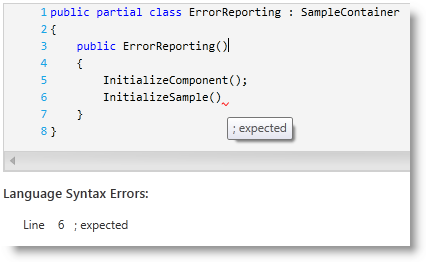

////

|metadata|
{
    "name": "xamsyntaxeditor-error-reporting",
    "controlName": ["xamSyntaxEditor"],
    "tags": ["Error Handling","How Do I"],
    "guid": "a6b70736-4cf2-44b6-bf71-8bfd31ce2c7e",  
    "buildFlags": [],
    "createdOn": "2016-05-25T18:21:59.4273977Z"
}
|metadata|
////

= Error Reporting (xamSyntaxEditor)

== Topic Overview

=== Purpose

This topic provides an overview of the  _xamSyntaxEditor™_   control’s error reporting functionality and shows how to configure and work with the control.

=== Required background

The following topics are prerequisites to understanding this topic:

[options="header", cols="a,a"]
|====
|Topic|Purpose

| link:xamsyntaxeditor-overview.html[ _xamSyntaxEditor_ Overview]
|In this topic, you will find information to help you better understand the _xamSyntaxEditor’s_ functions.

| link:xamsyntaxeditor-editing-support-overview.html[Editing Support Overview]
|This topic covers the text editing capabilities of the _xamSyntaxEditor_ control from both the developer and user’s perspective.

|====

=== In this topic

This topic contains the following sections:

* <<_Ref333307870, Introduction >>
* <<_Ref333307871, Configure Whether the  _xamSyntaxEditor_   Displays Error Squigglies >>
* <<_Ref333307877, Configure Color of the Squiggly Underlines >>
* <<_Ref333307885, Obtain the Document’s Errors >>
* <<_Ref333307894, Related Content >>

[[_Ref333307870]]
== Introduction

=== Error reporting summary

The  _xamSyntaxEditor_   highlights the flagged text as syntactically incorrect, based on the current language’s grammar rules. You can Identify the incorrect text by its being underlined using squiggly underlines, which by default are red. The user can hover the mouse over a squiggly underline to see details about the error, displayed in a tooltip.

The screenshot below is of a  _xamSyntaxEditor_  , showing some errors and a tooltip with error description of the hovered error.

[[_Ref333307871]]
== Configure Whether the  _xamSyntaxEditor_   Displays Error Squigglies

=== Overview

You can set whether the error squigglies are displayed by setting the  _xamSyntaxEditor's_   link:{ApiPlatform}controls.editors.xamsyntaxeditor.v{ProductVersion}~infragistics.controls.editors.xamsyntaxeditor~errordisplaymode.html[ErrorDisplayMode] property.

=== Property settings

The following table maps the desired property settings configuration.

[options="header", cols="a,a,a"]
|====
|In order to:|Use this property:|And set it to:

|Change error squigglies display mode
|`ErrorDisplayMode`
|An instance of link:{ApiPlatform}controls.editors.xamsyntaxeditor.v{ProductVersion}~infragistics.controls.editors.syntaxerrordisplaymode.html[SyntaxErrorDisplayMode]

|====

[[_Ref333307877]]
== Configure Color of the Squiggly Underlines

=== Overview

You can change the color of the squiggly underlines using the link:{ApiPlatform}controls.editors.xamsyntaxeditor.v{ProductVersion}~infragistics.controls.editors.xamsyntaxeditor~classificationappearancemap.html[ClassificationAppearanceMap] property of the  _xamSyntaxEditor_  .

=== Example

The following code changes the color of the squiggly underlines to Magenta:

*In C#:*

[source,csharp]
----
// create a new classification appearance map
ClassificationAppearanceMap cam = new ClassificationAppearanceMap();
// add a solid color brush with magenta color as "SyntaxError" classification type
cam.AddMapEntry(
    ClassificationType.SyntaxError,
    new TextDocumentAppearance()
    {
        Foreground = new SolidColorBrush(Colors.Magenta)
    }
);
// set the map to the xamSyntaxEditor
this.xamSyntaxEditor1.ClassificationAppearanceMap = cam;
----

*In Visual Basic:*

[source,vb]
----
' create a new classification appearance map
Dim cam As New ClassificationAppearanceMap()
' add a solid color brush with magenta color as "SyntaxError" classification type
cam.AddMapEntry(ClassificationType.SyntaxError, New TextDocumentAppearance() With { _
      .Foreground = New SolidColorBrush(Colors.Magenta) _
})
' set the map to the xamSyntaxEditor
Me.xamSyntaxEditor1.ClassificationAppearanceMap = cam
----

[[_Ref333307885]]
== Obtain the Document’s Errors

=== Overview

After initially loading a document each change made to the document in the editor the  _xamSyntaxEditor_   re-parses the document’s content. This is an asynchronous process, which you can monitor by attaching a handler to the link:{ApiPlatform}documents.textdocument.v{ProductVersion}~infragistics.documents.textdocument~propertychanged_ev.html[PropertyChanged] event of link:{ApiPlatform}documents.textdocument.v{ProductVersion}~infragistics.documents.textdocument_members.html[TextDocument] and checking for the link:{ApiPlatform}documents.textdocument.v{ProductVersion}~infragistics.documents.textdocument~syntaxtree.html[SyntaxTree] property. After a change to the `SyntaxTree`’s property, you can check for errors by querying the link:{ApiPlatform}documents.textdocument.v{ProductVersion}~infragistics.documents.parsing.syntaxnode~containsdiagnostics.html[ContainsDiagnostics] property of each node of the syntax tree.

=== Example

The following code example shows how to obtain the list of syntax errors and how to find each error description and the line where the error occurs:

*In C#:*

[source,csharp]
----
// obtain document
TextDocument doc = this.xamSyntaxEditor1.Document;
if (doc.SyntaxTree.RootNode.ContainsDiagnostics)
{
    // create a text span of the whole document
    TextSpan ts = new TextSpan(0, doc.CurrentSnapshot.Length);
    // obtain errors from the whole document
    IEnumerable<NodeDiagnostic> diagnostics =
        doc.SyntaxTree.RootNode.GetDiagnostics(ts);
    foreach (NodeDiagnostic nd in diagnostics)
    {
 // obtain the location of the error
 SnapshotSpan span = nd.SnapshotSpan;
 TextLocation location = span.Snapshot.LocationFromOffset(span.Offset);
 int errorLineNumber = location.Line + 1;
 int errorCharacter = location.Character + 1;
        // obtain the error message
        string errorMessage = nd.Message;
 }
}
----

*In Visual Basic:*

[source,vb]
----
' obtain document
Dim doc As TextDocument = Me.xamSyntaxEditor1.Document
If doc.SyntaxTree.RootNode.ContainsDiagnostics Then
    ' create a text span of the whole document
    Dim ts As New TextSpan(0, doc.CurrentSnapshot.Length)
    ' obtain errors from the whole document
    Dim diagnostics As IEnumerable(Of NodeDiagnostic) = _
        doc.SyntaxTree.RootNode.GetDiagnostics(ts)
    For Each nd As NodeDiagnostic In diagnostics
 ' obtain the location of the error
        Dim span As SnapshotSpan = nd.Span
        Dim location As TextLocation = span.Snapshot.LocationFromOffset(span.Offset)
        Dim errorLineNumber As Integer = location.Line + 1
        Dim errorCharacter As Integer = location.Character + 1
        ' obtain the error message
        Dim errorMessage As String = nd.Message
    Next
End If
----

[[_Ref333307894]]
== Related Content

=== Topics

The following topics provide additional information related to this topic.

[options="header", cols="a,a"]
|====
|Topic|Purpose

| link:xamsyntaxeditor-supported-languages.html[Supported Languages]
|This topic lists the languages supported by the _xamSyntaxEditor_ and shows you how to use each of them.

| link:xamsyntaxeditor-changing-default-classification-types-appearance.html[Changing Default Classification types Appearance]
|This topic provides information on how to change the colors and other appearance attributes assigned to language elements by the _xamSyntaxEditor_ .

| link:xamsyntaxeditor-changing-font-and-styles.html[Changing Fonts and Styles]
|This topic provides information on how to change the presention of the document’s content inside the _xamSyntaxEditor_ .

|====

=== Samples

The following samples provide additional information related to this topic.

[options="header", cols="a,a"]
|====
|Sample|Purpose

| pick:[sl=" link:{SamplesURL}/syntax-editor/#/error-reporting[Error Reporting]"] pick:[wpf=" link:{SamplesURL}/syntax-editor/error-reporting[Error Reporting]"] 
|This sample demonstrates how to configure the error reporting and how to obtain the list of errors from the _xamSyntaxEditor_ .

|====