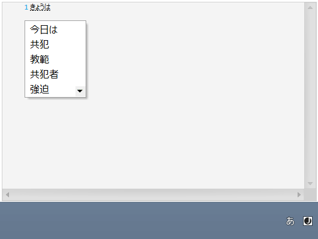
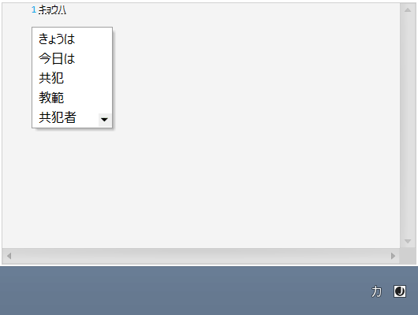

////

|metadata|
{
    "name": "xamsyntaxeditor-ime-support",
    "tags": ["Localization"],
    "controlName": ["xamSyntaxEditor"],
    "guid": "2202f56d-4628-46d7-b686-869d91fd2a4e",  
    "buildFlags": [],
    "createdOn": "2016-05-25T18:21:59.5153622Z"
}
|metadata|
////

= IME Support (xamSyntaxEditor)

== Topic Overview

=== Purpose

This topic explains the input method support of the control.

=== Required background

The following topics are prerequisites to understanding this topic:

[options="header", cols="a,a"]
|====
|Topic|Purpose

| link:xamsyntaxeditor-overview.html[xamSyntaxEditor Overview]
|Provides an overview of the features of the control.

|====

== IME Support

=== IME support summary

The  _xamSyntaxEditor_   control supports OS native language input directly in the editor. If you have installed an Asian language input method on your system, the  _xamSyntaxEditor_   control will display input method compositions and candidate lists directly in the control’s editing area, and immediately re-flow surrounding text as the composition changes.

The following screenshot shows an active Japanese language input composition in the  _xamSyntaxEditor_   using Hiragana as well as the dropdown list of candidates for the current composition:

The following screenshot shows an active Japanese language input composition in the  _xamSyntaxEditor_   using Katakana as well as the dropdown list of candidates for the current composition:

== Related Content

=== Topics

The following topics provide additional information related to this topic.

[options="header", cols="a,a"]
|====
|Topic|Purpose

| link:xamsyntaxeditor-configuring.html[Configuring xamSyntaxEditor]
|The topics in this section provide additional information about configuring the control.

|====