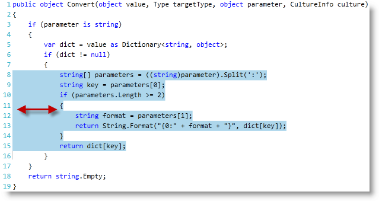
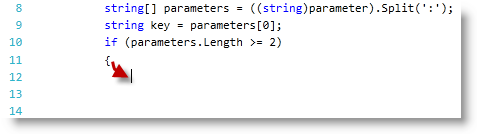

////

|metadata|
{
    "name": "xamsyntaxeditor-indent-outdent-lines",
    "controlName": ["xamSyntaxEditor"],
    "tags": ["Editing","How Do I"],
    "guid": "21bfac85-1793-40d3-bed4-7d427f6b2faf",  
    "buildFlags": [],
    "createdOn": "2016-05-25T18:21:59.3953958Z"
}
|metadata|
////

= Indent / Outdent Lines (xamSyntaxEditor)

== Topic Overview

=== Purpose

This topic provides information about indenting and outdenting text block as well as text formatting, which is based on rules defined by the language as well as the default (and optionally custom) link:{ApiPlatform}documents.textdocument{ApiVersion}~infragistics.documents.iindentserviceprovider.html[IndentServiceProvider] registered on the Language.

=== Required background

The following topics are prerequisites to understanding this topic:

[options="header", cols="a,a"]
|====
|Topic|Purpose

| link:xamsyntaxeditor-overview.html[ _xamSyntaxEditor_ Overview]
|In this topic, you will find information to help you better understand the _xamSyntaxEditor’s_ functions.

| link:xamsyntaxeditor-editing-support-overview.html[Editing Support Overview]
|This topic covers the text editing capabilities of the _xamSyntaxEditor_ control from both the developer and user’s perspective.

|====

=== In this topic

This topic contains the following sections:

* <<_Ref331763229, Introduction >>
* <<_Ref331763238, Indent and Outdent Using the Keyboard Shortcuts >>
* <<_Ref331763243, Indent and Outdent Using the Code >>
* <<_Ref331763249, Automatic Indent and Outdent >>
* <<_Ref331763261, Related Content >>

[[_Ref331763229]]
== Introduction

=== Overview

The  _xamSyntaxEditor™_   supports the indenting/outdenting of text blocks as well as automatic indenting/outdenting applied by the default (and optionally custom) `IndentServiceProvider` registered by the Language.

[[_Ref331763238]]
== Indenting and Outdenting Using Keyboard Shortcuts

=== Shortcuts summary chart

The user may indent/outdent selected text while editing a document using the following key combination:

[options="header", cols="a,a"]
|====
|Key (combination)|Operation

|Tab
|Indent the text selection

|Shift + Tab
|Outdent the text selection

|====

[[_Ref331763243]]
== Programmatic Indenting and Outdenting

=== Methods summary chart

You can use the following TextDocument methods to indent and outdent a specified range of contiguous lines.

[options="header", cols="a,a,a"]
|====
|Method|Arguments|Description

| link:{ApiPlatform}documents.textdocument{ApiVersion}~infragistics.documents.textdocument~indentlines.html[IndentLines]
|
* lineIndex 

* lineCount 

|This method will indent the specified number of lines starting from the line specified in _lineIndex_ (zero-based index).

| link:{ApiPlatform}documents.textdocument{ApiVersion}~infragistics.documents.textdocument~outdentlines.html[OutdentLines]
|
* lineIndex 

* lineCount 

|This method will outdent the specified number of lines starting from the line specified in _lineIndex_ (zero-based index).

|====

[[_Ref331763249]]
== Automatic Indenting and Outdenting

=== Description

Automatic indentation is based on The default (or optionally custom) IndentServiceProvider registered on the language. The indentation occurs automatically while editing text.

The screenshot below shows how the caret is automatically indented when the user presses the Enter key after a curly open braces, when the language is set to link:{ApiPlatform}documents.textdocument.csharp{ApiVersion}~infragistics.documents.parsing.csharplanguage.html[CSharpLanguage]:

[[_Ref331763261]]
== Related Content

=== Topics

The following topics provide additional information related to this topic.

[options="header", cols="a,a"]
|====
|Topic|Purpose

| link:xamsyntaxeditor-supported-languages.html[Supported Languages]
|This topic lists the languages supported by the _xamSyntaxEditor_ and shows you how to use each of them.

|====